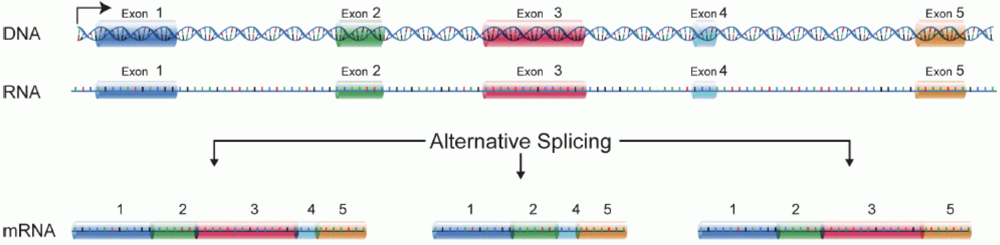
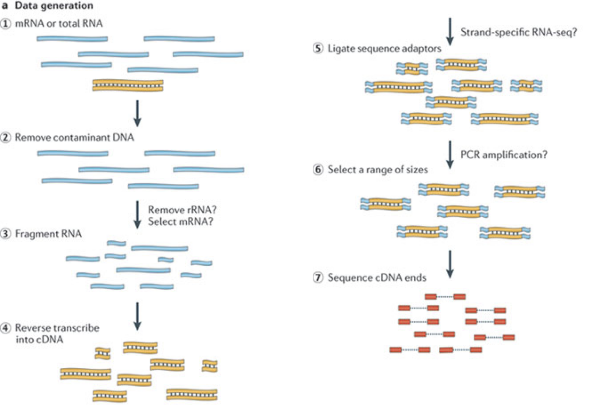
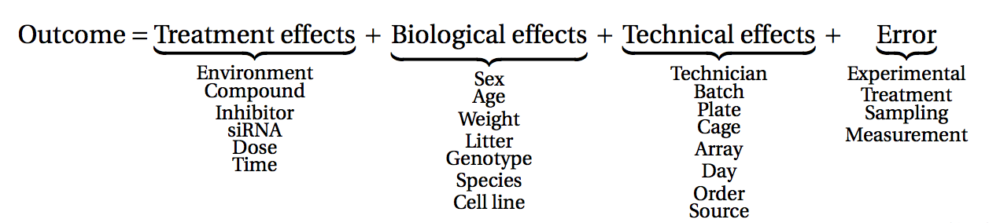
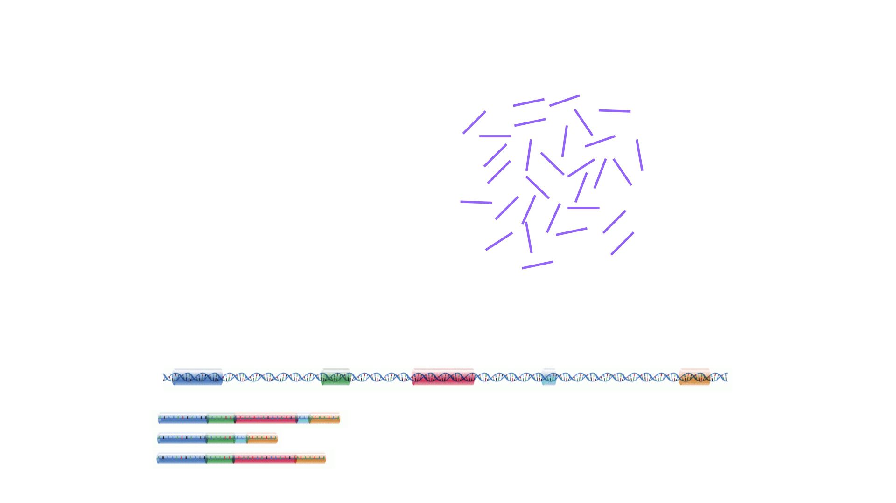
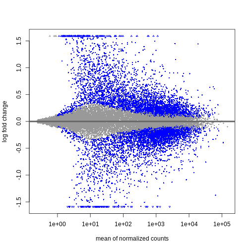
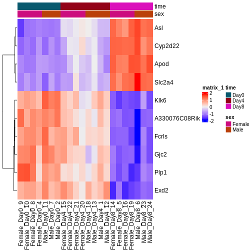

::::::::::::::::::::::::::::::::::::::: objectives

- RNA-seq技術の基本的な概念について説明してください。
- RNA-seq実験を実施する前に決定すべき主要な実験デザインの選択肢について解説してください。
- 生データからダウンストリーム解析で使用するリードカウント行列を生成する処理手順の概要を説明してください。
- RNA-seq解析で一般的に得られる結果の種類と、それらを表現する代表的な可視化手法を紹介してください。

::::::::::::::::::::::::::::::::::::::::::::::::::

:::::::::::::::::::::::::::::::::::::::: questions

- RNA-seq実験を計画する際に考慮すべき主要な選択肢にはどのようなものがありますか？
- 生のFASTQファイルを処理して、各遺伝子およびサンプルごとのリードカウントを含むテーブルを生成するには、どのような手順を踏めばよいでしょうか？
- 特定の生物種についてアノテーション済み遺伝子情報を入手するには、どこを参照すればよいですか？
- RNA-seq解析における標準的な分析手順にはどのようなものがありますか？

::::::::::::::::::::::::::::::::::::::::::::::::::

# RNA-seq実験では何を測定しているのか？

RNA分子を生成するには、まずDNAの一部がmRNAに転写されます。
その後、イントロン領域が除去され、エクソン領域が異なる遺伝子アイソフォームへと組み合わされます。

（図は[Martin & Wang (2011)](https://www.nature.com/articles/nrg3068)の研究を基に改変しています）

一般的なRNA-seq実験では、まず対象サンプルからRNA分子を採取します。
次に、ポリA尾部を持つ分子（主にmRNA）を選択的に濃縮するか、あるいは豊富に存在するリボソームRNAを減少させた後、残ったRNA分子を小さな断片に分解します（分子全体を対象とするロングリード法も存在しますが、本講義の主眼ではありません）。
重要な点として、スプライシングによってイントロン配列が除去されるため、RNA分子（ひいては生成される断片）は、ゲノムの連続した領域に対応しない場合があります。
これらのRNA断片は逆転写されてcDNAに変換され、その後各末端にシーケンシングアダプターが付加されます。
これらのアダプターにより、断片はフローセルに結合することが可能になります。
結合後、各断片は大量に増幅され、フローセル上に同一配列のクラスターが形成されます。
シーケンサーは、各クラスターのcDNA断片について、片方の末端から最初の50～200塩基の配列を決定します。これが1つの__リード__に相当します。
多くのデータセットでは、いわゆるペアエンド法が採用されており、断片は両端から読み取られます。
実験では数百万ものこのようなリード（あるいはリードペア）が生成され、これらは（ペアの）FASTQファイルに記録されます。
各リードはこのようなファイル内で4行連続で表現されます：まず固有のリード識別子を示す行、次に推定されたリード配列、続いて別の識別子行、そして最後に各推定塩基の塩基品質値を含む行があり、これは対応する位置の塩基が正しく同定された確率を示しています。

:::::::::::::::::::::::::::::::::::::::  challenge

## 課題：隣の席の方と以下の点について話し合ってください

1. 断片の片方のみをシーケンスする場合と比較して、ペアエンドプロトコルにはどのような利点と欠点が考えられますか？
2. リード配列を含むFASTQファイルに対して実施すると有用な品質評価手法として、どのようなものが考えられますか？

::::::::::::::::::::::::::::::::::::::::::::::::::

# 実験設計における重要な考慮事項

データ収集を開始する前に、実験設計について十分に検討する時間を設けることが極めて重要です。
実験設計とは、適切な種類のデータを十分な量確保し、関心のある研究課題を可能な限り効率的に解決するための実験構成を計画するプロセスを指します。
考慮すべき重要な要素として、どの条件やサンプル群を対象とするか、必要な複製数をどの程度とするか、実際のデータ収集をどのように計画するかなどが挙げられます。
多くのハイスループット生物学実験（RNA-seqを含む）は環境条件の影響を受けやすく、異なる日に、異なる分析者によって、異なる研究機関で、あるいは異なる試薬ロットを用いて実施された測定結果を直接比較することは困難です。
このため、実験を適切に設計し、一次効果と二次効果といった異なる種類の影響を分離可能にすることが極めて重要となります。

（図は[Lazic (2017)](https://www.amazon.com/Experimental-Design-Laboratory-Biologists-Reproducibility/dp/1107424887)より引用）

:::::::::::::::::::::::::::::::::::::::  challenge

## 課題：隣の人と話し合ってみましょう

1. 複製実験を行うことがなぜ重要なのでしょうか？

::::::::::::::::::::::::::::::::::::::::::::::::::

統計学的な観点から見ると、すべての複製データが同等に有用であるとは限りません。複製データを分類する一般的な方法として、「生物学的複製」と「技術的複製」の2種類があります。
後者は通常、測定機器の再現性を検証するために用いられ、一方生物学的複製は、研究対象集団内の異なるサンプル間の変動性に関する情報を提供します。
もう1つの分類体系では、複製単位を「生物学的」「実験的」「観察的」の3つに分類します。
この場合、「生物学的単位」とは、我々が推論を行いたい対象実体（例えば動物や人間）を指します。
治療効果について一般的な結論を導くためには、生物学的単位の複製が必須です。単一のマウスを調査しただけでは、マウス集団に対する薬剤の効果について確定的な結論を導き出すことはできません。
「実験的単位」とは、測定対象を_独立して治療群に割り当て可能な最小の実体_を意味します（例：動物個体、仔の群れ、ケージ、ウェルなど）。
真の意味での複製と認められるのは、実験的単位の複製のみです。
最後に、「観察的単位」とは、実際に測定が行われる対象実体を指します。

実験デザインが研究課題に対する回答能力に与える影響を検証するため、[ConfoundingExplorer](https://csoneson.github.io/ConfoundingExplorer/)パッケージで提供されているインタラクティブなアプリケーションを使用します。

:::::::::::::::::::::::::::::::::::::::  challenge

## 課題

「ConfoundingExplorer」アプリケーションを起動し、インターフェースの操作に慣れてください。

::::::::::::::::::::::::::::::::::::::::::::::::::

:::::::::::::::::::::::::::::::::::::::  challenge

## 課題

1. バランスの取れた設計（各バッチ内で2つのグループの複製数が均等に分布している場合）において、バッチ効果の強度を増大させた場合、どのような影響が生じるでしょうか？バッチ効果の補正を行うかどうかによって結果に違いは生じるのでしょうか？
2. サンプル数が不均衡な設計（特定のグループのすべてまたはほとんどの複製が同一バッチから採取されている場合）において、バッチ効果の影響度を高めた場合、どのような影響が生じるでしょうか？また、バッチ効果を考慮するか否かによって結果に差異が生じるのでしょうか？

::::::::::::::::::::::::::::::::::::::::::::::::::

# RNA-seqデータの定量化：リードからカウント行列への変換プロセス

シーケンサーから得られるFASTQファイルに含まれるリード配列は、通常そのままでは直接的な利用価値がありません。なぜなら、各リードが具体的にどの遺伝子または転写産物に由来するかという情報が欠落しているからです。
そのため、最初の処理ステップとして各リードの起源位置を特定し、これを基に遺伝子単位（あるいは個々の転写産物などの特徴単位）ごとのリード数を推定する作業が必要となります。
この推定値は、遺伝子の存在量（または発現レベル）の代理指標として用いることができます。
RNA定量化のためのパイプラインには多様な手法が存在しますが、最も一般的なアプローチは主に以下の3種類に分類されます：

1. リード配列をゲノムにアライメントし、各遺伝子のエクソン領域にマッピングされたリード数をカウントする方法
   これは最もシンプルな手法の一つです。トランスクリプトームのアノテーションが不十分な種に対しては、この方法が特に適しています。
   具体例：GRCm39ゲノムに対する`STAR`アライメントと`Rsubread`を用いた[featureCounts](https://doi.org/10.1093/nar/gkz114)による定量

2. リード配列をトランスクリプトームにアライメントし、転写産物の発現量を定量化した後、それらを遺伝子レベルの発現量に集約する方法
   この手法は高精度な定量結果を得られることが知られており（[独立したベンチマーク研究](https://doi.org/10.1186/s13059-016-0940-1)参照）、
   特にDNA汚染のない高品質なサンプルにおいて有効です。
   具体例：GENCODE GRCh38トランスクリプトームを用いた`rsem-calculate-expression --star`によるRSEM定量と`tximport`による処理

3. リード配列をトランスクリプトームに対して擬似アライメントし、同時に対応するゲノム配列をデコイとして用いることで、転写産物の発現量を定量化する方法
   この手法の利点は、計算効率の高さ、DNA汚染の影響軽減、およびGCバイアス補正が可能な点にあります
   具体例：`salmon quant --gcBias`と`tximport`を組み合わせた手法
   
一般的なシーケンシングリード深度においては、遺伝子発現量の定量化は転写産物レベルの定量化よりも精度が高い場合が多いです。
ただし、差異遺伝子発現解析においては、[転写産物レベルの定量結果も併用することで](https://doi.org/10.12688/f1000research.7563.1)
解析精度を向上させることが可能です。

RNA-seq定量化に用いられるその他のツールとしては、TopHat2、bowtie2、kallisto、HTseqなどが挙げられます。

適切なRNA-seq定量化手法の選択は、トランスクリプトームアノテーションの品質、RNA-seqライブラリ調製の質、混入配列の有無など、多くの要因に依存します。
多くの場合、複数の手法で得られた定量結果を比較することが有益な情報をもたらします。

最適な定量化手法は種や実験条件によって異なる上、多くの場合大規模な計算リソースを必要とするため、本ワークショップでは具体的なカウント生成方法の詳細には触れません。
代わりに、上記の参考文献を参照するか、必要に応じて地域のバイオインフォマティクス専門家に相談することをお勧めします。

:::::::::::::::::::::::::::::::::::::::  challenge

## 課題：以下の内容について隣席の方と議論してください

1. 提示されたRNA-Seq定量解析ツールのうち、ご存知のものはありますか？各手法の長所と短所について他にご存知の情報はありますか？
2. ご自身でRNA-Seq実験を実施した経験はありますか？実施された場合、どの定量解析ツールを使用され、なぜそのツールを選択したのか理由もお聞かせください。
3. 定量解析に使用できる特定のツール／地域のバイオインフォマティクス専門家／計算リソースへのアクセスはありますか？もし利用できない場合、どのようにアクセスを確保できると思いますか？

::::::::::::::::::::::::::::::::::::::::::::::::::

# 参照配列を見つけるには

RNA-seqデータから既知の遺伝子または転写産物の存在量を定量化するためには、これらの特徴量の配列情報を提供する参照データベースが必要です。この参照配列と読み取ったリードを比較することで、正確な定量が可能になります。
この情報は様々なオンラインリポジトリから取得できます。
特定のプロジェクトで使用する参照データベースは1つに限定し、異なる情報源からの情報を混在させないことが強く推奨されます。
選択した定量化ツールの種類によって、必要となる参照情報の形式が異なります。
ゲノム配列にリードをアラインさせ、既知のアノテーション済み特徴量との重複領域を解析する場合、完全なゲノム配列（fasta形式ファイル）と、各アノテーション済み特徴量のゲノム上の位置情報を記載したファイル（通常はgtf形式ファイル）が必要となります。
一方、トランスクリプトームにリードをマッピングする場合は、各転写産物の配列情報を含むファイル（こちらもfasta形式ファイル）が必要になります。

* マウスまたはヒトサンプルを扱う場合、[GENCODEプロジェクト](https://www.gencodegenes.org/)が提供する十分に整備された参照ファイルが利用可能です。
* [Ensembl](https://www.ensembl.org/info/data/ftp/index.html)では、[植物](https://plants.ensembl.org/info/data/ftp/index.html)や[真菌](https://fungi.ensembl.org/info/data/ftp/index.html)を含む広範な生物種の参照ファイルを提供しています。
* [UCSC](https://hgdownload.soe.ucsc.edu/downloads.html)も多くの生物種に対する参照ファイルを提供しています。

:::::::::::::::::::::::::::::::::::::::  challenge

## 課題

GENCODE から最新のマウストランスクリプトーム FASTA ファイルをダウンロードしてください。各エントリーはどのような形式になっていますか？ ヒント：R でこのファイルを読み込むには、`Biostrings` パッケージの `readDNAStringSet()` 関数の使用を検討してください。

::::::::::::::::::::::::::::::::::::::::::::::::::

# 本ワークショップではどのような方向性を目指していくのでしょうか？

今後2日間にわたり、Bioconductorを用いた差異的発現解析の実施方法とその結果の解釈方法について議論と実践を行います。
まずはカウント行列を出発点とし、遺伝子発現の初期品質評価と定量化は既に完了していることを前提とします。
差異的発現解析の結果は通常、MAプロットやヒートマップなどの視覚的表現を用いて表示されます（以下に具体例を示します）。

次回以降のセッションでは、特にこれらのプロットの生成方法と解釈方法について学びます。
また、上位にランクされた遺伝子間に機能的な関連性があるかどうかを調べるためのフォローアップ解析（いわゆる遺伝子セット解析/エンリッチメント解析）を実施するのが一般的であり、このテーマについても後のセッションで詳しく解説します。

:::::::::::::::::::::::::::::::::::::::: keypoints

- RNA-seqは、特定の時点における細胞または組織内で発現しているRNA分子の量を測定する技術です。
- RNA-seq実験を計画する際には、多くの重要な選択事項があります。例えば、ポリA選択法を採用するかリボソーム除去法を適用するか、ストランド特異的プロトコルを使用するか非ストランド特異的プロトコルを採用するか、リードをシングルエンドで配列決定するかペアエンドで配列決定するかなどです。これらの選択はいずれも、データ処理および解釈に重大な影響を及ぼします。
- RNA-seqデータの定量化には複数の手法が存在します。代表的な方法としては、リードをゲノム配列にアラインメントし、遺伝子領域にオーバーラップするリード数をカウントする手法があります。また、別の手法ではリードをトランスクリプトームにマッピングし、確率的アプローチを用いて各遺伝子または転写産物の存在量を推定します。
- アノテーション済み遺伝子に関する情報は、Ensembl、UCSC、GENCODEなどの複数の情報源から取得可能です。

::::::::::::::::::::::::::::::::::::::::::::::::::

