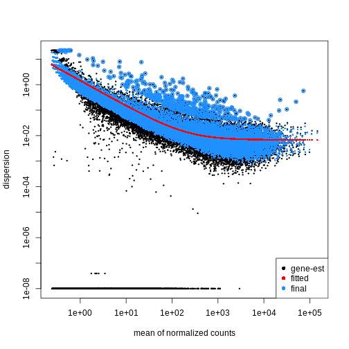
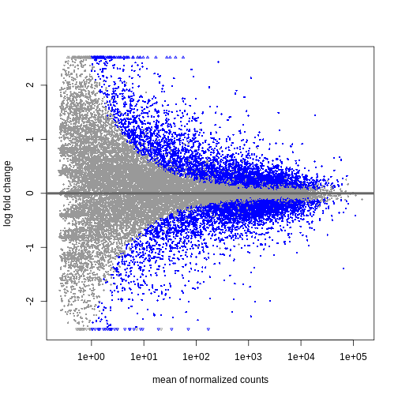
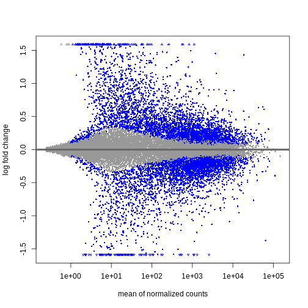
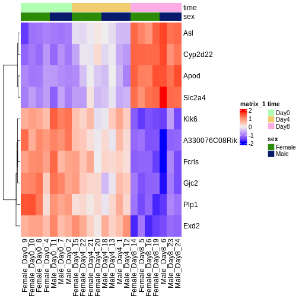

::::::::::::::::::::::::::::::::::::::: objectives

- Differential expression 解析における主要な手順について説明してください。
- DESeq2パッケージを使用してR環境でこれらの手順を実行する方法を説明してください。

::::::::::::::::::::::::::::::::::::::::::::::::::

:::::::::::::::::::::::::::::::::::::::: questions

- 典型的な Differential expression 解析で実施される主な手順は何ですか？
- DESeq2の出力結果をどのように解釈すればよいですか？

::::::::::::::::::::::::::::::::::::::::::::::::::

## Differential expression の推定

RNA-seqデータ解析における主要な目的の一つは、実験群間または条件間（例：処理群と対照群、時間点、組織など）における系統的な変化を定量化し、統計的に推論することです。これは通常、条件間変動と条件内変動を用いて発現変動パターンを示す遺伝子を同定することで行われ、生物学的複製サンプル（同一条件下での複数サンプル）が必要となります。
発現変動解析を実施するためのソフトウェアパッケージは複数存在します。比較研究によれば、発現変動遺伝子（DE遺伝子）に関してはある程度の一致が見られるものの、ツール間にはばらつきがあり、どのツールも他のすべてのツールを一貫して上回る性能を示すことはないことが報告されています（[Soneson and Delorenzi, 2013](https://bmcbioinformatics.biomedcentral.com/articles/10.1186/1471-2105-14-91)参照）。
以下では、[DESeq2](https://bioconductor.org/packages/release/bioc/html/DESeq2.html)
ソフトウェアパッケージを使用した発現変動解析の実施方法を説明し、実際に解析を行います。[edgeR](https://bioconductor.org/packages/release/bioc/html/edgeR.html)パッケージも同様の手法を実装しており、カウントデータに関する主要な仮定を共有しています。両パッケージとも一般的に良好な安定性を示し、同等の結果が得られます。

## DESeqDataSetオブジェクト

`DESeq2`を実行するには、カウントデータを`DESeqDataSet`クラスのオブジェクトとして表現する必要があります。
`DESeqDataSet`は`SummarizedExperiment`クラス（[定量データのインポートとアノテーション](../episodes/03-import-annotate.Rmd)セクション参照）の拡張版であり、カウントアッセイデータ、特徴量（ここでは遺伝子）、およびサンプルメタデータに加えて、_デザイン式_を保持します。
_デザイン式_は、モデリング時に用いる変数を表現するものです。通常は解析対象の変数（群変数）や、考慮したいその他の変数（例：バッチ効果変数）などが含まれます。_デザイン式_および関連する_デザイン行列_に関する詳細な説明は、[デザイン行列の詳細な探索](../episodes/06-extra-design.Rmd)セクションで行います。`DESeqDataSet`クラスのオブジェクトは、[カウント行列](https://bioconductor.org/packages/release/bioc/vignettes/DESeq2/inst/doc/DESeq2.html#countmat)、[SummarizedExperimentオブジェクト](https://bioconductor.org/packages/release/bioc/vignettes/DESeq2/inst/doc/DESeq2.html#se)、[トランスクリプト存在量ファイル](https://bioconductor.org/packages/release/bioc/vignettes/DESeq2/inst/doc/DESeq2.html#tximport)、または[htseqカウントファイル](https://bioconductor.org/packages/release/bioc/vignettes/DESeq2/inst/doc/DESeq2.html#htseq)から構築可能です。

### パッケージの読み込み


``` r
suppressPackageStartupMessages({
    library(SummarizedExperiment)
    library(DESeq2)
    library(ggplot2)
    library(ExploreModelMatrix)
    library(cowplot)
    library(ComplexHeatmap)
    library(apeglm)
})
```

### データの読み込み

前回の品質管理分析で使用した `SummarizedExperiment` オブジェクトを再度読み込みます。品質管理の探索的分析では、カウント数が5未満の遺伝子約35%を削除しました。これらの遺伝子は情報量が不足していたためです。DESeq2の統計解析においては、デフォルトで独立したフィルタリングが行われるため、これらの遺伝子を厳密に削除する必要はありません。ただし、これにより `DESeqDataSet` オブジェクトのメモリ使用量が減少し、計算速度が向上する可能性があります。さらに、これらの遺伝子が可視化結果を乱雑にするのを防ぐことができます。


``` r
se <- readRDS("data/GSE96870_se.rds")
se <- se[rowSums(assay(se, "counts")) > 5, ]
```

### DESeqDataSetの作成

本例で使用するデザイン行列は `~ sex + time` とします。これにより、以下の比較が可能になります：
- 雄と雌の平均値の差（時間ポイントを平均化）
- day 0、4、8の平均値の差（雄と雌を平均化）
他の比較（例：「雌・day8」対「雌・day0」、「雄・day8」対「雄・day0」）を行いたい場合は、異なるデザイン行列を使用することで、これらのペアワイズ比較をより容易に抽出できます。


``` r
dds <- DESeq2::DESeqDataSet(se,
                            design = ~ sex + time)
```

``` warning
Warning in DESeq2::DESeqDataSet(se, design = ~sex + time): some variables in
design formula are characters, converting to factors
```

::::::::::::::::::::::::::::::::::::: instructor

`DESeqDataSet`を生成する関数は、入力データの種類に応じて適切に調整する必要があります。例えば：


``` r
#From SummarizedExperiment object
ddsSE <- DESeqDataSet(se, design = ~ sex + time)

#From count matrix
dds <- DESeqDataSetFromMatrix(countData = assays(se)$counts,
                              colData = colData(se),
                              design = ~ sex + time)
```

:::::::::::::::::::::::::::::::::::::::::::::::::

## 正規化処理

`DESeq2` と `edgeR` は以下の前提条件に基づいています：

- ほとんどの遺伝子は発現量に有意な差がない
- 特定の遺伝子にリードがマッピングされる確率は、同一グループ内のすべてのサンプルにおいて同一である

[前節](../episodes/04-exploratory-qc.Rmd) の探索的データ分析で示したように、サンプルの総リード数（同一条件下で取得されたものであっても）はライブラリサイズ（シーケンシングされた総リード数）に依存します。グループ間およびグループ内で特定の遺伝子のカウント変動を比較するためには、まずライブラリサイズと組成効果を考慮する必要があります。
前節で説明した `estimateSizeFactors()` 関数を思い出してください：


``` r
dds <- estimateSizeFactors(dds)
```

::::::::::::::::::::::::::::::::::::: instructor

_DESeq2_ では、**「相対対数発現量」（RLE：Relative Log Expression）**法を用いて、リード深度とライブラリ構成を考慮したサンプルごとの**サイズ因子**を算出します。
一方、_edgeR_ では**「トリミング平均M値」（TMM：Trimmed Mean of M-Values）**法を採用し、ライブラリサイズの差異や組成的影響を補正します。
_edgeR_の**正規化係数**と_DESeq2_の**サイズ因子**は類似した結果をもたらしますが、これらは理論的に同等のパラメータではありません。

:::::::::::::::::::::::::::::::::::::::::::::::::

## 統計モデリング

`DESeq2` と `edgeR` は、RNA-seqデータのカウント値を **負の二項分布** としてモデル化します。これは、グループあたりのサンプル数が少ない場合、平均値と分散の相関関係（[探索的データ解析](../episodes/04-exploratory-qc.Rmd)参照）、およびカウント分布の偏りを考慮するためです。

### 分散パラメータ

負の二項分布に従う遺伝子のカウント値におけるグループ内分散は、平均 $\mu$ に対して以下のようにモデル化できます：

$var = \mu + \theta \mu^2$

ここで $\theta$ は遺伝子固有の **分散パラメータ** を表し、データのばらつき度合いを示す指標です。第二段階として、各遺伝子の分散パラメータを推定することで、グループ内の期待分散値を算出し、グループ間の差異を検定します。サンプル数が限られている場合、適切な分散推定値は得にくいため、類似した発現パターンを示す遺伝子間の情報が活用されます。各遺伝子の分散推定値は、観測された分散分布の中央値方向に「縮小」（shrinked）されます。`DESeq2` では、`estimateDispersions()` 関数を使用して分散推定値を取得できます。
`plotDispEsts()` 関数を用いることで、この **縮小効果** の影響を視覚的に確認することが可能です：


``` r
dds <- estimateDispersions(dds)
```

``` output
gene-wise dispersion estimates
```

``` output
mean-dispersion relationship
```

``` output
final dispersion estimates
```

``` r
plotDispEsts(dds)
```



### Testing

We can use the `nbinomWaldTest()`function of `DESeq2` to fit a _generalized linear model (GLM)_ and compute _log2 fold changes_ (synonymous with "GLM coefficients", "beta coefficients" or "effect size") corresponding to the variables of the _design matrix_. The _design matrix_ is directly related to the _design formula_ and automatically derived from it. Assume a design formula with one variable (`~ treatment`) and two factor levels (treatment and control). The mean expression $\mu_{j}$ of a specific gene in sample $j$ will be modeled as following:

$log(μ_j) = β_0 + x_j β_T$,

with $β_T$ corresponding to the log2 fold change of the treatment groups, $x_j$ = 1, if $j$ belongs to the treatment group and $x_j$ = 0, if $j$ belongs to the control group.

Finally, the estimated log2 fold changes are scaled by their standard error and tested for being significantly different from 0 using the _Wald test_.


``` r
dds <- nbinomWaldTest(dds)
```

::::::::::::::::::::::::::::::::::::: callout

### Note

Standard differential expression analysis as performed above is wrapped into a single function, `DESeq()`. Running the first code chunk is equivalent to running the second one:


``` r
dds <- DESeq(dds)
```


``` r
dds <- estimateSizeFactors(dds)
dds <- estimateDispersions(dds)
dds <- nbinomWaldTest(dds)
```

:::::::::::::::::::::::::::::::::::::::::::::::::

## Explore results for specific contrasts

The `results()` function can be used to extract gene-wise test statistics, such as log2 fold changes and (adjusted) p-values. The comparison of interest can be defined using contrasts, which are linear combinations of the model coefficients (equivalent to combinations of columns within the _design matrix_) and thus directly related to the design formula. A detailed explanation of design matrices and how to use them to specify different contrasts of interest can be found in the section on the [exploration of design matrices](../episodes/06-extra-design.Rmd). In the `results()` function a contrast can be represented by the variable of interest (reference variable) and the related level to compare using the `contrast` argument. By default the reference variable will be the **last variable** of the design formula, the _reference level_ will be the first factor level and the _last level_ will be used for comparison. You can also explicitly specify a contrast by the `name` argument of the `results()` function. Names of all available contrasts can be accessed using `resultsNames()`.

::::::::::::::::::::::::::::::::::::: challenge

What will be the default **contrast**, **reference level** and **"last level"** for comparisons when running `results(dds)` for the example used in this lesson?

_Hint: Check the design formula used to build the object._

:::::::::::::::::::::::: solution

In the lesson example the last variable of the design formula is `time`.
The **reference level** (first in alphabetical order) is `Day0` and the **last level** is `Day8`


``` r
levels(dds$time)
```

``` output
[1] "Day0" "Day4" "Day8"
```

No worries, if you had difficulties to identify the default contrast the output of the `results()` function explicitly states the contrast it is referring to (see below)!

:::::::::::::::::::::::::::::::::
::::::::::::::::::::::::::::::::::::::::::::::::

To explore the output of the `results()` function we can use the `summary()` function and order results by significance (p-value). Here we assume that we are interested in changes over `time` ("variable of interest"), more specifically genes with differential expression between `Day0` ("reference level") and `Day8` ("level to compare"). The model we used included the `sex` variable (see above). Thus our results will be "corrected" for sex-related differences.


``` r
## Day 8 vs Day 0
resTime <- results(dds, contrast = c("time", "Day8", "Day0"))
summary(resTime)
```

``` output

out of 27430 with nonzero total read count
adjusted p-value < 0.1
LFC > 0 (up)       : 4472, 16%
LFC < 0 (down)     : 4282, 16%
outliers [1]       : 10, 0.036%
low counts [2]     : 3723, 14%
(mean count < 1)
[1] see 'cooksCutoff' argument of ?results
[2] see 'independentFiltering' argument of ?results
```

``` r
# View(resTime)
head(resTime[order(resTime$pvalue), ])
```

``` output
log2 fold change (MLE): time Day8 vs Day0 
Wald test p-value: time Day8 vs Day0 
DataFrame with 6 rows and 6 columns
               baseMean log2FoldChange     lfcSE      stat      pvalue
              <numeric>      <numeric> <numeric> <numeric>   <numeric>
Asl             701.343       1.117332 0.0594128   18.8062 6.71212e-79
Apod          18765.146       1.446981 0.0805056   17.9737 3.13229e-72
Cyp2d22        2550.480       0.910202 0.0556002   16.3705 3.10712e-60
Klk6            546.503      -1.671897 0.1057395  -15.8115 2.59339e-56
Fcrls           184.235      -1.947016 0.1277235  -15.2440 1.80488e-52
A330076C08Rik   107.250      -1.749957 0.1155125  -15.1495 7.63434e-52
                     padj
                <numeric>
Asl           1.59057e-74
Apod          3.71130e-68
Cyp2d22       2.45431e-56
Klk6          1.53639e-52
Fcrls         8.55406e-49
A330076C08Rik 3.01518e-48
```

::::::::::::::::::::::::::::::::::::: instructor
Both of the below ways of specifying the contrast are essentially equivalent.
The `name` parameter can be accessed using `resultsNames()`.


``` r
resTime <- results(dds, contrast = c("time", "Day8", "Day0"))
resTime <- results(dds, name = "time_Day8_vs_Day0")
```

:::::::::::::::::::::::::::::::::::::::::::::::::

::::::::::::::::::::::::::::::::::::: challenge

Explore the DE genes between males and females independent of time.

_Hint: You don't need to fit the GLM again. Use `resultsNames()` to get the correct contrast._

:::::::::::::::::::::::: solution


``` r
## Male vs Female
resSex <- results(dds, contrast = c("sex", "Male", "Female"))
summary(resSex)
```

``` output

out of 27430 with nonzero total read count
adjusted p-value < 0.1
LFC > 0 (up)       : 51, 0.19%
LFC < 0 (down)     : 70, 0.26%
outliers [1]       : 10, 0.036%
low counts [2]     : 8504, 31%
(mean count < 6)
[1] see 'cooksCutoff' argument of ?results
[2] see 'independentFiltering' argument of ?results
```

``` r
head(resSex[order(resSex$pvalue), ])
```

``` output
log2 fold change (MLE): sex Male vs Female 
Wald test p-value: sex Male vs Female 
DataFrame with 6 rows and 6 columns
               baseMean log2FoldChange     lfcSE      stat       pvalue
              <numeric>      <numeric> <numeric> <numeric>    <numeric>
Xist         22603.0359      -11.60429  0.336282  -34.5076 6.16852e-261
Ddx3y         2072.9436       11.87241  0.397493   29.8683 5.08722e-196
Eif2s3y       1410.8750       12.62513  0.565194   22.3377 1.58997e-110
Kdm5d          692.1672       12.55386  0.593607   21.1484  2.85293e-99
Uty            667.4375       12.01728  0.593573   20.2457  3.87772e-91
LOC105243748    52.9669        9.08325  0.597575   15.2002  3.52699e-52
                     padj
                <numeric>
Xist         1.16684e-256
Ddx3y        4.81149e-192
Eif2s3y      1.00253e-106
Kdm5d         1.34915e-95
Uty           1.46702e-87
LOC105243748  1.11194e-48
```

:::::::::::::::::::::::::::::::::
::::::::::::::::::::::::::::::::::::::::::::::::

::::::::::::::::::::::::::::::::::::: callout

### Multiple testing correction

Due to the high number of tests (one per gene) our DE results will contain a substantial number of **false positives**. For example, if we tested 20,000 genes at a threshold of $\alpha = 0.05$ we would expect 1,000 significant DE genes with no differential expression.

To account for this expected high number of false positives, we can correct our results for **multiple testing**. By default `DESeq2` uses the [Benjamini-Hochberg procedure](https://link.springer.com/referenceworkentry/10.1007/978-1-4419-9863-7_1215)
to calculate **adjusted p-values** (padj) for DE results.

:::::::::::::::::::::::::::::::::::::::::::::::::

## Independent Filtering and log-fold shrinkage

We can visualize the results in many ways. A good check is to explore the relationship between _log2fold changes_, _significant DE genes_ and the _genes mean count_.
`DESeq2` provides a useful function to do so, `plotMA()`.


``` r
plotMA(resTime)
```



We can see that genes with a low mean count tend to have larger log fold changes.
This is caused by counts from lowly expressed genes tending to be very noisy.
We can _shrink_ the log fold changes of these genes with low mean and high dispersion, as they contain little information.


``` r
resTimeLfc <- lfcShrink(dds, coef = "time_Day8_vs_Day0", res = resTime)
```

``` output
using 'apeglm' for LFC shrinkage. If used in published research, please cite:
    Zhu, A., Ibrahim, J.G., Love, M.I. (2018) Heavy-tailed prior distributions for
    sequence count data: removing the noise and preserving large differences.
    Bioinformatics. https://doi.org/10.1093/bioinformatics/bty895
```

``` r
plotMA(resTimeLfc)
```



Shrinkage of log fold changes is useful for visualization and ranking of genes, but for result exploration typically the `independentFiltering` argument is used to remove lowly expressed genes.

::::::::::::::::::::::::::::::::::::: challenge

By default `independentFiltering` is set to `TRUE`. What happens without filtering lowly expressed genes? Use the `summary()` function to compare the results. Most of the lowly expressed genes are not significantly differential expressed (blue in the above MA plots). What could cause the difference in the results then?

:::::::::::::::::::::::: solution


``` r
resTimeNotFiltered <- results(dds,
                              contrast = c("time", "Day8", "Day0"), 
                              independentFiltering = FALSE)
summary(resTime)
```

``` output

out of 27430 with nonzero total read count
adjusted p-value < 0.1
LFC > 0 (up)       : 4472, 16%
LFC < 0 (down)     : 4282, 16%
outliers [1]       : 10, 0.036%
low counts [2]     : 3723, 14%
(mean count < 1)
[1] see 'cooksCutoff' argument of ?results
[2] see 'independentFiltering' argument of ?results
```

``` r
summary(resTimeNotFiltered)
```

``` output

out of 27430 with nonzero total read count
adjusted p-value < 0.1
LFC > 0 (up)       : 4324, 16%
LFC < 0 (down)     : 4129, 15%
outliers [1]       : 10, 0.036%
low counts [2]     : 0, 0%
(mean count < 0)
[1] see 'cooksCutoff' argument of ?results
[2] see 'independentFiltering' argument of ?results
```

Genes with very low counts are not likely to see significant differences typically due to high dispersion. Filtering of lowly expressed genes thus increased detection power at the same experiment-wide false positive rate.

:::::::::::::::::::::::::::::::::
::::::::::::::::::::::::::::::::::::::::::::::::

## Visualize selected set of genes

The amount of DE genes can be overwhelming and a ranked list of genes can still be hard to interpret with regards to an experimental question. Visualizing gene expression can help to detect expression pattern or group of genes with related functions. We will perform systematic detection of over represented groups of genes in a [later section](../episodes/07-gene-set-analysis.Rmd). Before this visualization can already help us to get a good intuition about what to expect.

We will use transformed data (see [exploratory data analysis](../episodes/04-exploratory-qc.Rmd)) and the top differentially expressed genes for visualization. A heatmap can reveal expression pattern across sample groups (columns) and automatically orders genes (rows) according to their similarity.


``` r
# Transform counts
vsd <- vst(dds, blind = TRUE)

# Get top DE genes
genes <- resTime[order(resTime$pvalue), ] |>
         head(10) |>
         rownames()
heatmapData <- assay(vsd)[genes, ]

# Scale counts for visualization
heatmapData <- t(scale(t(heatmapData)))

# Add annotation
heatmapColAnnot <- data.frame(colData(vsd)[, c("time", "sex")])
heatmapColAnnot <- HeatmapAnnotation(df = heatmapColAnnot)

# Plot as heatmap
ComplexHeatmap::Heatmap(heatmapData,
                        top_annotation = heatmapColAnnot,
                        cluster_rows = TRUE, cluster_columns = FALSE)
```



::::::::::::::::::::::::::::::::::::: challenge

Check the heatmap and top DE genes. Do you find something expected/unexpected in terms of change across all 3 time points?

::::::::::::::::::::::::::::::::::::::::::::::::

## Output results

We may want to to output our results out of R to have a stand-alone file. The format of `resTime` only has the gene symbols as rownames, so let us join the gene annotation information, and then write out as .csv file:


``` r
head(as.data.frame(resTime))
head(as.data.frame(rowRanges(se)))

temp <- cbind(as.data.frame(rowRanges(se)),
              as.data.frame(resTime))

write.csv(temp, file = "output/Day8vsDay0.csv")
```

:::::::::::::::::::::::::::::::::::::::: keypoints

- With DESeq2, the main steps of a differential expression analysis (size factor estimation, dispersion estimation, calculation of test statistics) are wrapped in a single function: DESeq().
- Independent filtering of lowly expressed genes is often beneficial.

::::::::::::::::::::::::::::::::::::::::::::::::::


