::::::::::::::::::::::::::::::::::::::: objectives

- 数式表記法とdesign matricesについて説明します。
- さまざまな実験デザインの種類を紹介し、各係数の解釈方法について学びます。

::::::::::::::::::::::::::::::::::::::::::::::::::

:::::::::::::::::::::::::::::::::::::::: questions

- 生物学的な質問や比較結果を、RNA-seq解析パッケージで使用可能な統計用語に翻訳するにはどうすればよいでしょうか？

::::::::::::::::::::::::::::::::::::::::::::::::::

## 必要なパッケージの読み込みとデータの読み込み

まず、今回のエピソードで使用するいくつかのパッケージを読み込みます。
特に、[ExploreModelMatrix](https://bioconductor.org/packages/ExploreModelMatrix/) パッケージは、設計行列を視覚的に探索するための機能を提供しており、解釈を容易にします。


``` r
suppressPackageStartupMessages({
    library(SummarizedExperiment)
    library(ExploreModelMatrix)
    library(dplyr)
    library(DESeq2)
})
```

次に、データセットのメタデータテーブルを読み込みます。さまざまなdesign matricesを検討するため、これまで使用していない4番目のファイルを読み込みます。このファイルには、小脳と脊髄のサンプル（合計45サンプル）のデータが含まれています。以前のエピソードで説明した通り、メタデータには収集サンプルの年齢、性別、感染状態、測定時点、および組織情報が含まれています。
特に注意すべき点として、Day0は常に非感染サンプルに対応しており、感染サンプルはDay4とDay8に採取されています。
さらに、すべてのマウスの年齢は8週間で統一されています。
したがって、本エピソードの前半では、これらの変数（性別、組織、測定時点）のみを考慮します。


``` r
meta <- read.csv("data/GSE96870_coldata_all.csv", row.names = 1)
# Here, for brevity we only print the first rows of the data.frame
head(meta)
```

``` output
                     title geo_accession     organism     age    sex
GSM2545336 CNS_RNA-seq_10C    GSM2545336 Mus musculus 8 weeks Female
GSM2545337 CNS_RNA-seq_11C    GSM2545337 Mus musculus 8 weeks Female
GSM2545338 CNS_RNA-seq_12C    GSM2545338 Mus musculus 8 weeks Female
GSM2545339 CNS_RNA-seq_13C    GSM2545339 Mus musculus 8 weeks Female
GSM2545340 CNS_RNA-seq_14C    GSM2545340 Mus musculus 8 weeks   Male
GSM2545341 CNS_RNA-seq_17C    GSM2545341 Mus musculus 8 weeks   Male
             infection  strain time     tissue mouse
GSM2545336  InfluenzaA C57BL/6 Day8 Cerebellum    14
GSM2545337 NonInfected C57BL/6 Day0 Cerebellum     9
GSM2545338 NonInfected C57BL/6 Day0 Cerebellum    10
GSM2545339  InfluenzaA C57BL/6 Day4 Cerebellum    15
GSM2545340  InfluenzaA C57BL/6 Day4 Cerebellum    18
GSM2545341  InfluenzaA C57BL/6 Day8 Cerebellum     6
```

``` r
table(meta$time, meta$infection)
```

``` output
      
       InfluenzaA NonInfected
  Day0          0          15
  Day4         16           0
  Day8         14           0
```

``` r
table(meta$age)
```

``` output

8 weeks 
     45 
```

まず、3つの予測変数の組み合わせごとの観測値数を可視化することから始めましょう。


``` r
vd <- VisualizeDesign(sampleData = meta, 
                      designFormula = ~ tissue + time + sex)
vd$cooccurrenceplots
```

``` output
$`tissue = Cerebellum`
```

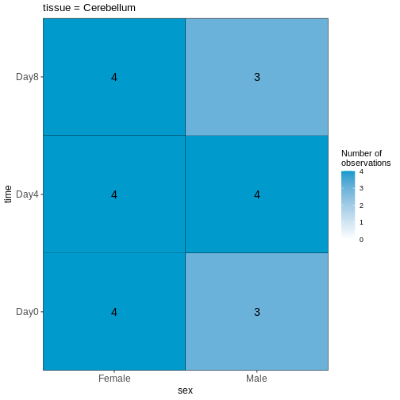

``` output

$`tissue = Spinalcord`
```

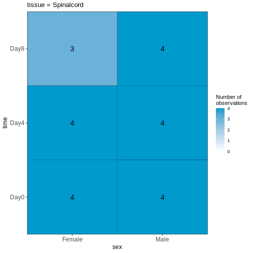

:::::::::::::::::::::::::::::::::::::::  challenge

### 課題

この可視化結果を踏まえると、このデータセットはバランスが取れていると言えますか？あるいは、予測変数の組み合わせにおいて著しく過少または過剰表現されているケースが存在するでしょうか？

::::::::::::::::::::::::::::::::::::::::::::::::::

## 雄雌および非感染脊髄の比較解析

次に、最初のdesign matricesを設定します。
ここでは、非感染状態（Day0）の脊髄サンプルに焦点を当て、雄マウスと雌マウスを比較することを目的とします。
そこで、まずメタデータを対象サンプルのみに絞り込み、次に単一の予測変数（性別）を用いてdesign matricesを設定し可視化します。
design formulaを `~ sex` と定義することで、Rに対してdesign matricesに切片項を含めるよう指示します。
この切片項は、予測変数の「基準レベル」を表し、この場合は「雌マウス」が基準として選択されます。
特に指定がない場合、Rは予測変数の値をアルファベット順に並べ替え、最初の値を参照レベルまたは基準レベルとして自動的に選択します。


``` r
## Subset metadata
meta_noninf_spc <- meta %>% filter(time == "Day0" & 
                                       tissue == "Spinalcord")
meta_noninf_spc
```

``` output
                     title geo_accession     organism     age    sex
GSM2545356 CNS_RNA-seq_574    GSM2545356 Mus musculus 8 weeks   Male
GSM2545357 CNS_RNA-seq_575    GSM2545357 Mus musculus 8 weeks   Male
GSM2545358 CNS_RNA-seq_583    GSM2545358 Mus musculus 8 weeks Female
GSM2545361 CNS_RNA-seq_590    GSM2545361 Mus musculus 8 weeks   Male
GSM2545364 CNS_RNA-seq_709    GSM2545364 Mus musculus 8 weeks Female
GSM2545365 CNS_RNA-seq_710    GSM2545365 Mus musculus 8 weeks Female
GSM2545366 CNS_RNA-seq_711    GSM2545366 Mus musculus 8 weeks Female
GSM2545367 CNS_RNA-seq_713    GSM2545367 Mus musculus 8 weeks   Male
             infection  strain time     tissue mouse
GSM2545356 NonInfected C57BL/6 Day0 Spinalcord     2
GSM2545357 NonInfected C57BL/6 Day0 Spinalcord     3
GSM2545358 NonInfected C57BL/6 Day0 Spinalcord     4
GSM2545361 NonInfected C57BL/6 Day0 Spinalcord     7
GSM2545364 NonInfected C57BL/6 Day0 Spinalcord     8
GSM2545365 NonInfected C57BL/6 Day0 Spinalcord     9
GSM2545366 NonInfected C57BL/6 Day0 Spinalcord    10
GSM2545367 NonInfected C57BL/6 Day0 Spinalcord    11
```

``` r
## Use ExploreModelMatrix to create a design matrix and visualizations, given 
## the desired design formula. 
vd <- VisualizeDesign(sampleData = meta_noninf_spc, 
                      designFormula = ~ sex)
vd$designmatrix
```

``` output
           (Intercept) sexMale
GSM2545356           1       1
GSM2545357           1       1
GSM2545358           1       0
GSM2545361           1       1
GSM2545364           1       0
GSM2545365           1       0
GSM2545366           1       0
GSM2545367           1       1
```

``` r
vd$plotlist
```

``` output
[[1]]
```

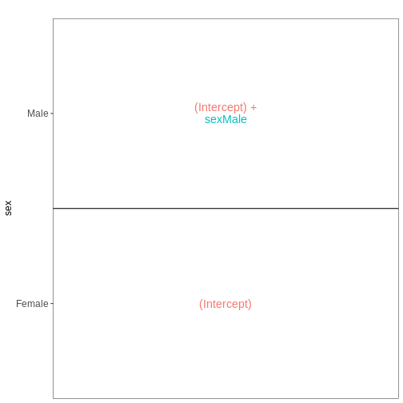

``` r
## Note that we can also generate the design matrix like this
model.matrix(~ sex, data = meta_noninf_spc)
```

``` output
           (Intercept) sexMale
GSM2545356           1       1
GSM2545357           1       1
GSM2545358           1       0
GSM2545361           1       1
GSM2545364           1       0
GSM2545365           1       0
GSM2545366           1       0
GSM2545367           1       1
attr(,"assign")
[1] 0 1
attr(,"contrasts")
attr(,"contrasts")$sex
[1] "contr.treatment"
```

:::::::::::::::::::::::::::::::::::::::  challenge

### 課題

この設計において、`sexMale` 係数はどのような解釈が可能でしょうか？

::::::::::::::::::::::::::::::::::::::::::::::::::

:::::::::::::::::::::::::::::::::::::::  challenge

### 課題

Day0時点の雄雌脊髄組織サンプルを比較するため、前述の設計式を設定してください。ただし、Rに対してモデルに切片項を含めないよう指示してください。この変更は各係数の解釈にどのような影響を与えるでしょうか？また、雄マウスと雌マウス間で特定の遺伝子の平均発現量を比較するには、どのような対比を指定する必要があるでしょうか？

:::::::::::::::  solution

### 解答


``` r
meta_noninf_spc <- meta %>% filter(time == "Day0" & 
                                       tissue == "Spinalcord")
meta_noninf_spc
```

``` output
                     title geo_accession     organism     age    sex
GSM2545356 CNS_RNA-seq_574    GSM2545356 Mus musculus 8 weeks   Male
GSM2545357 CNS_RNA-seq_575    GSM2545357 Mus musculus 8 weeks   Male
GSM2545358 CNS_RNA-seq_583    GSM2545358 Mus musculus 8 weeks Female
GSM2545361 CNS_RNA-seq_590    GSM2545361 Mus musculus 8 weeks   Male
GSM2545364 CNS_RNA-seq_709    GSM2545364 Mus musculus 8 weeks Female
GSM2545365 CNS_RNA-seq_710    GSM2545365 Mus musculus 8 weeks Female
GSM2545366 CNS_RNA-seq_711    GSM2545366 Mus musculus 8 weeks Female
GSM2545367 CNS_RNA-seq_713    GSM2545367 Mus musculus 8 weeks   Male
             infection  strain time     tissue mouse
GSM2545356 NonInfected C57BL/6 Day0 Spinalcord     2
GSM2545357 NonInfected C57BL/6 Day0 Spinalcord     3
GSM2545358 NonInfected C57BL/6 Day0 Spinalcord     4
GSM2545361 NonInfected C57BL/6 Day0 Spinalcord     7
GSM2545364 NonInfected C57BL/6 Day0 Spinalcord     8
GSM2545365 NonInfected C57BL/6 Day0 Spinalcord     9
GSM2545366 NonInfected C57BL/6 Day0 Spinalcord    10
GSM2545367 NonInfected C57BL/6 Day0 Spinalcord    11
```

``` r
vd <- VisualizeDesign(sampleData = meta_noninf_spc, 
                      designFormula = ~ 0 + sex)
vd$designmatrix
```

``` output
           sexFemale sexMale
GSM2545356         0       1
GSM2545357         0       1
GSM2545358         1       0
GSM2545361         0       1
GSM2545364         1       0
GSM2545365         1       0
GSM2545366         1       0
GSM2545367         0       1
```

``` r
vd$plotlist
```

``` output
[[1]]
```

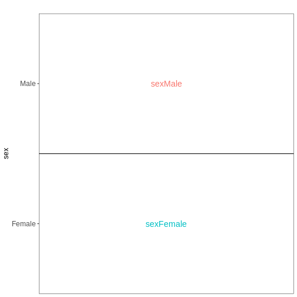

:::::::::::::::::::::::::

::::::::::::::::::::::::::::::::::::::::::::::::::

:::::::::::::::::::::::::::::::::::::::  challenge

### 課題

男性脊髄組織サンプルにおける3時点（Day0、Day4、Day8）を比較するためのdesign formulaを設定し、`ExploreModelMatrix`を使用してその結果を可視化してください。

:::::::::::::::  solution

### Solution


``` r
meta_male_spc <- meta %>% filter(sex == "Male" & tissue == "Spinalcord")
meta_male_spc
```

``` output
                     title geo_accession     organism     age  sex   infection
GSM2545355 CNS_RNA-seq_571    GSM2545355 Mus musculus 8 weeks Male  InfluenzaA
GSM2545356 CNS_RNA-seq_574    GSM2545356 Mus musculus 8 weeks Male NonInfected
GSM2545357 CNS_RNA-seq_575    GSM2545357 Mus musculus 8 weeks Male NonInfected
GSM2545360 CNS_RNA-seq_589    GSM2545360 Mus musculus 8 weeks Male  InfluenzaA
GSM2545361 CNS_RNA-seq_590    GSM2545361 Mus musculus 8 weeks Male NonInfected
GSM2545367 CNS_RNA-seq_713    GSM2545367 Mus musculus 8 weeks Male NonInfected
GSM2545368 CNS_RNA-seq_728    GSM2545368 Mus musculus 8 weeks Male  InfluenzaA
GSM2545369 CNS_RNA-seq_729    GSM2545369 Mus musculus 8 weeks Male  InfluenzaA
GSM2545372 CNS_RNA-seq_733    GSM2545372 Mus musculus 8 weeks Male  InfluenzaA
GSM2545373 CNS_RNA-seq_735    GSM2545373 Mus musculus 8 weeks Male  InfluenzaA
GSM2545378 CNS_RNA-seq_742    GSM2545378 Mus musculus 8 weeks Male  InfluenzaA
GSM2545379 CNS_RNA-seq_743    GSM2545379 Mus musculus 8 weeks Male  InfluenzaA
            strain time     tissue mouse
GSM2545355 C57BL/6 Day4 Spinalcord     1
GSM2545356 C57BL/6 Day0 Spinalcord     2
GSM2545357 C57BL/6 Day0 Spinalcord     3
GSM2545360 C57BL/6 Day8 Spinalcord     6
GSM2545361 C57BL/6 Day0 Spinalcord     7
GSM2545367 C57BL/6 Day0 Spinalcord    11
GSM2545368 C57BL/6 Day4 Spinalcord    12
GSM2545369 C57BL/6 Day4 Spinalcord    13
GSM2545372 C57BL/6 Day8 Spinalcord    17
GSM2545373 C57BL/6 Day4 Spinalcord    18
GSM2545378 C57BL/6 Day8 Spinalcord    23
GSM2545379 C57BL/6 Day8 Spinalcord    24
```

``` r
vd <- VisualizeDesign(sampleData = meta_male_spc, designFormula = ~ time)
vd$designmatrix
```

``` output
           (Intercept) timeDay4 timeDay8
GSM2545355           1        1        0
GSM2545356           1        0        0
GSM2545357           1        0        0
GSM2545360           1        0        1
GSM2545361           1        0        0
GSM2545367           1        0        0
GSM2545368           1        1        0
GSM2545369           1        1        0
GSM2545372           1        0        1
GSM2545373           1        1        0
GSM2545378           1        0        1
GSM2545379           1        0        1
```

``` r
vd$plotlist
```

``` output
[[1]]
```

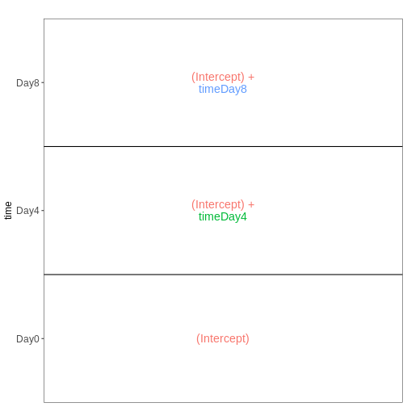

:::::::::::::::::::::::::

::::::::::::::::::::::::::::::::::::::::::::::::::

## 交互作用のないファクトリアルデザイン

次に、再び非感染マウスのみを対象に、性別と組織を予測因子として組み込んだモデルを構築します。
組織間の差異は雄マウスと雌マウスで同等であると仮定し、したがって交互作用項を含まない加算モデルを適用します。


``` r
meta_noninf <- meta %>% filter(time == "Day0")
meta_noninf
```

``` output
                     title geo_accession     organism     age    sex
GSM2545337 CNS_RNA-seq_11C    GSM2545337 Mus musculus 8 weeks Female
GSM2545338 CNS_RNA-seq_12C    GSM2545338 Mus musculus 8 weeks Female
GSM2545343 CNS_RNA-seq_20C    GSM2545343 Mus musculus 8 weeks   Male
GSM2545348 CNS_RNA-seq_27C    GSM2545348 Mus musculus 8 weeks Female
GSM2545349 CNS_RNA-seq_28C    GSM2545349 Mus musculus 8 weeks   Male
GSM2545353  CNS_RNA-seq_3C    GSM2545353 Mus musculus 8 weeks Female
GSM2545354  CNS_RNA-seq_4C    GSM2545354 Mus musculus 8 weeks   Male
GSM2545356 CNS_RNA-seq_574    GSM2545356 Mus musculus 8 weeks   Male
GSM2545357 CNS_RNA-seq_575    GSM2545357 Mus musculus 8 weeks   Male
GSM2545358 CNS_RNA-seq_583    GSM2545358 Mus musculus 8 weeks Female
GSM2545361 CNS_RNA-seq_590    GSM2545361 Mus musculus 8 weeks   Male
GSM2545364 CNS_RNA-seq_709    GSM2545364 Mus musculus 8 weeks Female
GSM2545365 CNS_RNA-seq_710    GSM2545365 Mus musculus 8 weeks Female
GSM2545366 CNS_RNA-seq_711    GSM2545366 Mus musculus 8 weeks Female
GSM2545367 CNS_RNA-seq_713    GSM2545367 Mus musculus 8 weeks   Male
             infection  strain time     tissue mouse
GSM2545337 NonInfected C57BL/6 Day0 Cerebellum     9
GSM2545338 NonInfected C57BL/6 Day0 Cerebellum    10
GSM2545343 NonInfected C57BL/6 Day0 Cerebellum    11
GSM2545348 NonInfected C57BL/6 Day0 Cerebellum     8
GSM2545349 NonInfected C57BL/6 Day0 Cerebellum     7
GSM2545353 NonInfected C57BL/6 Day0 Cerebellum     4
GSM2545354 NonInfected C57BL/6 Day0 Cerebellum     2
GSM2545356 NonInfected C57BL/6 Day0 Spinalcord     2
GSM2545357 NonInfected C57BL/6 Day0 Spinalcord     3
GSM2545358 NonInfected C57BL/6 Day0 Spinalcord     4
GSM2545361 NonInfected C57BL/6 Day0 Spinalcord     7
GSM2545364 NonInfected C57BL/6 Day0 Spinalcord     8
GSM2545365 NonInfected C57BL/6 Day0 Spinalcord     9
GSM2545366 NonInfected C57BL/6 Day0 Spinalcord    10
GSM2545367 NonInfected C57BL/6 Day0 Spinalcord    11
```

``` r
vd <- VisualizeDesign(sampleData = meta_noninf, 
                      designFormula = ~ sex + tissue)
vd$designmatrix
```

``` output
           (Intercept) sexMale tissueSpinalcord
GSM2545337           1       0                0
GSM2545338           1       0                0
GSM2545343           1       1                0
GSM2545348           1       0                0
GSM2545349           1       1                0
GSM2545353           1       0                0
GSM2545354           1       1                0
GSM2545356           1       1                1
GSM2545357           1       1                1
GSM2545358           1       0                1
GSM2545361           1       1                1
GSM2545364           1       0                1
GSM2545365           1       0                1
GSM2545366           1       0                1
GSM2545367           1       1                1
```

``` r
vd$plotlist
```

``` output
[[1]]
```

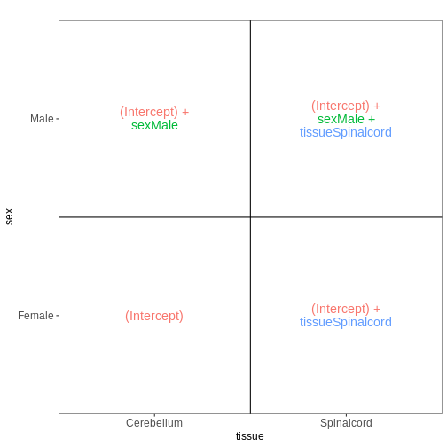

## 交互作用を考慮した要因計画

前回のモデルでは、組織間の差異は雄マウスと雌マウスで同等であると仮定していました。
性別ごとに異なる組織間差異を推定可能にするため（ただし推定すべき係数が1つ増加するというコストが生じます）、モデルに交互作用項を追加することができます。


``` r
meta_noninf <- meta %>% filter(time == "Day0")
meta_noninf
```

``` output
                     title geo_accession     organism     age    sex
GSM2545337 CNS_RNA-seq_11C    GSM2545337 Mus musculus 8 weeks Female
GSM2545338 CNS_RNA-seq_12C    GSM2545338 Mus musculus 8 weeks Female
GSM2545343 CNS_RNA-seq_20C    GSM2545343 Mus musculus 8 weeks   Male
GSM2545348 CNS_RNA-seq_27C    GSM2545348 Mus musculus 8 weeks Female
GSM2545349 CNS_RNA-seq_28C    GSM2545349 Mus musculus 8 weeks   Male
GSM2545353  CNS_RNA-seq_3C    GSM2545353 Mus musculus 8 weeks Female
GSM2545354  CNS_RNA-seq_4C    GSM2545354 Mus musculus 8 weeks   Male
GSM2545356 CNS_RNA-seq_574    GSM2545356 Mus musculus 8 weeks   Male
GSM2545357 CNS_RNA-seq_575    GSM2545357 Mus musculus 8 weeks   Male
GSM2545358 CNS_RNA-seq_583    GSM2545358 Mus musculus 8 weeks Female
GSM2545361 CNS_RNA-seq_590    GSM2545361 Mus musculus 8 weeks   Male
GSM2545364 CNS_RNA-seq_709    GSM2545364 Mus musculus 8 weeks Female
GSM2545365 CNS_RNA-seq_710    GSM2545365 Mus musculus 8 weeks Female
GSM2545366 CNS_RNA-seq_711    GSM2545366 Mus musculus 8 weeks Female
GSM2545367 CNS_RNA-seq_713    GSM2545367 Mus musculus 8 weeks   Male
             infection  strain time     tissue mouse
GSM2545337 NonInfected C57BL/6 Day0 Cerebellum     9
GSM2545338 NonInfected C57BL/6 Day0 Cerebellum    10
GSM2545343 NonInfected C57BL/6 Day0 Cerebellum    11
GSM2545348 NonInfected C57BL/6 Day0 Cerebellum     8
GSM2545349 NonInfected C57BL/6 Day0 Cerebellum     7
GSM2545353 NonInfected C57BL/6 Day0 Cerebellum     4
GSM2545354 NonInfected C57BL/6 Day0 Cerebellum     2
GSM2545356 NonInfected C57BL/6 Day0 Spinalcord     2
GSM2545357 NonInfected C57BL/6 Day0 Spinalcord     3
GSM2545358 NonInfected C57BL/6 Day0 Spinalcord     4
GSM2545361 NonInfected C57BL/6 Day0 Spinalcord     7
GSM2545364 NonInfected C57BL/6 Day0 Spinalcord     8
GSM2545365 NonInfected C57BL/6 Day0 Spinalcord     9
GSM2545366 NonInfected C57BL/6 Day0 Spinalcord    10
GSM2545367 NonInfected C57BL/6 Day0 Spinalcord    11
```

``` r
## Define a design including an interaction term
## Note that ~ sex * tissue is equivalent to 
## ~ sex + tissue + sex:tissue
vd <- VisualizeDesign(sampleData = meta_noninf, 
                      designFormula = ~ sex * tissue)
vd$designmatrix
```

``` output
           (Intercept) sexMale tissueSpinalcord sexMale:tissueSpinalcord
GSM2545337           1       0                0                        0
GSM2545338           1       0                0                        0
GSM2545343           1       1                0                        0
GSM2545348           1       0                0                        0
GSM2545349           1       1                0                        0
GSM2545353           1       0                0                        0
GSM2545354           1       1                0                        0
GSM2545356           1       1                1                        1
GSM2545357           1       1                1                        1
GSM2545358           1       0                1                        0
GSM2545361           1       1                1                        1
GSM2545364           1       0                1                        0
GSM2545365           1       0                1                        0
GSM2545366           1       0                1                        0
GSM2545367           1       1                1                        1
```

``` r
vd$plotlist
```

``` output
[[1]]
```

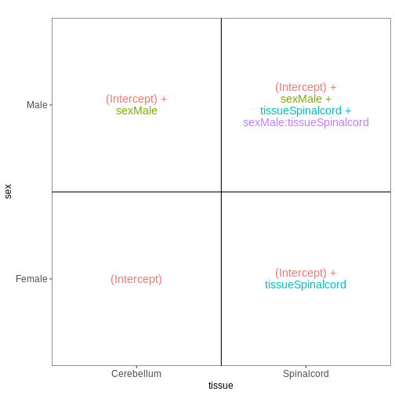

## 複数の因子を1つに統合する

複数の因子を含む実験において、因子を1つに統合することで、係数の解釈や目的とする対比の設定が容易になる場合があります。
この手法を用いて、先ほどの例を再度検討してみましょう：


``` r
meta_noninf <- meta %>% filter(time == "Day0")
meta_noninf$sex_tissue <- paste0(meta_noninf$sex, "_", meta_noninf$tissue)
meta_noninf
```

``` output
                     title geo_accession     organism     age    sex
GSM2545337 CNS_RNA-seq_11C    GSM2545337 Mus musculus 8 weeks Female
GSM2545338 CNS_RNA-seq_12C    GSM2545338 Mus musculus 8 weeks Female
GSM2545343 CNS_RNA-seq_20C    GSM2545343 Mus musculus 8 weeks   Male
GSM2545348 CNS_RNA-seq_27C    GSM2545348 Mus musculus 8 weeks Female
GSM2545349 CNS_RNA-seq_28C    GSM2545349 Mus musculus 8 weeks   Male
GSM2545353  CNS_RNA-seq_3C    GSM2545353 Mus musculus 8 weeks Female
GSM2545354  CNS_RNA-seq_4C    GSM2545354 Mus musculus 8 weeks   Male
GSM2545356 CNS_RNA-seq_574    GSM2545356 Mus musculus 8 weeks   Male
GSM2545357 CNS_RNA-seq_575    GSM2545357 Mus musculus 8 weeks   Male
GSM2545358 CNS_RNA-seq_583    GSM2545358 Mus musculus 8 weeks Female
GSM2545361 CNS_RNA-seq_590    GSM2545361 Mus musculus 8 weeks   Male
GSM2545364 CNS_RNA-seq_709    GSM2545364 Mus musculus 8 weeks Female
GSM2545365 CNS_RNA-seq_710    GSM2545365 Mus musculus 8 weeks Female
GSM2545366 CNS_RNA-seq_711    GSM2545366 Mus musculus 8 weeks Female
GSM2545367 CNS_RNA-seq_713    GSM2545367 Mus musculus 8 weeks   Male
             infection  strain time     tissue mouse        sex_tissue
GSM2545337 NonInfected C57BL/6 Day0 Cerebellum     9 Female_Cerebellum
GSM2545338 NonInfected C57BL/6 Day0 Cerebellum    10 Female_Cerebellum
GSM2545343 NonInfected C57BL/6 Day0 Cerebellum    11   Male_Cerebellum
GSM2545348 NonInfected C57BL/6 Day0 Cerebellum     8 Female_Cerebellum
GSM2545349 NonInfected C57BL/6 Day0 Cerebellum     7   Male_Cerebellum
GSM2545353 NonInfected C57BL/6 Day0 Cerebellum     4 Female_Cerebellum
GSM2545354 NonInfected C57BL/6 Day0 Cerebellum     2   Male_Cerebellum
GSM2545356 NonInfected C57BL/6 Day0 Spinalcord     2   Male_Spinalcord
GSM2545357 NonInfected C57BL/6 Day0 Spinalcord     3   Male_Spinalcord
GSM2545358 NonInfected C57BL/6 Day0 Spinalcord     4 Female_Spinalcord
GSM2545361 NonInfected C57BL/6 Day0 Spinalcord     7   Male_Spinalcord
GSM2545364 NonInfected C57BL/6 Day0 Spinalcord     8 Female_Spinalcord
GSM2545365 NonInfected C57BL/6 Day0 Spinalcord     9 Female_Spinalcord
GSM2545366 NonInfected C57BL/6 Day0 Spinalcord    10 Female_Spinalcord
GSM2545367 NonInfected C57BL/6 Day0 Spinalcord    11   Male_Spinalcord
```

``` r
vd <- VisualizeDesign(sampleData = meta_noninf, 
                      designFormula = ~ 0 + sex_tissue)
vd$designmatrix
```

``` output
           sex_tissueFemale_Cerebellum sex_tissueFemale_Spinalcord
GSM2545337                           1                           0
GSM2545338                           1                           0
GSM2545343                           0                           0
GSM2545348                           1                           0
GSM2545349                           0                           0
GSM2545353                           1                           0
GSM2545354                           0                           0
GSM2545356                           0                           0
GSM2545357                           0                           0
GSM2545358                           0                           1
GSM2545361                           0                           0
GSM2545364                           0                           1
GSM2545365                           0                           1
GSM2545366                           0                           1
GSM2545367                           0                           0
           sex_tissueMale_Cerebellum sex_tissueMale_Spinalcord
GSM2545337                         0                         0
GSM2545338                         0                         0
GSM2545343                         1                         0
GSM2545348                         0                         0
GSM2545349                         1                         0
GSM2545353                         0                         0
GSM2545354                         1                         0
GSM2545356                         0                         1
GSM2545357                         0                         1
GSM2545358                         0                         0
GSM2545361                         0                         1
GSM2545364                         0                         0
GSM2545365                         0                         0
GSM2545366                         0                         0
GSM2545367                         0                         1
```

``` r
vd$plotlist
```

``` output
[[1]]
```

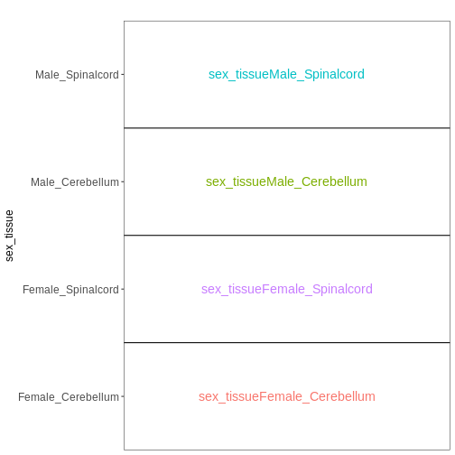

## ペアデザイン

本データセットでは、サンプルがペアとして収集されています。すなわち、同一のマウスから大脳小脳と脊髄の両方のサンプルが採取されています。
この情報は従来のモデルでは考慮されていませんでした。
しかし、この情報をモデルに組み込むことで、マウス間のベースライン発現レベルのばらつきを排除し、組織間の差異を検出する検出力を向上させることが可能になります。
ここでは、雌の非感染マウスを対象に、マウス間のベースライン差異を考慮した上で組織間の差異を検証するためのペアデザインを定義します。


``` r
meta_fem_day0 <- meta %>% filter(sex == "Female" & 
                                     time == "Day0")

# ensure that mouse is treated as a categorical variable
meta_fem_day0$mouse <- factor(meta_fem_day0$mouse)

meta_fem_day0
```

``` output
                     title geo_accession     organism     age    sex
GSM2545337 CNS_RNA-seq_11C    GSM2545337 Mus musculus 8 weeks Female
GSM2545338 CNS_RNA-seq_12C    GSM2545338 Mus musculus 8 weeks Female
GSM2545348 CNS_RNA-seq_27C    GSM2545348 Mus musculus 8 weeks Female
GSM2545353  CNS_RNA-seq_3C    GSM2545353 Mus musculus 8 weeks Female
GSM2545358 CNS_RNA-seq_583    GSM2545358 Mus musculus 8 weeks Female
GSM2545364 CNS_RNA-seq_709    GSM2545364 Mus musculus 8 weeks Female
GSM2545365 CNS_RNA-seq_710    GSM2545365 Mus musculus 8 weeks Female
GSM2545366 CNS_RNA-seq_711    GSM2545366 Mus musculus 8 weeks Female
             infection  strain time     tissue mouse
GSM2545337 NonInfected C57BL/6 Day0 Cerebellum     9
GSM2545338 NonInfected C57BL/6 Day0 Cerebellum    10
GSM2545348 NonInfected C57BL/6 Day0 Cerebellum     8
GSM2545353 NonInfected C57BL/6 Day0 Cerebellum     4
GSM2545358 NonInfected C57BL/6 Day0 Spinalcord     4
GSM2545364 NonInfected C57BL/6 Day0 Spinalcord     8
GSM2545365 NonInfected C57BL/6 Day0 Spinalcord     9
GSM2545366 NonInfected C57BL/6 Day0 Spinalcord    10
```

``` r
vd <- VisualizeDesign(sampleData = meta_fem_day0,
                      designFormula = ~ mouse + tissue)
vd$designmatrix
```

``` output
           (Intercept) mouse8 mouse9 mouse10 tissueSpinalcord
GSM2545337           1      0      1       0                0
GSM2545338           1      0      0       1                0
GSM2545348           1      1      0       0                0
GSM2545353           1      0      0       0                0
GSM2545358           1      0      0       0                1
GSM2545364           1      1      0       0                1
GSM2545365           1      0      1       0                1
GSM2545366           1      0      0       1                1
```

``` r
vd$plotlist
```

``` output
[[1]]
```

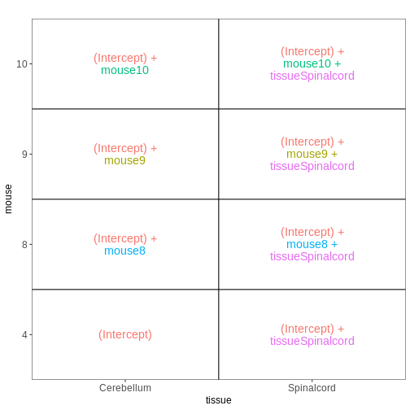

## 被験者内比較と被験者間比較

場合によっては、前述した2種類のモデルを組み合わせる必要があります。
例えば、感染マウスと非感染マウスの雌個体間で組織学的差異に違いがあるかどうかを調査したい場合を考えてみましょう。
この場合、各マウスはいずれか一方の感染群にのみ寄与します（各マウスは感染群か非感染群のいずれかに分類されます）が、小脳と脊髄の両方の組織サンプルを提供します。
この実験デザインを解釈する一つの方法は、各感染群ごとに2つのペア実験として捉えることです（[edgeRユーザーガイド 第3.5節](https://www.bioconductor.org/packages/release/bioc/vignettes/edgeR/inst/doc/edgeRUsersGuide.pdf)参照）。
この手法を用いれば、各感染群における2種類の組織を容易に比較でき、さらに感染群間の組織学的差異を対比することが可能になります。


``` r
meta_fem_day04 <- meta %>% 
    filter(sex == "Female" & 
               time %in% c("Day0", "Day4")) %>%
    droplevels()
# ensure that mouse is treated as a categorical variable
meta_fem_day04$mouse <- factor(meta_fem_day04$mouse)

meta_fem_day04
```

``` output
                     title geo_accession     organism     age    sex
GSM2545337 CNS_RNA-seq_11C    GSM2545337 Mus musculus 8 weeks Female
GSM2545338 CNS_RNA-seq_12C    GSM2545338 Mus musculus 8 weeks Female
GSM2545339 CNS_RNA-seq_13C    GSM2545339 Mus musculus 8 weeks Female
GSM2545344 CNS_RNA-seq_21C    GSM2545344 Mus musculus 8 weeks Female
GSM2545348 CNS_RNA-seq_27C    GSM2545348 Mus musculus 8 weeks Female
GSM2545352 CNS_RNA-seq_30C    GSM2545352 Mus musculus 8 weeks Female
GSM2545353  CNS_RNA-seq_3C    GSM2545353 Mus musculus 8 weeks Female
GSM2545358 CNS_RNA-seq_583    GSM2545358 Mus musculus 8 weeks Female
GSM2545362  CNS_RNA-seq_5C    GSM2545362 Mus musculus 8 weeks Female
GSM2545364 CNS_RNA-seq_709    GSM2545364 Mus musculus 8 weeks Female
GSM2545365 CNS_RNA-seq_710    GSM2545365 Mus musculus 8 weeks Female
GSM2545366 CNS_RNA-seq_711    GSM2545366 Mus musculus 8 weeks Female
GSM2545371 CNS_RNA-seq_731    GSM2545371 Mus musculus 8 weeks Female
GSM2545375 CNS_RNA-seq_738    GSM2545375 Mus musculus 8 weeks Female
GSM2545376 CNS_RNA-seq_740    GSM2545376 Mus musculus 8 weeks Female
GSM2545377 CNS_RNA-seq_741    GSM2545377 Mus musculus 8 weeks Female
             infection  strain time     tissue mouse
GSM2545337 NonInfected C57BL/6 Day0 Cerebellum     9
GSM2545338 NonInfected C57BL/6 Day0 Cerebellum    10
GSM2545339  InfluenzaA C57BL/6 Day4 Cerebellum    15
GSM2545344  InfluenzaA C57BL/6 Day4 Cerebellum    22
GSM2545348 NonInfected C57BL/6 Day0 Cerebellum     8
GSM2545352  InfluenzaA C57BL/6 Day4 Cerebellum    21
GSM2545353 NonInfected C57BL/6 Day0 Cerebellum     4
GSM2545358 NonInfected C57BL/6 Day0 Spinalcord     4
GSM2545362  InfluenzaA C57BL/6 Day4 Cerebellum    20
GSM2545364 NonInfected C57BL/6 Day0 Spinalcord     8
GSM2545365 NonInfected C57BL/6 Day0 Spinalcord     9
GSM2545366 NonInfected C57BL/6 Day0 Spinalcord    10
GSM2545371  InfluenzaA C57BL/6 Day4 Spinalcord    15
GSM2545375  InfluenzaA C57BL/6 Day4 Spinalcord    20
GSM2545376  InfluenzaA C57BL/6 Day4 Spinalcord    21
GSM2545377  InfluenzaA C57BL/6 Day4 Spinalcord    22
```

``` r
design <- model.matrix(~ mouse, data = meta_fem_day04)
design <- cbind(design, 
                Spc.Day0 = meta_fem_day04$tissue == "Spinalcord" & 
                    meta_fem_day04$time == "Day0",
                Spc.Day4 = meta_fem_day04$tissue == "Spinalcord" & 
                    meta_fem_day04$time == "Day4")
rownames(design) <- rownames(meta_fem_day04)
design
```

``` output
           (Intercept) mouse8 mouse9 mouse10 mouse15 mouse20 mouse21 mouse22
GSM2545337           1      0      1       0       0       0       0       0
GSM2545338           1      0      0       1       0       0       0       0
GSM2545339           1      0      0       0       1       0       0       0
GSM2545344           1      0      0       0       0       0       0       1
GSM2545348           1      1      0       0       0       0       0       0
GSM2545352           1      0      0       0       0       0       1       0
GSM2545353           1      0      0       0       0       0       0       0
GSM2545358           1      0      0       0       0       0       0       0
GSM2545362           1      0      0       0       0       1       0       0
GSM2545364           1      1      0       0       0       0       0       0
GSM2545365           1      0      1       0       0       0       0       0
GSM2545366           1      0      0       1       0       0       0       0
GSM2545371           1      0      0       0       1       0       0       0
GSM2545375           1      0      0       0       0       1       0       0
GSM2545376           1      0      0       0       0       0       1       0
GSM2545377           1      0      0       0       0       0       0       1
           Spc.Day0 Spc.Day4
GSM2545337        0        0
GSM2545338        0        0
GSM2545339        0        0
GSM2545344        0        0
GSM2545348        0        0
GSM2545352        0        0
GSM2545353        0        0
GSM2545358        1        0
GSM2545362        0        0
GSM2545364        1        0
GSM2545365        1        0
GSM2545366        1        0
GSM2545371        0        1
GSM2545375        0        1
GSM2545376        0        1
GSM2545377        0        1
```

``` r
vd <- VisualizeDesign(sampleData = meta_fem_day04 %>%
                          select(time, tissue, mouse),
                      designFormula = NULL, 
                      designMatrix = design, flipCoordFitted = FALSE)
vd$designmatrix
```

``` output
           (Intercept) mouse8 mouse9 mouse10 mouse15 mouse20 mouse21 mouse22
GSM2545337           1      0      1       0       0       0       0       0
GSM2545338           1      0      0       1       0       0       0       0
GSM2545339           1      0      0       0       1       0       0       0
GSM2545344           1      0      0       0       0       0       0       1
GSM2545348           1      1      0       0       0       0       0       0
GSM2545352           1      0      0       0       0       0       1       0
GSM2545353           1      0      0       0       0       0       0       0
GSM2545358           1      0      0       0       0       0       0       0
GSM2545362           1      0      0       0       0       1       0       0
GSM2545364           1      1      0       0       0       0       0       0
GSM2545365           1      0      1       0       0       0       0       0
GSM2545366           1      0      0       1       0       0       0       0
GSM2545371           1      0      0       0       1       0       0       0
GSM2545375           1      0      0       0       0       1       0       0
GSM2545376           1      0      0       0       0       0       1       0
GSM2545377           1      0      0       0       0       0       0       1
           Spc.Day0 Spc.Day4
GSM2545337        0        0
GSM2545338        0        0
GSM2545339        0        0
GSM2545344        0        0
GSM2545348        0        0
GSM2545352        0        0
GSM2545353        0        0
GSM2545358        1        0
GSM2545362        0        0
GSM2545364        1        0
GSM2545365        1        0
GSM2545366        1        0
GSM2545371        0        1
GSM2545375        0        1
GSM2545376        0        1
GSM2545377        0        1
```

``` r
vd$plotlist
```

``` output
$`time = Day0`
```

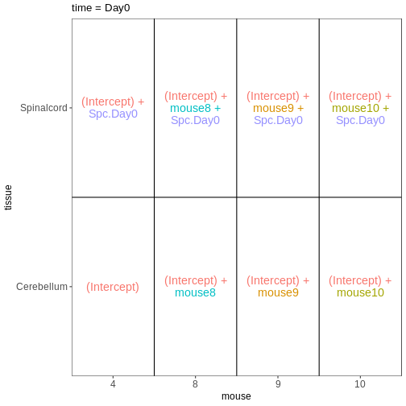

``` output

$`time = Day4`
```

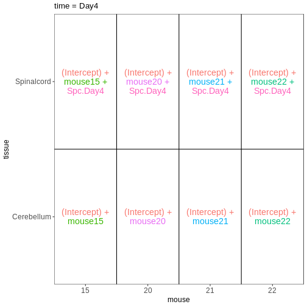

## この内容は、前回のエピソードで行った DESeq2 解析とどのように関連しているのでしょうか？

設計行列の解釈方法についてさらに理解を深めたところで、前回のエピソードで行った差異発現解析を振り返ってみましょう。
ここでは主要なコードの流れを改めて説明します。


``` r
se <- readRDS("data/GSE96870_se.rds")
se <- se[rowSums(assay(se, "counts")) > 5, ]
dds <- DESeq2::DESeqDataSet(se, design = ~ sex + time)
dds <- DESeq(dds)
```

``` output
estimating size factors
```

``` output
estimating dispersions
```

``` output
gene-wise dispersion estimates
```

``` output
mean-dispersion relationship
```

``` output
final dispersion estimates
```

``` output
fitting model and testing
```

`DESeq2` では、design matricesがオブジェクト内に以下のように格納されます：


``` r
attr(dds, "modelMatrix")
```

``` output
               Intercept sex_Male_vs_Female time_Day4_vs_Day0 time_Day8_vs_Day0
Female_Day0_9          1                  0                 0                 0
Female_Day0_10         1                  0                 0                 0
Female_Day0_8          1                  0                 0                 0
Female_Day0_4          1                  0                 0                 0
Male_Day0_11           1                  1                 0                 0
Male_Day0_7            1                  1                 0                 0
Male_Day0_2            1                  1                 0                 0
Female_Day4_15         1                  0                 1                 0
Female_Day4_22         1                  0                 1                 0
Female_Day4_21         1                  0                 1                 0
Female_Day4_20         1                  0                 1                 0
Male_Day4_18           1                  1                 1                 0
Male_Day4_13           1                  1                 1                 0
Male_Day4_1            1                  1                 1                 0
Male_Day4_12           1                  1                 1                 0
Female_Day8_14         1                  0                 0                 1
Female_Day8_5          1                  0                 0                 1
Female_Day8_16         1                  0                 0                 1
Female_Day8_19         1                  0                 0                 1
Male_Day8_6            1                  1                 0                 1
Male_Day8_23           1                  1                 0                 1
Male_Day8_24           1                  1                 0                 1
attr(,"assign")
[1] 0 1 2 2
attr(,"contrasts")
attr(,"contrasts")$sex
[1] "contr.treatment"

attr(,"contrasts")$time
[1] "contr.treatment"
```

列名は `resultsNames` 関数を使用して取得できます：


``` r
resultsNames(dds)
```

``` output
[1] "Intercept"          "sex_Male_vs_Female" "time_Day4_vs_Day0" 
[4] "time_Day8_vs_Day0" 
```

このデザインを可視化してみましょう：


``` r
vd <- VisualizeDesign(sampleData = colData(dds)[, c("sex", "time")], 
                      designMatrix = attr(dds, "modelMatrix"), 
                      flipCoordFitted = TRUE)
vd$plotlist
```

``` output
[[1]]
```

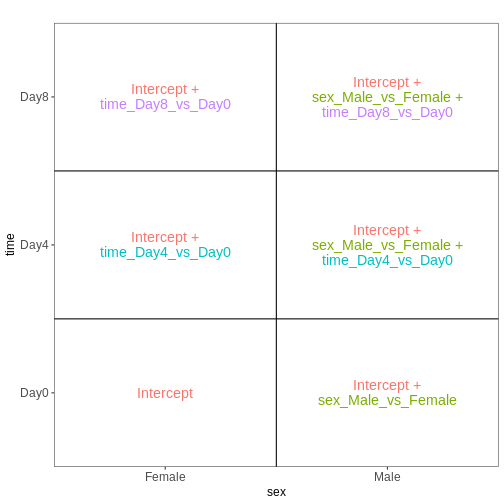

前回のエピソードでは、Day8のサンプルとDay0のサンプルを比較するテストを実施しました：


``` r
resTime <- results(dds, contrast = c("time", "Day8", "Day0"))
```

上記の図からわかるように、この比較はdesign matricesの4列目に対応する`time_Day8_vs_Day0`係数によって表現されています。
したがって、この検定における対比を別の方法で指定する場合、以下のように記述できます：


``` r
resTimeNum <- results(dds, contrast = c(0, 0, 0, 1))
```

結果が比較可能かどうかを確認してみましょう：


``` r
summary(resTime)
```

``` output

out of 27430 with nonzero total read count
adjusted p-value < 0.1
LFC > 0 (up)       : 4472, 16%
LFC < 0 (down)     : 4282, 16%
outliers [1]       : 10, 0.036%
low counts [2]     : 3723, 14%
(mean count < 1)
[1] see 'cooksCutoff' argument of ?results
[2] see 'independentFiltering' argument of ?results
```

``` r
summary(resTimeNum)
```

``` output

out of 27430 with nonzero total read count
adjusted p-value < 0.1
LFC > 0 (up)       : 4472, 16%
LFC < 0 (down)     : 4282, 16%
outliers [1]       : 10, 0.036%
low counts [2]     : 3723, 14%
(mean count < 1)
[1] see 'cooksCutoff' argument of ?results
[2] see 'independentFiltering' argument of ?results
```

``` r
## logFC
plot(resTime$log2FoldChange, resTimeNum$log2FoldChange)
abline(0, 1)
```

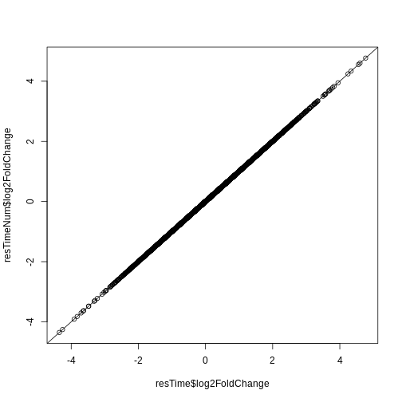

``` r
## -log10(p-value)
plot(-log10(resTime$pvalue), -log10(resTimeNum$pvalue))
abline(0, 1)
```

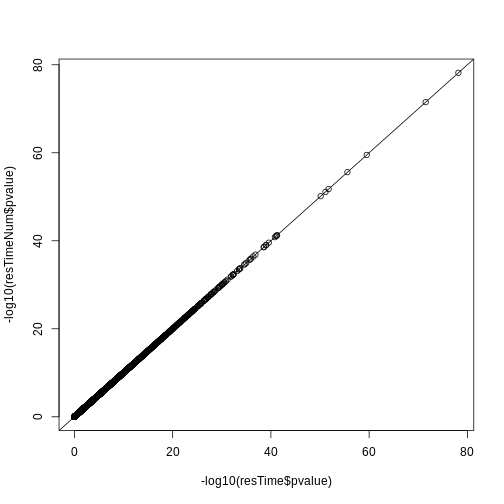

## 相互作用を考慮した DESeq2 解析の再実行

次に、異なる設定条件について検討します。
ここでは引き続き性別と時間を予測因子として考慮しますが、これらの間に相互作用項を導入します。
つまり、時間の影響が男性と女性で異なる可能性を認めるということです。


``` r
se <- readRDS("data/GSE96870_se.rds")
se <- se[rowSums(assay(se, "counts")) > 5, ]
dds <- DESeq2::DESeqDataSet(se, design = ~ sex * time)
dds <- DESeq(dds)
```

``` output
estimating size factors
```

``` output
estimating dispersions
```

``` output
gene-wise dispersion estimates
```

``` output
mean-dispersion relationship
```

``` output
final dispersion estimates
```

``` output
fitting model and testing
```

``` r
attr(dds, "modelMatrix")
```

``` output
               Intercept sex_Male_vs_Female time_Day4_vs_Day0 time_Day8_vs_Day0
Female_Day0_9          1                  0                 0                 0
Female_Day0_10         1                  0                 0                 0
Female_Day0_8          1                  0                 0                 0
Female_Day0_4          1                  0                 0                 0
Male_Day0_11           1                  1                 0                 0
Male_Day0_7            1                  1                 0                 0
Male_Day0_2            1                  1                 0                 0
Female_Day4_15         1                  0                 1                 0
Female_Day4_22         1                  0                 1                 0
Female_Day4_21         1                  0                 1                 0
Female_Day4_20         1                  0                 1                 0
Male_Day4_18           1                  1                 1                 0
Male_Day4_13           1                  1                 1                 0
Male_Day4_1            1                  1                 1                 0
Male_Day4_12           1                  1                 1                 0
Female_Day8_14         1                  0                 0                 1
Female_Day8_5          1                  0                 0                 1
Female_Day8_16         1                  0                 0                 1
Female_Day8_19         1                  0                 0                 1
Male_Day8_6            1                  1                 0                 1
Male_Day8_23           1                  1                 0                 1
Male_Day8_24           1                  1                 0                 1
               sexMale.timeDay4 sexMale.timeDay8
Female_Day0_9                 0                0
Female_Day0_10                0                0
Female_Day0_8                 0                0
Female_Day0_4                 0                0
Male_Day0_11                  0                0
Male_Day0_7                   0                0
Male_Day0_2                   0                0
Female_Day4_15                0                0
Female_Day4_22                0                0
Female_Day4_21                0                0
Female_Day4_20                0                0
Male_Day4_18                  1                0
Male_Day4_13                  1                0
Male_Day4_1                   1                0
Male_Day4_12                  1                0
Female_Day8_14                0                0
Female_Day8_5                 0                0
Female_Day8_16                0                0
Female_Day8_19                0                0
Male_Day8_6                   0                1
Male_Day8_23                  0                1
Male_Day8_24                  0                1
attr(,"assign")
[1] 0 1 2 2 3 3
attr(,"contrasts")
attr(,"contrasts")$sex
[1] "contr.treatment"

attr(,"contrasts")$time
[1] "contr.treatment"
```

このデザインを可視化してみましょう：


``` r
vd <- VisualizeDesign(sampleData = colData(dds)[, c("sex", "time")], 
                      designMatrix = attr(dds, "modelMatrix"), 
                      flipCoordFitted = TRUE)
vd$plotlist
```

``` output
[[1]]
```

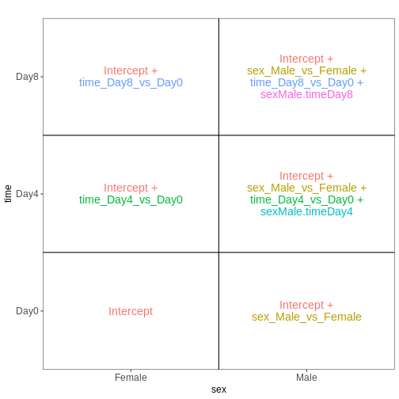

現在、`time_Day8_vs_Day0` 係数は **雌サンプル** における Day8 と Day0 の差を表しています。
雄サンプルに対応する差を求めるには、相互作用効果（`sexMale.timeDay8`）も追加する必要があります。


``` r
## Day8 vs Day0, female
resTimeFemale <- results(dds, contrast = c("time", "Day8", "Day0"))

## Interaction effect (difference in Day8-Day0 effect between Male and Female)
resTimeInt <- results(dds, name = "sexMale.timeDay8")
```

前述の第2のアプローチ、すなわち単一の因子を作成する方法を用いて、このモデルの適合を試みてみましょう。


``` r
se <- readRDS("data/GSE96870_se.rds")
se <- se[rowSums(assay(se, "counts")) > 5, ]
se$sex_time <- paste0(se$sex, "_", se$time)
dds <- DESeq2::DESeqDataSet(se, design = ~ 0 + sex_time)
dds <- DESeq(dds)
```

``` output
estimating size factors
```

``` output
estimating dispersions
```

``` output
gene-wise dispersion estimates
```

``` output
mean-dispersion relationship
```

``` output
final dispersion estimates
```

``` output
fitting model and testing
```

``` r
attr(dds, "modelMatrix")
```

``` output
               sex_timeFemale_Day0 sex_timeFemale_Day4 sex_timeFemale_Day8
Female_Day0_9                    1                   0                   0
Female_Day0_10                   1                   0                   0
Female_Day0_8                    1                   0                   0
Female_Day0_4                    1                   0                   0
Male_Day0_11                     0                   0                   0
Male_Day0_7                      0                   0                   0
Male_Day0_2                      0                   0                   0
Female_Day4_15                   0                   1                   0
Female_Day4_22                   0                   1                   0
Female_Day4_21                   0                   1                   0
Female_Day4_20                   0                   1                   0
Male_Day4_18                     0                   0                   0
Male_Day4_13                     0                   0                   0
Male_Day4_1                      0                   0                   0
Male_Day4_12                     0                   0                   0
Female_Day8_14                   0                   0                   1
Female_Day8_5                    0                   0                   1
Female_Day8_16                   0                   0                   1
Female_Day8_19                   0                   0                   1
Male_Day8_6                      0                   0                   0
Male_Day8_23                     0                   0                   0
Male_Day8_24                     0                   0                   0
               sex_timeMale_Day0 sex_timeMale_Day4 sex_timeMale_Day8
Female_Day0_9                  0                 0                 0
Female_Day0_10                 0                 0                 0
Female_Day0_8                  0                 0                 0
Female_Day0_4                  0                 0                 0
Male_Day0_11                   1                 0                 0
Male_Day0_7                    1                 0                 0
Male_Day0_2                    1                 0                 0
Female_Day4_15                 0                 0                 0
Female_Day4_22                 0                 0                 0
Female_Day4_21                 0                 0                 0
Female_Day4_20                 0                 0                 0
Male_Day4_18                   0                 1                 0
Male_Day4_13                   0                 1                 0
Male_Day4_1                    0                 1                 0
Male_Day4_12                   0                 1                 0
Female_Day8_14                 0                 0                 0
Female_Day8_5                  0                 0                 0
Female_Day8_16                 0                 0                 0
Female_Day8_19                 0                 0                 0
Male_Day8_6                    0                 0                 1
Male_Day8_23                   0                 0                 1
Male_Day8_24                   0                 0                 1
attr(,"assign")
[1] 1 1 1 1 1 1
attr(,"contrasts")
attr(,"contrasts")$sex_time
[1] "contr.treatment"
```

このデザインを再度可視化します：


``` r
vd <- VisualizeDesign(sampleData = colData(dds)[, c("sex", "time")], 
                      designMatrix = attr(dds, "modelMatrix"), 
                      flipCoordFitted = TRUE)
vd$plotlist
```

``` output
[[1]]
```

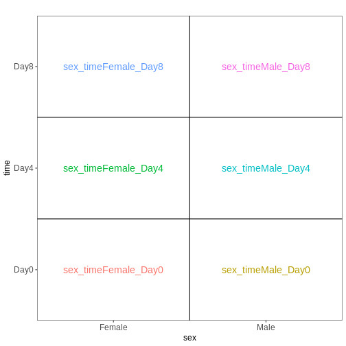

次に、前述と同様のコントラスト設定を行います


``` r
## Day8 vs Day0, female
resTimeFemaleSingle <- results(dds, contrast = c("sex_time", "Female_Day8", "Female_Day0"))

## Interaction effect (difference in Day8-Day0 effect between Male and Female)
resultsNames(dds)
```

``` output
[1] "sex_timeFemale_Day0" "sex_timeFemale_Day4" "sex_timeFemale_Day8"
[4] "sex_timeMale_Day0"   "sex_timeMale_Day4"   "sex_timeMale_Day8"  
```

``` r
resTimeIntSingle <- results(dds, contrast = c(1, 0, -1, -1, 0, 1))
```

これらの結果が、2つの因子と交互作用項を含むモデルを適合させた場合に得られる結果と一致することを確認してください。


``` r
summary(resTimeFemale)
```

``` output

out of 27430 with nonzero total read count
adjusted p-value < 0.1
LFC > 0 (up)       : 2969, 11%
LFC < 0 (down)     : 3218, 12%
outliers [1]       : 6, 0.022%
low counts [2]     : 6382, 23%
(mean count < 3)
[1] see 'cooksCutoff' argument of ?results
[2] see 'independentFiltering' argument of ?results
```

``` r
summary(resTimeFemaleSingle)
```

``` output

out of 27430 with nonzero total read count
adjusted p-value < 0.1
LFC > 0 (up)       : 2969, 11%
LFC < 0 (down)     : 3218, 12%
outliers [1]       : 6, 0.022%
low counts [2]     : 6382, 23%
(mean count < 3)
[1] see 'cooksCutoff' argument of ?results
[2] see 'independentFiltering' argument of ?results
```

``` r
plot(-log10(resTimeFemale$pvalue), -log10(resTimeFemaleSingle$pvalue))
abline(0, 1)
```

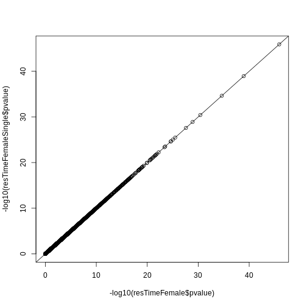

``` r
summary(resTimeInt)
```

``` output

out of 27430 with nonzero total read count
adjusted p-value < 0.1
LFC > 0 (up)       : 0, 0%
LFC < 0 (down)     : 0, 0%
outliers [1]       : 6, 0.022%
low counts [2]     : 0, 0%
(mean count < 0)
[1] see 'cooksCutoff' argument of ?results
[2] see 'independentFiltering' argument of ?results
```

``` r
summary(resTimeIntSingle)
```

``` output

out of 27430 with nonzero total read count
adjusted p-value < 0.1
LFC > 0 (up)       : 0, 0%
LFC < 0 (down)     : 0, 0%
outliers [1]       : 6, 0.022%
low counts [2]     : 0, 0%
(mean count < 0)
[1] see 'cooksCutoff' argument of ?results
[2] see 'independentFiltering' argument of ?results
```

``` r
plot(-log10(resTimeInt$pvalue), -log10(resTimeIntSingle$pvalue))
abline(0, 1)
```

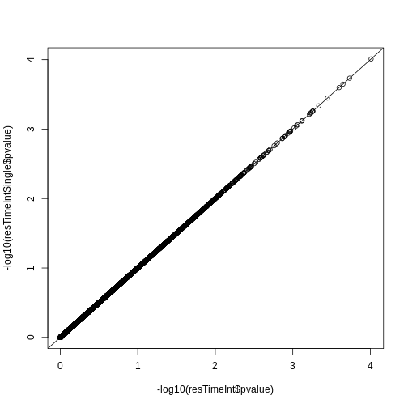

:::::::::::::::::::::::::::::::::::::::: keypoints

- R言語のformulaフレームワークを使用すると、設計行列を作成できます。この設計行列は、遺伝子発現レベルにおける系統的な差異に関連すると予想される変数の詳細を記述するものです。
- 比較対象として関心のある条件は、モデル係数の線形結合であるコントラストを用いて定義することができます。

::::::::::::::::::::::::::::::::::::::::::::::::::


