<style>
body h3 {
    margin-top: 50px;
}
</style>

::::::::::::::::::::::::::::::::::::::: objectives

- 遺伝子セットエンリッチメント解析の手法について学びます。
- R環境で様々なリソースから遺伝子セットを取得する方法について習得します。
- 遺伝子セットエンリッチメント解析の実施方法と、解析結果の可視化方法について学びます。

::::::::::::::::::::::::::::::::::::::::::::::::::

:::::::::::::::::::::::::::::::::::::::: questions

- 遺伝子セットエンリッチメント解析を実施する目的は何ですか？
- over-representation analysis の手法にはどのようなものがありますか？
- 一般的に使用されている遺伝子セットデータベースにはどのようなものがありますか？

::::::::::::::::::::::::::::::::::::::::::::::::::


発現変動遺伝子（DE遺伝子）のリストを取得した後、次に当然生じる疑問は、これらのDE遺伝子がどのような生物学的機能に影響を与える可能性があるかということです。遺伝子セットエンリッチメント解析（GSEA）では、事前に定義された遺伝子セット群に対して、DE遺伝子リストとの関連性を評価します。各遺伝子セットは特定の生物学的意味を持っています。DE遺伝子が特定の遺伝子セットに有意にエンリッチメントされている場合、対応する生物学的意味（例えば生物学的プロセスやパスウェイなど）が有意に影響を受けるという結論が導かれます。

遺伝子セットの定義は非常に柔軟であり、その構築方法も簡潔です。多くの場合、遺伝子セットは公共データベースから取得され、科学的なキュレーターによって遺伝子を明確な生物学的意味を持つグループに慎重に分類するための多大な労力が既に費やされています。ただし、遺伝子セットは個々の研究から独自に定義することも可能です。例えば、共発現ネットワーク解析におけるネットワークモジュールを構成する遺伝子群や、特定の疾患において発現が上昇する遺伝子群などがこれに該当します。

GSEA（Gene Set Enrichment Analysis）には数多くの分析手法が存在します。このエピソードでは、最もシンプルでかつ最も広く用いられている手法である「過剰表現解析（Over-Representation Analysis: ORA）」について解説します。ORAは差異発現遺伝子リストに直接適用可能な手法で、異なるカテゴリーにおける遺伝子数に基づいて、差異発現遺伝子と遺伝子セットとの関連性を評価します。

ORA（Over-Representation Analysis）は汎用性の高い手法であり、DE遺伝子リストだけでなく、研究対象とする任意の遺伝子リストに対しても適用可能です。これにより、それらの遺伝子群が統計的に有意に関連する生物学的意義を明らかにすることができます。

本エピソードでは、ORA（Over-Representation Analysis）という統計手法を説明するための簡単な事例から始めます。続いて、生物学分野で広く利用されている複数の遺伝子セットデータベースを紹介し、R環境でのアクセス方法について解説します。その後、Bioconductorパッケージである**clusterProfiler**を用いたORA解析の実施方法を学びます。最後に、GSEA（Gene Set Enrichment Analysis）の結果を可視化するためのいくつかの手法を習得します。

本エピソードで使用するパッケージの一覧は以下の通りです：


``` r
library(SummarizedExperiment)
library(DESeq2)
library(gplots)
library(microbenchmark)
library(org.Hs.eg.db)
library(org.Mm.eg.db)
library(msigdb)
library(clusterProfiler)
library(enrichplot)
library(ggplot2)
library(simplifyEnrichment)
```


## 統計的手法について

ORA解析の具体例を示すため、性別間比較によって得られた発現変動遺伝子リストを使用します。以下のコードでは、前エピソードで既に学習済みの**DESeq2**解析を実行します。最終的に、FDR値が0.05未満にフィルタリングされた発現変動遺伝子リストを取得し、これをオブジェクト`sexDEgenes`として保存します。

ファイル `data/GSE96870_se.rds` には、[エピソード2](../episodes/02-setup.Rmd) でダウンロードし、[エピソード3](../episodes/03-import-annotate.Rmd) で構築した RNA-Seq カウントデータを含む `RangedSummarizedExperiment` オブジェクトが格納されています（ダウンロードおよび構築のための最小限のコードは、スクリプト [`download_data.R`](https://github.com/carpentries-incubator/bioc-rnaseq/blob/main/episodes/download_data.R) に記載されています）。
以下のコードには、分析の各ステップを説明するコメントも記載されています。


``` r
library(SummarizedExperiment)
library(DESeq2)

# read the example dataset which is a `RangedSummarizedExperiment` object
se <- readRDS("data/GSE96870_se.rds")

# only restrict to mRNA (protein-coding genes)
se <- se[rowData(se)$gbkey == "mRNA"]

# construct a `DESeqDataSet` object where we also specify the experimental design
dds <- DESeqDataSet(se, design = ~ sex + time)
# perform DESeq2 analysis
dds <- DESeq(dds)
# obtain DESeq2 results, here we only want Male vs Female in the "sex" variable
resSex <- results(dds, contrast = c("sex", "Male", "Female"))
# extract DE genes with padj < 0.05
sexDE <- as.data.frame(subset(resSex, padj < 0.05))
# the list of DE genes
sexDEgenes <- rownames(sexDE)
```

DEGの数とその分布状況を確認してみましょう。DEGの数は一見非常に少ないように見えますが、今回の例ではこれが正常な状態です。


``` r
length(sexDEgenes)
```

``` output
[1] 54
```

``` r
head(sexDEgenes)
```

``` output
[1] "Lgr6"   "Myoc"   "Fibcd1" "Kcna4"  "Ctxn2"  "S100a9"
```

次に、性染色体上に位置する遺伝子を含む遺伝子セットを作成します（以下「_XY遺伝子セット_」と呼びます）。`RangedSummarizedExperiment`オブジェクトには遺伝子のゲノム位置情報も含まれているため、染色体名でフィルタリングするだけで性染色体上の遺伝子を簡単に取得できます。

以下のコードでは、`geneGR`は`GRanges`オブジェクトであり、`seqnames()`関数を適用して染色体名を抽出しています。`seqnames()`関数は特殊なデータ形式を返すため、`as.vector()`関数で明示的に通常のベクトル形式に変換する必要があります。


``` r
geneGR <- rowRanges(se)
totalGenes <- rownames(se)
XYGeneSet <- totalGenes[as.vector(seqnames(geneGR)) %in% c("X", "Y")]
head(XYGeneSet)
```

``` output
[1] "Gm21950"   "Gm14346"   "Gm14345"   "Gm14351"   "Spin2-ps1" "Gm3701"   
```

``` r
length(XYGeneSet)
```

``` output
[1] 1134
```

単一の遺伝子セットの形式は非常に単純で、単にベクトルとして表現されます。
このORA解析では、発現変動遺伝子ベクトルと遺伝子セットベクトルに対して解析が行われます。

先に進む前に、一つ重要な注意点を挙げておきます。ORA解析では2つの遺伝子ベクトルを扱います。これらのベクトル間で正しく対応付けを行うためには、両ベクトルの遺伝子IDタイプが一致している必要があります。この簡単な例では、DE遺伝子と_XY遺伝子セットの両方が同じオブジェクト`se`から取得されているため、同じ遺伝子IDタイプ（遺伝子シンボル）であることが保証されています。しかし実際には、DE遺伝子と遺伝子セットは通常異なるソースから取得されます（例えばDE遺伝子は研究者の実験データから、遺伝子セットは公開データベースから取得される場合が多いです）。このため、遺伝子IDタイプが一致していないケースが頻繁に発生します。このエピソードの後半では、ORA解析における遺伝子ID変換の方法について詳しく説明します。

DE遺伝子と遺伝子セットは数学的に2つの集合として扱えるため、
自然なアプローチとして、まずベン図を用いて可視化する方法が有効です。


``` r
library(gplots)
plot(venn(list("sexDEgenes"  = sexDEgenes, 
               "XY gene set" = XYGeneSet)))
title(paste0("|universe| = ", length(totalGenes)))
```

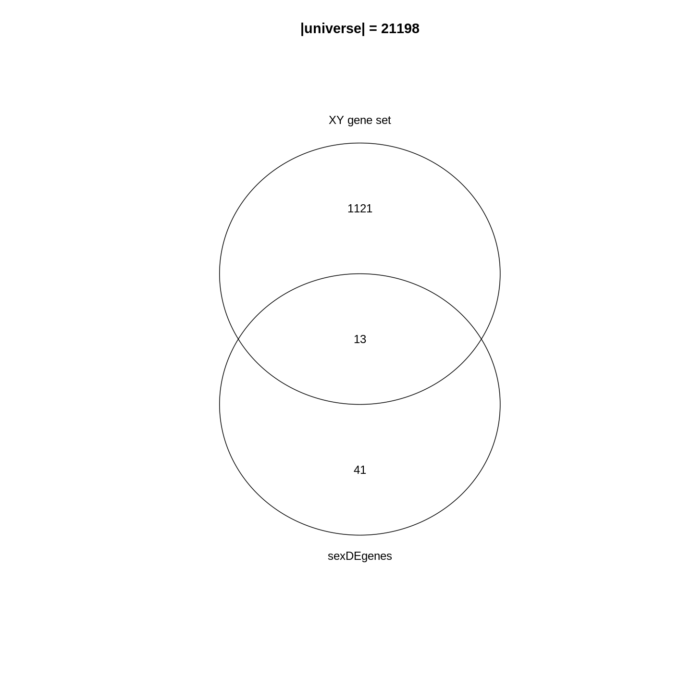

ベン図の分析結果から、_XY遺伝子セット_に含まれる遺伝子の約1.1%（13/1134）が発現変動遺伝子（DE遺伝子）であることがわかります。全遺伝子における発現変動遺伝子の割合（54/21198 = 0.25%）と比較すると、発現変動遺伝子とこの遺伝子セットとの間には強い関連性が存在することが示唆されます。さらに、遺伝子セットに属する発現変動遺伝子の割合（13/54 = 24.1%）と、ゲノム全体における_XY遺伝子セット_の割合（1134/21198 = 5.3%）を比較することも可能です。なお、この結果は生物学的に極めて妥当なものです。なぜなら、一方は性別間の比較に基づくデータであり、他方は性別に関連する遺伝子群の集合体という、いずれも生物学的に重要な事象を扱っているからです。

では、遺伝子セットのエンリッチメント度や過剰表現を統計的に測定するにはどうすればよいでしょうか？次のセクションに進みましょう。

### Fisher's 正確確率検定

エンリッチメント効果を統計的に評価するため、発現変動遺伝子群と遺伝子セットの関連性は、通常以下の2×2分割表に整理されます。この表では、各カテゴリーに属する遺伝子数が示されます。$n_{+1}$は対象遺伝子セット（XY遺伝子セット）のサイズ（すなわち構成遺伝子数）を、$n_{1+}$は発現変動遺伝子の数を、$n$は全遺伝子数をそれぞれ表します。

<center>
|            | In the gene set | Not in the gene set | Total
| ---------- | --------------- | --------------------| -------
|  **DE**    |     $n_{11}$    |    $n_{12}$         | $n_{1+}$
| **Not DE** |     $n_{21}$    |    $n_{22}$         | $n_{2+}$
| **Total**  |     $n_{+1}$    |    $n_{+2}$         | $n$
</center>

これらの数値は以下のコードで取得できます^[各ベクトル内の遺伝子は一意である必要があります]。なお、R変数名中の`+`は`0`に置き換えられている点にご注意ください。


``` r
n    <- nrow(se)
n_01 <- length(XYGeneSet)
n_10 <- length(sexDEgenes)
n_11 <- length(intersect(sexDEgenes, XYGeneSet))
```

その他の値は以下の方法で取得できます：


``` r
n_12 <- n_10 - n_11
n_21 <- n_01 - n_11
n_20 <- n    - n_10
n_02 <- n    - n_01
n_22 <- n_02 - n_12
```

すべての値は以下の通りです：


``` r
matrix(c(n_11, n_12, n_10, n_21, n_22, n_20, n_01, n_02, n),
    nrow = 3, byrow = TRUE)
```

``` output
     [,1]  [,2]  [,3]
[1,]   13    41    54
[2,] 1121 20023 21144
[3,] 1134 20064 21198
```

これらの数値を2×2分割表に入力します：


<center>
|            | In the gene set | Not in the gene set | Total
| ---------- | --------------- | --------------------| -------
|  **DE**    |     13    |    41         | 54
| **Not DE** |     1121    |    20023         | 21144
| **Total**  |     1134    |    20064         | 21198
</center>


フィッシャーの正確確率検定は、2つの周辺属性間の関連性を検定する際に使用できます。具体的には、遺伝子が発現変動遺伝子であるかどうかと、特定の遺伝子セット（例：_XY遺伝子セット_）に含まれるかどうかの間に依存関係が存在するかどうかを検証します。R言語では、この検定を実行するために`fisher.test()`関数を使用します。入力データとしては、左上の2×2サブマトリックスを指定します。関数の引数で`alternative = "greater"`と指定しているのは、過剰表現の有無のみに関心があるためです。


``` r
fisher.test(matrix(c(n_11, n_12, n_21, n_22), nrow = 2, byrow = TRUE),
    alternative = "greater")
```

``` output

	Fisher's Exact Test for Count Data

data:  matrix(c(n_11, n_12, n_21, n_22), nrow = 2, byrow = TRUE)
p-value = 3.906e-06
alternative hypothesis: true odds ratio is greater than 1
95 percent confidence interval:
 3.110607      Inf
sample estimates:
odds ratio 
  5.662486 
```

出力結果から、_p値_が非常に小さい値（`3.906e-06`）であることが確認できます。したがって、DE遺伝子が_XY遺伝子セット_に極めて強くエンリッチメントされていると結論付けることができます。

Fisherの正確確率検定の結果は、オブジェクト`t`として保存できます。このオブジェクトは単純なリスト形式であり、_p値_は`t$p.value`で取得可能です。


``` r
t <- fisher.test(matrix(c(n_11, n_12, n_21, n_22), nrow = 2, byrow = TRUE),
    alternative = "greater")
t$p.value
```

``` output
[1] 3.9059e-06
```

フィッシャーの正確確率検定によるオッズ比は以下のように定義されます：

$$ 
\mathrm{Odds\_ratio} = \frac{n_{11}/n_{21}}{n_{12}/n_{22}} = \frac{n_{11}/n_{12}}{n_{21}/n_{22}} = \frac{n_{11} * n_{22}}{n_{12} * n_{21}}
$$

発現変動遺伝子と遺伝子セットとの間に関連性がない場合、オッズ比は1になることが期待されます。一方、遺伝子セットにおいて発現変動遺伝子が過剰に存在している場合には、この値が1を上回ることになります。


:::::::::::::::::::::::::::::::::::::::::  callout

### 関連資料

2×2分割表は転置可能であり、この操作はフィッシャーの正確確率検定の結果に影響を与えません。例えば、遺伝子が特定の遺伝子セットに含まれるかどうかを行に、遺伝子が発現変動しているかどうかを列に配置するといった方法が考えられます。

<center>

|                         |    DE       | Not DE    | Total
| ----------------------- | ----------- | ----------| -------
| **In the gene set**     |  13   |  1121 | 1134
| **Not in the gene set** |  41   |  20023 | 20064
| **Total**               |  54   |  21144 | 21198
</center>

対応する `fisher.test()` の結果は次のとおりです：


``` r
fisher.test(matrix(c(13, 1121, 41, 20023), nrow = 2, byrow = TRUE),
    alternative = "greater")
```

``` output

	Fisher's Exact Test for Count Data

data:  matrix(c(13, 1121, 41, 20023), nrow = 2, byrow = TRUE)
p-value = 3.906e-06
alternative hypothesis: true odds ratio is greater than 1
95 percent confidence interval:
 3.110607      Inf
sample estimates:
odds ratio 
  5.662486 
```

::::::::::::::::::::::::::::::::::::::::::::::::::

### 超幾何分布について

この問題を別の視点から考察してみましょう。
今回は、すべての遺伝子を大きな箱の中のボールとして扱います。
各遺伝子が選ばれる確率は等しく設定されています。
特定の遺伝子群はDE遺伝子としてマークされており（図では赤色で表示）、それ以外の遺伝子は非DE遺伝子としてマークされています（青色で表示）。
箱から$n_{+1}$個の遺伝子（遺伝子セットのサイズ）を取り出したとき、「**手に取った$n_{11}$個の遺伝子のうち、DE遺伝子が占める確率はどのくらいか？**」という問いを立てます。


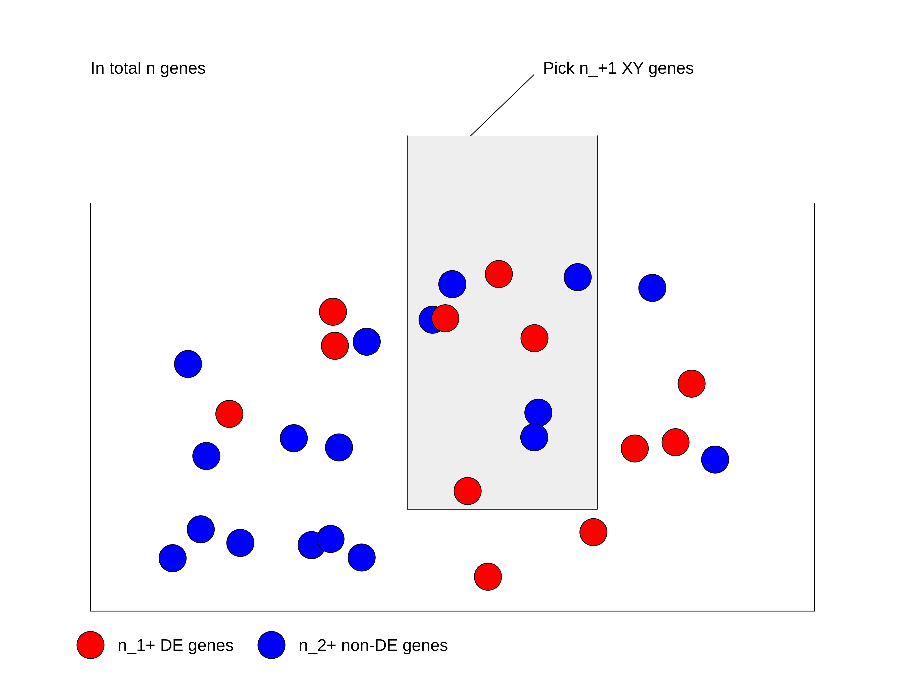

まず、DE遺伝子かどうかの区別をせずに、総遺伝子数$n$の中から$n_{+1}$個の遺伝子を選ぶ場合の総数を計算します：$\binom{n}{n_{+1}}$。

次に、選ばれた$n_{+1}$個の遺伝子の中には、総DE遺伝子数$n_{1+}$個の中から選ばれた$n_{11}$個のDE遺伝子が含まれています。したがって、総DE遺伝子数$n_{1+}$個の中から$n_{11}$個のDE遺伝子を選ぶ方法の数は：$\binom{n_{1+}}{n_{11}}$となります。

同様に、手元に残っている非DE遺伝子は$n_{21}$個あり、これは総非DE遺伝子数$n_{2+}$個の中から選ばれたものです。したがって、総非DE遺伝子数$n_{2+}$個の中から$n_{21}$個の非DE遺伝子を選ぶ方法の数は：$\binom{n_{2+}}{n_{21}}$となります。

DE遺伝子を選ぶ過程と非DE遺伝子を選ぶ過程は互いに独立しているため、$n_{11}$個のDE遺伝子と$n_{21}$個の非DE遺伝子を含む$n_{+1}$個の遺伝子を選ぶ方法の総数は、これら二つの組み合わせになります：$\binom{n_{1+}}{n_{11}} \binom{n_{2+}}{n_{21}}$。

確率$P$は以下のように表されます：

$$P = \frac{\binom{n_{1+}}{n_{11}} \binom{n_{2+}}{n_{21}}}{\binom{n}{n_{+1}}} = \frac{\binom{n_{1+}}{n_{11}} \binom{n - n_{1+}}{n_{+1} - n_{11}}}{\binom{n}{n_{+1}}}$$

ここで分母は、DE遺伝子かどうかの区別をせずに$n_{+1}$個の遺伝子を選ぶ場合の総数を表しています。

$n$（総遺伝子数）、$n_{1+}$（DE遺伝子数）、$n_{+1}$（遺伝子セットのサイズ）がすべて固定値である場合、選ばれるDE遺伝子の数は確率変数$X$で表せます。この場合、$X$はパラメータ$n$、$n_{1+}$、$n_{+1}$を持つ超幾何分布に従い、これを以下のように表記します：

$$ X \sim \mathrm{Hyper}(n, n_{1+}, n_{+1})$$

エンリッチメントの_p値_は、独立性を仮定した場合に$n_{11}$個以上の遺伝子が観測される確率として計算されます：

$$
\mathrm{Pr}( X \geqslant n_{11} ) = \sum_{x \in \{ {n_{11}, n_{11}+1, ..., \min\{n_{1+}, n_{+1}\} \}}} \mathrm{Pr}(X = x)
$$

R言語では、関数`phyper()`を使用して超幾何分布から_p値_を計算できます。この関数には4つの引数があります：


```r
phyper(q, m, n, k)
```

これらの変数の意味は以下の通りです：

- `q`：観測値
- `m`：DE遺伝子の数
- `n`：非DE遺伝子の数
- `k`：遺伝子セットのサイズ

`phyper()` 関数は $\mathrm{Pr}(X \leqslant q)$ を計算します。$\mathrm{Pr}(X \geqslant q)$ を計算するには、以下のように少し変形する必要があります：

$$ \mathrm{Pr}(X \geqslant q) = 1 - \mathrm{Pr}(X < q) = 1 - \mathrm{Pr}(X \leqslant q-1)$$

したがって、`phyper()` 関数の正しい使用方法は以下の通りです：


```r
1 - phyper(q - 1, m, n, k)
```

変数を代入してみましょう：


``` r
1 - phyper(n_11 - 1, n_10, n_20, n_01)
```

``` output
[1] 3.9059e-06
```

オプションとして、`lower.tail` 引数を指定することで、分布の上側テールから直接 _p_値を計算することも可能です。


``` r
phyper(n_11 - 1, n_10, n_20, n_01, lower.tail = FALSE)
```

``` output
[1] 3.9059e-06
```

`n_01` と `n_10` を入れ替えた場合、_p_値は同じ結果になります：


``` r
1 - phyper(n_11 - 1, n_01, n_02, n_10)
```

``` output
[1] 3.9059e-06
```

`fisher.test()` と `phyper()` は同じ _p_値を返します。実際、この2つの手法は同一のものです。
Fisherの正確検定では、超幾何分布がその統計量の厳密な分布となるためです。

これら2つの関数の実行時間を比較してみましょう：


``` r
library(microbenchmark)
microbenchmark(
    fisher = fisher.test(matrix(c(n_11, n_12, n_21, n_22), nrow = 2, byrow = TRUE),
        alternative = "greater"),
    hyper = 1 - phyper(n_11 - 1, n_10, n_20, n_01)
)
```

``` output
Unit: microseconds
   expr     min       lq      mean   median      uq     max neval
 fisher 258.953 264.3685 276.47313 269.1975 281.871 581.514   100
  hyper   1.603   1.8435   2.88681   2.9800   3.297  25.919   100
```

`phyper()` が `fisher.test()` よりも数百倍高速であることは驚くべき結果です。
主な理由は、`fisher.test()` では _p_値の計算以外にも多くの追加処理が行われているためです。
ご自身でORA分析を実装する場合には、常に `phyper()` を使用することをお勧めします^[なお、`phyper()` はベクトル化処理にも対応しています]。


:::::::::::::::::::::::::::::::::::::::::  callout

### 関連文献

現在使用されている解析ツールでは、二項分布やカイ二乗検定がORA（Over-Representation Analysis）の統計的手法として採用されています。
ただし、これらの手法はあくまで近似値に基づくものであり、より厳密な統計解析を行う場合には以下の文献を参照することをお勧めします：[Rivals et al., "Enrichment or depletion of a GO category within a class of genes: which test?』Bioinformatics 2007](https://doi.org/10.1093/bioinformatics/btl633)。
この論文では、ORA解析において用いられる各種統計手法について包括的な解説がなされています。


::::::::::::::::::::::::::::::::::::::::::::::::::


## 遺伝子セットリソース

ORA解析の基本手法について学んだところで、次は解析の第二の要素である「遺伝子セット」について説明します。

遺伝子セットとは、遺伝子セット内の遺伝子が共有する生物学的特性に関する事前知識を表したものです。
例えば、「細胞周期」遺伝子セットに含まれるすべての遺伝子は、細胞周期プロセスに関与しています。
したがって、DE遺伝子がこの「細胞周期」遺伝子セットに有意に濃縮されている場合、これは細胞周期関連遺伝子の発現差異が予想よりも顕著であることを意味します。
このことから、細胞周期プロセスの正常な機能が何らかの影響を受けている可能性が示唆されます。

前述の通り、遺伝子セット内の遺伝子は「生物学的特性」を共有しており、この「特性」が解析結果の解釈に用いられます。
「生物学的特性」の定義は非常に柔軟であり、例えば「細胞周期」のような生物学的プロセスを指す場合もあれば、以下のような多様な定義が含まれることもあります：

- 細胞内の位置（例：細胞膜、細胞核）
- 染色体上の位置（例：性染色体、染色体10上の細胞遺伝学的バンドp13）
- 転写因子やマイクロRNAの標的遺伝子（例：NF-κBによって転写制御されるすべての遺伝子）
- 特定の腫瘍型に特徴的な遺伝子（例：特定の腫瘍型において特異的に高発現する遺伝子群）

[MSigDBデータベース](https://www.gsea-msigdb.org/gsea/msigdb)には、さまざまなトピックに関する遺伝子セットが収録されています。
このデータベースについては、本節の後半で詳しく説明します。

遺伝子セットの名称には多様な表現方法があります：「遺伝子セット」「生物学的用語」「GO用語」「GO遺伝子セット」「パスウェイ」など。これらは本質的には同じ概念を異なる観点から表現したものです。
以下の図に示すように、「遺伝子セット」は遺伝子のベクトルとして表現され、計算処理のためのデータ表現形式です。
「生物学的用語」はその生物学的意味を説明するテキストデータであり、遺伝子セットの知識ベースとして解析推論に用いられます。
「GO遺伝子セット」と「パスウェイ」は、特にGO遺伝子セットとパスウェイ遺伝子セットを用いたエンリッチメント解析を指す用語です。

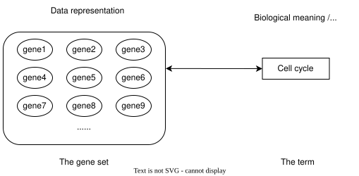

遺伝子セットデータベースの詳細に入る前に、R言語における遺伝子セットの一般的な形式について概説します。
ほとんどの解析では、遺伝子セットは単に遺伝子のベクトルとして扱われます。
したがって、複数の遺伝子セットの集合は、ベクトルのリストとして表現できます。
以下の例では、3個、5個、2個の遺伝子を含む3つの遺伝子セットがあり、一部の遺伝子は複数の遺伝子セットに重複して存在しています。


``` r
lt <- list(gene_set_1 = c("gene_1", "gene_2", "gene_3"),
           gene_set_2 = c("gene_1", "gene_3", "gene_4", "gene_5", "gene_6"),
           gene_set_3 = c("gene_4", "gene_7")
)
lt
```

``` output
$gene_set_1
[1] "gene_1" "gene_2" "gene_3"

$gene_set_2
[1] "gene_1" "gene_3" "gene_4" "gene_5" "gene_6"

$gene_set_3
[1] "gene_4" "gene_7"
```

遺伝子セットと遺伝子の関係を2列のデータフレームとして保存することも非常に一般的です。
遺伝子セット列と遺伝子列の順序、つまりどちらの列を最初の列とするかは任意に決定できます。
使用するツールによって要件が異なる場合があります。


``` r
data.frame(gene_set = rep(names(lt), times = sapply(lt, length)),
           gene = unname(unlist(lt)))
```

``` output
     gene_set   gene
1  gene_set_1 gene_1
2  gene_set_1 gene_2
3  gene_set_1 gene_3
4  gene_set_2 gene_1
5  gene_set_2 gene_3
6  gene_set_2 gene_4
7  gene_set_2 gene_5
8  gene_set_2 gene_6
9  gene_set_3 gene_4
10 gene_set_3 gene_7
```

あるいは、遺伝子列を最初の列に配置することもできます：


``` output
     gene   gene_set
1  gene_1 gene_set_1
2  gene_2 gene_set_1
3  gene_3 gene_set_1
4  gene_1 gene_set_2
5  gene_3 gene_set_2
6  gene_4 gene_set_2
7  gene_5 gene_set_2
8  gene_6 gene_set_2
9  gene_4 gene_set_3
10 gene_7 gene_set_3
```


あまり一般的ではありませんが、遺伝子セットを行列形式で表現する場合もあります。
この場合、1つの次元が遺伝子セットに、もう1つの次元が遺伝子に対応します。行列の値はバイナリ形式であり、1の値は対応する遺伝子セットにその遺伝子が含まれていることを示します。
一部の手法では、遺伝子セット内の遺伝子の影響度を調整するため、1を$w_{ij}$で置き換える場合があります。

```
#            gene_1 gene_2 gene_3 gene_4
# gene_set_1      1      1      0      0
# gene_set_2      1      0      1      1
```


:::::::::::::::::::::::::::::::::::::::  challenge

異なる遺伝子セット表現形式間の変換は可能ですか？
例えば、リスト形式のデータを2列のデータフレームに変換することはできますか？

::::::::::::::::::::::::::::::::::: solution


``` r
lt <- list(gene_set_1 = c("gene_1", "gene_2", "gene_3"),
           gene_set_2 = c("gene_1", "gene_3", "gene_4", "gene_5", "gene_6"),
           gene_set_3 = c("gene_4", "gene_7")
)
```

`lt`をデータフレーム形式に変換する場合（例えば遺伝子セットを最初の列に配置するには以下のようにします）：


``` r
df = data.frame(gene_set = rep(names(lt), times = sapply(lt, length)),
                gene = unname(unlist(lt)))
df
```

``` output
     gene_set   gene
1  gene_set_1 gene_1
2  gene_set_1 gene_2
3  gene_set_1 gene_3
4  gene_set_2 gene_1
5  gene_set_2 gene_3
6  gene_set_2 gene_4
7  gene_set_2 gene_5
8  gene_set_2 gene_6
9  gene_set_3 gene_4
10 gene_set_3 gene_7
```

変換後の`df`を元のリスト形式に戻すには：


``` r
split(df$gene, df$gene_set)
```

``` output
$gene_set_1
[1] "gene_1" "gene_2" "gene_3"

$gene_set_2
[1] "gene_1" "gene_3" "gene_4" "gene_5" "gene_6"

$gene_set_3
[1] "gene_4" "gene_7"
```

:::::::::::::::::::::::::::::::::::

:::::::::::::::::::::::::::::::::::::::


次に、主要なデータベースであるGO、KEGG、MSigDBの遺伝子セットについて見ていきましょう。


### 遺伝子オントロジー（GO）遺伝子セット

遺伝子オントロジー（Gene Ontology: GO）は、遺伝子セットのエンリッチメント解析における標準的なリソースです。
GOには、生物学的プロセス（BP）、細胞構成要素（CC）、分子機能（MF）という3つの異なる観点で生物的実体を記述する名前空間が含まれています。
これらのGO用語と遺伝子との関連性は、Bioconductor標準パッケージである「生物種アノテーションパッケージ」に統合されています。
現在のBioconductorリリースでは以下の生物種パッケージが利用可能です：


<center>

|    Package    |   Organism   |   Package         | Organism
| ------------- | ------------ | ----------------- | -----
| org.Hs.eg.db  |  Human       | org.Mm.eg.db      | Mouse
| org.Rn.eg.db  |  Rat         | org.Dm.eg.db      | Fly
| org.At.tair.db|  Arabidopsis | org.Dr.eg.db      | Zebrafish
| org.Sc.sgd.db |  Yeast       | org.Ce.eg.db      | Worm
| org.Bt.eg.db  |  Bovine      | org.Gg.eg.db      | Chicken
| org.Ss.eg.db  |  Pig         | org.Mmu.eg.db     | Rhesus
| org.Cf.eg.db  |  Canine      | org.EcK12.eg.db   | E coli strain K12
| org.Xl.eg.db  |  Xenopus     | org.Pt.eg.db      | Chimp
| org.Ag.eg.db  |  Anopheles   | org.EcSakai.eg.db | E coli strain Sakai

</center>

生物パッケージの名称には4つのセクションが存在します。
命名規則は以下の通りです：`org`は単に「生物」を意味します。
2番目のセクションは特定の生物種に対応しており、例えばヒトの場合は`Hs`、マウスの場合は`Mm`となります。
3番目のセクションはパッケージ内で主に使用される遺伝子IDのタイプを示し、通常は`eg`が使用されます。
これはデータのほとんどがNCBIデータベースから取得されるためで、「Entrez遺伝子」を意味します。
ただし、一部の生物種では、主IDが独自の主要データベースから取得される場合もあります。例えば酵母の場合は`sgd`で、これは[Saccharomyces Genome Database](https://www.yeastgenome.org/)に対応しており、酵母の主要データベースです。
最後のセクションは常に"db"であり、これは単に「データベースパッケージ」であることを示しています。

**org.Hs.eg.db**パッケージを例に説明すると、すべてのデータは`OrgDb`クラスのデータベースオブジェクト`org.Hs.eg.db`に格納されています。
このオブジェクトはローカルのSQLiteデータベースへの接続を保持しています。
ユーザーは`org.Hs.eg.db`を、さまざまなデータベース間のIDマッピングを含む巨大なテーブルとして考えるとよいでしょう。
GO遺伝子セットは基本的に、GO用語と遺伝子の間のマッピングです。
`org.Hs.eg.db`オブジェクトからこれを抽出する方法を見ていきましょう。

すべての列（キー列またはソース列）は`keytypes()`関数で取得できます：


``` r
library(org.Hs.eg.db)
keytypes(org.Hs.eg.db)
```

``` output
 [1] "ACCNUM"       "ALIAS"        "ENSEMBL"      "ENSEMBLPROT"  "ENSEMBLTRANS"
 [6] "ENTREZID"     "ENZYME"       "EVIDENCE"     "EVIDENCEALL"  "GENENAME"    
[11] "GENETYPE"     "GO"           "GOALL"        "IPI"          "MAP"         
[16] "OMIM"         "ONTOLOGY"     "ONTOLOGYALL"  "PATH"         "PFAM"        
[21] "PMID"         "PROSITE"      "REFSEQ"       "SYMBOL"       "UCSCKG"      
[26] "UNIPROT"     
```

GO遺伝子セットを取得するには、まずBP（生物学的プロセス）ネームスペースに属するすべてのGO IDを取得します。
`keytype()`の出力に示されているように、`"ONTOLOGY"`も有効な「キー列」として扱えるため、「対応するONTOLOGYがBPであるすべてのGO IDを選択する」というクエリを実行できます。
これは以下のコードに変換されます：


``` r
BP_Id = mapIds(org.Hs.eg.db, keys = "BP", keytype = "ONTOLOGY", 
               column = "GO", multiVals = "list")[[1]]
head(BP_Id)
```

``` output
[1] "GO:0002764" "GO:0001553" "GO:0001869" "GO:0002438" "GO:0006953"
[6] "GO:0007584"
```

`mapIds()`関数は2つのソース間のIDマッピングを行います。
GOネームスペースには複数のGO用語が存在するため、特定のネームスペースに属するすべてのGO用語を取得するには`multiVals = "list"`を設定する必要があります。
今回は単一のGO "ONTOLOGY"のみをクエリしているため、`mapIds()`が返すリストの最初の要素を直接取得しています。

次に、GO IDから遺伝子のEntrez IDへのマッピングを行います。
この場合のクエリは「_GO IDのベクトルを指定し、それらすべてに対応するENTREZIDを選択する_」となります。


``` r
BPGeneSets = mapIds(org.Hs.eg.db, keys = BP_Id, keytype = "GOALL", 
                    column = "ENTREZID", multiVals = "list")
```

データベース内に「GO」キー列と「GOALL」列の両方が存在することにお気づきかもしれません。
GOには階層構造があり、子用語は親用語のサブクラスとなります。
子用語にアノテーションされた遺伝子は、その親用語にもすべてアノテーションされています。
遺伝子をGO用語にアノテーションする際に重複した情報を減らすため、通常はGO階層の中で最も具体的な子孫用語に遺伝子がアノテーションされます。
遺伝子アノテーションの上流統合は、分析を行うツール側で実施されるべきです。
この方法により、`"GO"`と`"ENTREZID"`の間のマッピングは完全なものではなく、「主要な」アノテーションのみを含むことになり、`"GOALL"`と`"ENTREZID"`の間のマッピングが適切な使用法となります。

遺伝子がアノテーションされていないGO遺伝子セットは除外します。


``` r
BPGeneSets = BPGeneSets[sapply(BPGeneSets, length) > 0]
BPGeneSets[2:3] # BPGeneSets[[1]]は長すぎるため省略
```

``` output
$`GO:0001553`
 [1] "2"     "2516"  "2661"  "2661"  "3624"  "4313"  "5156"  "5798"  "6777" 
[10] "8322"  "8879"  "56729" "59338"

$`GO:0001869`
[1] "2"   "710"
```

ほとんどの場合、`OrgDb`は標準的なBioconductorデータ構造であるため、ほとんどのツールは内部的にGO遺伝子セットを自動的に構築できます。
ユーザーはこのような低レベルの処理に直接触れる必要はありません。


:::::::::::::::::::::::::::::::::::::::::  callout


### 関連文献

各種データベース間のマッピングは、汎用の`select()`インターフェースを使用して実行することも可能です。
`OrgDb`オブジェクトが**org.Hs.eg.db**などのパッケージから提供される場合、GO用語と遺伝子間のマッピング情報に特化した別のオブジェクトが用意されています。
詳細は`org.Hs.egGO2ALLEGS`のドキュメントを参照してください。
GO用語に関する追加情報（用語名や詳細な説明など）については、**GO.db**パッケージで入手できます。


Bioconductorでは既に多数の生物種向けパッケージが提供されています。
ただし、研究対象の生物種がこれらのパッケージでサポートされていない場合、**AnnotationHub**パッケージを利用して検索することをお勧めします。
このパッケージでは約2,000種の生物種に対する`OrgDb`オブジェクトが提供されています。
これらの`OrgDb`オブジェクトは、次節で紹介するORA解析に直接使用することができます。


::::::::::::::::::::::::::::::::::::::::::::::::::


### KEGG遺伝子セット

生物学的経路とは、細胞内における分子間の一連の相互作用のことで、特定の生成物や細胞状態の変化をもたらすプロセスを指します^[この定義はWikipediaの「生物学的経路」の項目に基づいています: https://en.wikipedia.org/wiki/Biological_pathway]。
経路とは、それぞれ異なる役割を担う遺伝子群によって構成される「経路遺伝子セット」のことです。
[KEGG経路データベース](https://www.genome.jp/kegg/pathway.html)は経路情報を扱う最も広く利用されているデータベースです。
このデータベースのデータはREST API（https://rest.kegg.jp/）を通じて提供されています。
特定の種類のデータを取得するにはいくつかのコマンドが用意されています。
経路遺伝子セットを取得するには、以下のURLで示されているように「link」コマンドを使用します（「link」コマンドは遺伝子と経路を関連付ける機能です）。
WebブラウザでこのURLにアクセスすると：

```
https://rest.kegg.jp/link/pathway/hsa
```

遺伝子名の列と経路IDの列からなるテキスト形式のテーブルが表示されます。

```
hsa:10327   path:hsa00010
hsa:124 path:hsa00010
hsa:125 path:hsa00010
hsa:126 path:hsa00010
```

このテキスト出力は`read.table()`関数でそのまま読み込むことができます。
URLを`url()`関数でラップすることで、リモートWebサーバーから直接データを読み込むように処理できます。


``` r
keggGeneSets = read.table(url("https://rest.kegg.jp/link/pathway/hsa"), sep = "\t")
head(keggGeneSets)
```

``` output
         V1            V2
1 hsa:10327 path:hsa00010
2   hsa:124 path:hsa00010
3   hsa:125 path:hsa00010
4   hsa:126 path:hsa00010
5   hsa:127 path:hsa00010
6   hsa:128 path:hsa00010
```

この2列のテーブルでは、最初の列にEntrez ID形式の遺伝子名が含まれています。
ここでは`"hsa:"`のプレフィックスを削除するとともに、2列目の経路IDから`"path:"`のプレフィックスも削除します。


``` r
keggGeneSets[, 1] = gsub("hsa:", "", keggGeneSets[, 1])
keggGeneSets[, 2] = gsub("path:", "", keggGeneSets[, 2])
head(keggGeneSets)
```

``` output
     V1       V2
1 10327 hsa00010
2   124 hsa00010
3   125 hsa00010
4   126 hsa00010
5   127 hsa00010
6   128 hsa00010
```

完全な経路名は「list」コマンドを使用して取得できます。


``` r
keggNames = read.table(url("https://rest.kegg.jp/list/pathway/hsa"), sep = "\t")
head(keggNames)
```

``` output
        V1                                                     V2
1 hsa01100              Metabolic pathways - Homo sapiens (human)
2 hsa01200               Carbon metabolism - Homo sapiens (human)
3 hsa01210 2-Oxocarboxylic acid metabolism - Homo sapiens (human)
4 hsa01212           Fatty acid metabolism - Homo sapiens (human)
5 hsa01230     Biosynthesis of amino acids - Homo sapiens (human)
6 hsa01232           Nucleotide metabolism - Homo sapiens (human)
```

どちらのコマンドでも、対応するKEGGコードが`"hsa"`であるヒトのデータが取得されます。
他の生物種のコードは[KEGGウェブサイト](https://www.genome.jp/kegg/)で確認できます（例：マウスの場合は`"mmu"`）、またはhttps://rest.kegg.jp/list/organismから取得可能です。


なお、KEGGの経路情報は学術利用に限り無料で提供されています。
商用目的で利用される場合は、[KEGGチームまで連絡してライセンスを取得してください](https://www.kegg.jp/kegg/legal.html)。


:::::::::::::::::::::::::::::::::::::::::  callout

### さらに詳しく知りたい方へ

直接URLからデータを取得する方法以外にも、KEGGデータベースからデータを取得するのに役立つRパッケージがいくつか存在します。
代表的なものとして、**KEGGREST**パッケージや**clusterProfiler**パッケージに含まれる`download_KEGG()`関数などが挙げられます。
ただし、これらのパッケージはいずれもREST APIを利用してKEGGデータを取得する仕組みとなっています。


::::::::::::::::::::::::::::::::::::::::::::::::::


### MSigDB遺伝子セット

[分子シグネチャデータベース](https://www.gsea-msigdb.org/gsea/msigdb/)
（MSigDB）は、専門家によって手作業でキュレーションされた遺伝子セットデータベースです。
当初は[オリジナルのGSEA論文](https://www.nature.com/articles/ng1180)の補助データセットとして提案されました。
その後、独立したデータベースとして発展を続けています。
2005年の初版では遺伝子セットコレクションが2つ、合計843セットのみでしたが、最新バージョンのMSigDB v2023.1.Hsでは9つのコレクションに拡大し、3万セット以上を網羅するまでに成長しました。
多様な研究テーマに対応した遺伝子セットを提供しています。

MSigDBでは遺伝子セットを9つのコレクションに分類しており、各コレクションは特定の研究テーマに特化しています。
一部のコレクションはさらにサブコレクションに細分化されています。
MSigDBから遺伝子セットを取得する方法はいくつかありますが、最も便利な方法の一つが**msigdb**パッケージを使用することです。
また、**msigdbr** CRANパッケージを使用する方法もあり、このパッケージではヒトやマウス以外の生物種についても、オーソログへのマッピング機能を通じて対応しています。

**msigdb**パッケージでは、マウスおよびヒトの遺伝子セットを、遺伝子記号またはEntrez IDのいずれかの形式で提供しています。
ここではマウスコレクションを取得してみましょう。


``` r
library(msigdb)
library(ExperimentHub)
library(GSEABase)
MSigDBGeneSets <- getMsigdb(org = "mm", id = "SYM", version = "7.4")
```

上記の`msigdb`オブジェクトは`GeneSetCollection`型であり、MSigDBに含まれるすべての遺伝子セットを格納しています。
`GeneSetCollection`オブジェクトクラスは`GSEABase`パッケージで定義されており、基本的なリストオブジェクトと同様の線形データ構造を持ちつつ、遺伝子識別子の種類などのメタデータや、遺伝子セットの由来情報などの追加情報を保持しています。


``` r
MSigDBGeneSets
```

``` output
GeneSetCollection
  names: 10qA1, 10qA2, ..., ZZZ3_TARGET_GENES (44688 total)
  unique identifiers: Epm2a, Esr1, ..., Gm52481 (53805 total)
  types in collection:
    geneIdType: SymbolIdentifier (1 total)
    collectionType: BroadCollection (1 total)
```

``` r
length(MSigDBGeneSets)
```

``` output
[1] 44688
```

各遺伝子セットは`GeneSet`オブジェクトとして格納されており、これも`GSEABase`パッケージで定義されています。


``` r
gs <- MSigDBGeneSets[[2000]]
gs
```

``` output
setName: DESCARTES_MAIN_FETAL_CHROMAFFIN_CELLS 
geneIds: Asic5, Cntfr, ..., Slc22a22 (total: 28)
geneIdType: Symbol
collectionType: Broad
  bcCategory: c8 (Cell Type Signatures)
  bcSubCategory: NA
details: use 'details(object)'
```

``` r
collectionType(gs)
```

``` output
collectionType: Broad
  bcCategory: c8 (Cell Type Signatures)
  bcSubCategory: NA
```

``` r
geneIds(gs)
```

``` output
 [1] "Asic5"    "Cntfr"    "Galnt16"  "Galnt14"  "Gip"      "Hmx1"    
 [7] "Il7"      "Insl5"    "Insm2"    "Insm1"    "Mab21l1"  "Mab21l2" 
[13] "Npy"      "Pyy"      "Ntrk1"    "Ntrk2"    "Ntrk3"    "Phox2a"  
[19] "Ptchd1"   "Ptchd4"   "Reg4"     "Slc22a26" "Slc22a30" "Slc22a19"
[25] "Slc22a27" "Slc22a29" "Slc22a28" "Slc22a22"
```

コレクションの一部を抽出することも可能です。
まず、利用可能なコレクションとサブコレクションの一覧を表示します。


``` r
listCollections(MSigDBGeneSets)
```

``` output
[1] "c1" "c3" "c2" "c8" "c6" "c7" "c4" "c5" "h" 
```

``` r
listSubCollections(MSigDBGeneSets)
```

``` output
 [1] "MIR:MIR_Legacy"  "TFT:TFT_Legacy"  "CGP"             "TFT:GTRD"       
 [5] "VAX"             "CP:BIOCARTA"     "CGN"             "GO:BP"          
 [9] "GO:CC"           "IMMUNESIGDB"     "GO:MF"           "HPO"            
[13] "MIR:MIRDB"       "CM"              "CP"              "CP:PID"         
[17] "CP:REACTOME"     "CP:WIKIPATHWAYS"
```

次に、「hallmarks」コレクションのみを抽出します。


``` r
(hm <- subsetCollection(MSigDBGeneSets, collection = "h"))
```

``` output
GeneSetCollection
  names: HALLMARK_ADIPOGENESIS, HALLMARK_ALLOGRAFT_REJECTION, ..., HALLMARK_XENOBIOTIC_METABOLISM (50 total)
  unique identifiers: Abca1, Abca4, ..., Upb1 (5435 total)
  types in collection:
    geneIdType: SymbolIdentifier (1 total)
    collectionType: BroadCollection (1 total)
```

特定のサブカテゴリのみを使用したい場合は、`subsetCollection`関数に`collection`と`subcollection`の両方の引数を指定してください。


## clusterProfilerを用いたORA解析

ORA手法自体は非常にシンプルなアルゴリズムであり、数多くのRパッケージに実装されています。
中でも**clusterProfiler**パッケージは特に優れた機能を備えており、Bioconductorが提供する豊富なアノテーションリソースとシームレスに連携することで、GSEA解析を他の生物種にも容易に拡張可能です。
また、一般的な解析タスク（GOエンリッチメント解析、KEGGエンリッチメント解析など）向けの事前定義関数を備えており、GSEA結果に対して多様な可視化手法を実装しています。
このセクションでは、**clusterProfiler**を用いたORA解析の実施方法について解説します。

ここでは異なる比較条件から得られたDE遺伝子リストを使用します。
ご記憶の通り、性別間の差異ではDE遺伝子はわずか54個しか検出されておらず、これはGSEA解析には不向きなケースです。
遺伝子セットコレクションとのオーバーラップを行うと、ほとんどの遺伝子セットで重複遺伝子がごく少数、あるいは全く存在しない状態になるためです。
この例では、異なる時間ポイント間の比較から得られたDE遺伝子リストを使用します。

もう一つ重要な点として、以下のコードでDE遺伝子をフィルタリングする際に、log2倍変化量に基づく追加フィルタを適用しています。
これはDE遺伝子の数が過度に多い場合に推奨される手法です。
log2倍変化量によるフィルタリングは、生物学的観点からのフィルタリングと捉えることができます。


``` r
resTime <- DESeq2::results(dds, contrast = c("time", "Day8", "Day0"))
timeDE <- as.data.frame(subset(resTime, 
                               padj < 0.05 & abs(log2FoldChange) > log2(1.5)
                       ))
timeDEgenes <- rownames(timeDE)
head(timeDEgenes)
```

``` output
[1] "3110035E14Rik" "Sgk3"          "Kcnb2"         "Sbspon"       
[5] "Gsta3"         "Lman2l"       
```

``` r
length(timeDEgenes)
```

``` output
[1] 1134
```

確認しますと、約1,000個のDE遺伝子が検出されており、これらの遺伝子は遺伝子シンボル形式で表示されています。


### GOエンリッチメント解析

**clusterProfiler** パッケージには、GO遺伝子セットに対してORA（Over-Representation Analysis）を実行する`enrichGO()`関数が用意されています。
この関数を使用するには、以下の情報を入力する必要があります：発現変動遺伝子、対象生物種の`OrgDb`オブジェクト（本データがマウス由来の場合は**org.Mm.eg.db**パッケージを使用）、およびGOの分類体系（`"BP"`：生物学的プロセス、`"CC"`：細胞成分、`"MF"`：分子機能のいずれか）です。`enrichGO()`関数では、`org.Mm.eg.db`から自動的にGO遺伝子セットが取得・処理されます。


``` r
library(clusterProfiler)
library(org.Mm.eg.db)
resTimeGO = enrichGO(gene = timeDEgenes, 
                     ont = "BP", 
                     OrgDb = org.Mm.eg.db)
```

``` output
--> No gene can be mapped....
```

``` output
--> Expected input gene ID: 238217,52276,75619,20044,54127,71890
```

``` output
--> return NULL...
```

おや、何か問題があるようです。
これはよくあるミスで、発現変動遺伝子と遺伝子セット間で遺伝子IDの形式が一致していない場合に発生します。
幸いなことに、メッセージには明確な原因説明が記載されています。
遺伝子セットのID形式はEntrez IDであり、これはどの発現変動遺伝子とも一致しません。

この問題を解決する方法は2つあります：1) `timeDEgenes`内の遺伝子IDを事前にEntrez IDに変換しておく方法、あるいは2) DE遺伝子のID形式を明示的に指定し、`enrichGO()`関数にID形式の変換作業を任せる方法です（`OrgDb`オブジェクトには様々な遺伝子ID形式が格納されていることに留意してください）。ここでは後者の方法を採用します。

次のコードでは、DE遺伝子が遺伝子記号で表されていることを明確に指定するため、`keyType = "SYMBOL"`を追加で指定しています。
`keyType`の有効な値はすべて`keytypes(org.Mm.eg.db)`で確認できます。


``` r
resTimeGO = enrichGO(gene = timeDEgenes, 
                     keyType = "SYMBOL",
                     ont = "BP", 
                     OrgDb = org.Mm.eg.db)
resTimeGOTable = as.data.frame(resTimeGO)
head(resTimeGOTable)
```

``` output
                   ID                Description GeneRatio   BgRatio RichFactor
GO:0050900 GO:0050900        leukocyte migration    50/965 408/28832  0.1225490
GO:0006935 GO:0006935                 chemotaxis    54/965 475/28832  0.1136842
GO:0042330 GO:0042330                      taxis    54/965 477/28832  0.1132075
GO:0030595 GO:0030595       leukocyte chemotaxis    35/965 242/28832  0.1446281
GO:0060326 GO:0060326            cell chemotaxis    41/965 337/28832  0.1216617
GO:0071674 GO:0071674 mononuclear cell migration    32/965 229/28832  0.1397380
           FoldEnrichment    zScore       pvalue     p.adjust       qvalue
GO:0050900       3.661485 10.075346 2.751321e-15 1.053782e-11 7.745382e-12
GO:0006935       3.396625  9.800882 5.186751e-15 1.053782e-11 7.745382e-12
GO:0042330       3.382383  9.763475 6.190224e-15 1.053782e-11 7.745382e-12
GO:0030595       4.321158  9.654694 3.373742e-13 4.307425e-10 3.165991e-10
GO:0060326       3.634975  9.054313 1.137629e-12 1.161974e-09 8.540597e-10
GO:0071674       4.175053  8.976588 8.861995e-12 6.891923e-09 5.065617e-09
                                                                                                                                                                                                                                                                                                                             geneID
GO:0050900                                 Tnfsf18/Sell/Slamf9/Fut7/Itga4/Mdk/Grem1/Ada/Prex1/Edn3/P2ry12/Il12a/S100a8/S100a9/Nbl1/Padi2/Bst1/Cxcl5/Ppbp/Pf4/Cxcl1/Ptn/Alox5/Trpm4/Hsd3b7/Itgam/Adam8/Ascl2/Gdf15/Calr/Enpp1/Aire/Ccl2/Ccl7/Ccl5/Ccr7/Aoc3/Itgb3/Ccl28/Lgals3/Ptk2b/Emp2/Apod/Retnlg/Plg/Fpr2/Dusp1/Ager/Il33/Ch25h
GO:0006935 Tnfsf18/Sell/Slamf9/Mdk/Grem1/Prex1/Edn3/P2ry12/Il12a/S100a7a/S100a8/S100a9/Lpar1/Ptgr1/Nbl1/Padi2/Bst1/Cxcl5/Ppbp/Pf4/Cxcl1/Ptn/Alox5/Ntf3/Trpm4/Hsd3b7/Itgam/Adam8/Lsp1/Calr/Ccl17/Robo3/Cmtm7/Ccl2/Ccl7/Ccl5/Ccl6/Ccr7/Itgb3/Tubb2b/Ccl28/Lgals3/Cmtm5/Ptk2b/Nr4a1/Casr/Retnlg/Fpr2/Dusp1/Ager/Stx3/Ch25h/Plxnb3/Nox1
GO:0042330 Tnfsf18/Sell/Slamf9/Mdk/Grem1/Prex1/Edn3/P2ry12/Il12a/S100a7a/S100a8/S100a9/Lpar1/Ptgr1/Nbl1/Padi2/Bst1/Cxcl5/Ppbp/Pf4/Cxcl1/Ptn/Alox5/Ntf3/Trpm4/Hsd3b7/Itgam/Adam8/Lsp1/Calr/Ccl17/Robo3/Cmtm7/Ccl2/Ccl7/Ccl5/Ccl6/Ccr7/Itgb3/Tubb2b/Ccl28/Lgals3/Cmtm5/Ptk2b/Nr4a1/Casr/Retnlg/Fpr2/Dusp1/Ager/Stx3/Ch25h/Plxnb3/Nox1
GO:0030595                                                                                                                 Tnfsf18/Sell/Slamf9/Mdk/Grem1/Prex1/Edn3/Il12a/S100a8/S100a9/Nbl1/Padi2/Bst1/Cxcl5/Ppbp/Pf4/Cxcl1/Ptn/Alox5/Trpm4/Hsd3b7/Itgam/Adam8/Calr/Ccl2/Ccl7/Ccl5/Ccr7/Ccl28/Lgals3/Ptk2b/Retnlg/Fpr2/Dusp1/Ch25h
GO:0060326                                                                              Tnfsf18/Sell/Slamf9/Mdk/Grem1/Prex1/Edn3/Il12a/S100a8/S100a9/Lpar1/Nbl1/Padi2/Bst1/Cxcl5/Ppbp/Pf4/Cxcl1/Ptn/Alox5/Trpm4/Hsd3b7/Itgam/Adam8/Calr/Ccl17/Ccl2/Ccl7/Ccl5/Ccl6/Ccr7/Ccl28/Lgals3/Ptk2b/Nr4a1/Retnlg/Fpr2/Dusp1/Ch25h/Plxnb3/Nox1
GO:0071674                                                                                                                                  Tnfsf18/Slamf9/Fut7/Itga4/Mdk/Grem1/P2ry12/Il12a/Nbl1/Padi2/Alox5/Trpm4/Hsd3b7/Adam8/Ascl2/Calr/Enpp1/Aire/Ccl2/Ccl7/Ccl5/Ccr7/Itgb3/Lgals3/Ptk2b/Apod/Retnlg/Plg/Fpr2/Dusp1/Ager/Ch25h
           Count
GO:0050900    50
GO:0006935    54
GO:0042330    54
GO:0030595    35
GO:0060326    41
GO:0071674    32
```

これで`enrichGO()`関数が正常に動作しました！返される`resTimeGO`オブジェクトは特殊な形式をしており、一見するとテーブルのように見えますが、実際にはテーブルではありません^[この問題を回避するため、コード内では`as.data.frame()`関数を使用して実際のデータフレーム`resTimeGOTable`に変換しています]。

出力データフレームには以下の列が含まれています：

- `ID`：遺伝子セットのID。この例ではGO IDが該当します。
- `Description`：人間が読める形式の説明。ここではGOタームの名称が表示されます。
- `GeneRatio`：遺伝子セットに含まれる発現変動遺伝子数 / 全発現変動遺伝子数の比率
- `BgRatio`：遺伝子セットのサイズ / 全遺伝子数の比率
- `pvalue`：ハイパー幾何分布に基づいて算出された_p_値
- `p.adjust`：BH法（Benjamini-Hochberg法）による調整後_p_値
- `qvalue`：多重検定における偽陽性を制御するための別の指標である_q_値
- `geneID`：遺伝子セットに含まれる発現変動遺伝子のリスト
- `Count`：遺伝子セットに含まれる発現変動遺伝子の数

発現変動遺伝子の総数が変化していることにお気づきかもしれません。
`timeDEgenes`には1134個の遺伝子が含まれていますが、エンリッチメント結果表（`GeneRatio`列）には983個の発現変動遺伝子のみが含まれます。
この主な理由は、デフォルトではGO遺伝子セットにアノテーションされていない発現変動遺伝子が自動的に除外されるためです。
これはORAにおける「ユニバース」（全遺伝子集合）の概念に関連しており、本節の最後に詳しく説明します。

`enrichGO()`関数には他にもいくつかの追加引数があります：

- `universe`：使用する全遺伝子の集合、つまり「ユニバース」セット。デフォルトではすべての遺伝子セットに含まれる遺伝子の和集合が使用されます。この引数を指定すると、発現変動遺伝子とすべての遺伝子セットがこの集合と交差演算されます。この詳細については本節の最後に解説します。
- `minGSSize`：遺伝子セットの最小サイズ。通常、非常に小さなサイズの遺伝子セットは特定の生物学的意味を持つものの、解釈にはあまり役立ちません。この値未満のサイズの遺伝子セットは解析から除外されます。デフォルト値は10です。
- `maxGSSize`：遺伝子セットの最大サイズ。通常、非常に大きなサイズの遺伝子セットは生物学的意味が一般化されすぎており、やはり解釈には有用ではありません。デフォルト値は500です。
- `pvalueCutoff`：_p_値と調整後_p_値の両方に対する閾値。デフォルト値は0.05です。
- `qvalueCutoff`：_q_値に対する閾値。デフォルト値は0.2です。

注：`enrichGO()`関数は閾値を満たした有意な遺伝子セットのみを返します^[これは厳密には正しくありません。実際には`as.data.frame(resTimeGO)`は有意なGOタームのみを返しますが、完全なエンリッチメントテーブル自体は`resTimeGO@result`に保持されています。ただし、S4オブジェクトのスロットを直接参照することは推奨されません]。
この関数設計は適切ではない可能性があります。
なぜなら、関数は有意かどうかに関わらずすべての結果を返すべきだからです。
後のユーザーは下流解析のために完全なエンリッチメントテーブルを必要とする場合があります。
さらに、`pvalueCutoff`の意味は厳密ではなく、`pvalueCutoff`と`qvalueCutoff`の間には冗長性が存在します（調整後_p_値と_q_値は常に生の_p_値よりも小さくなることはありません）。
したがって、`enrichGO()`関数では`pvalueCutoff`と`qvalueCutoff`の両方を1に設定することが推奨されます。


``` r
resTimeGO = enrichGO(gene = timeDEgenes, 
                     keyType = "SYMBOL",
                     ont = "BP", 
                     OrgDb = org.Mm.eg.db,
                     pvalueCutoff = 1,
                     qvalueCutoff = 1)
resTimeGOTable = as.data.frame(resTimeGO)
head(resTimeGOTable)
```

``` output
                   ID                Description GeneRatio   BgRatio RichFactor
GO:0050900 GO:0050900        leukocyte migration    50/965 408/28832  0.1225490
GO:0006935 GO:0006935                 chemotaxis    54/965 475/28832  0.1136842
GO:0042330 GO:0042330                      taxis    54/965 477/28832  0.1132075
GO:0030595 GO:0030595       leukocyte chemotaxis    35/965 242/28832  0.1446281
GO:0060326 GO:0060326            cell chemotaxis    41/965 337/28832  0.1216617
GO:0071674 GO:0071674 mononuclear cell migration    32/965 229/28832  0.1397380
           FoldEnrichment    zScore       pvalue     p.adjust       qvalue
GO:0050900       3.661485 10.075346 2.751321e-15 1.053782e-11 7.745382e-12
GO:0006935       3.396625  9.800882 5.186751e-15 1.053782e-11 7.745382e-12
GO:0042330       3.382383  9.763475 6.190224e-15 1.053782e-11 7.745382e-12
GO:0030595       4.321158  9.654694 3.373742e-13 4.307425e-10 3.165991e-10
GO:0060326       3.634975  9.054313 1.137629e-12 1.161974e-09 8.540597e-10
GO:0071674       4.175053  8.976588 8.861995e-12 6.891923e-09 5.065617e-09
                                                                                                                                                                                                                                                                                                                             geneID
GO:0050900                                 Tnfsf18/Sell/Slamf9/Fut7/Itga4/Mdk/Grem1/Ada/Prex1/Edn3/P2ry12/Il12a/S100a8/S100a9/Nbl1/Padi2/Bst1/Cxcl5/Ppbp/Pf4/Cxcl1/Ptn/Alox5/Trpm4/Hsd3b7/Itgam/Adam8/Ascl2/Gdf15/Calr/Enpp1/Aire/Ccl2/Ccl7/Ccl5/Ccr7/Aoc3/Itgb3/Ccl28/Lgals3/Ptk2b/Emp2/Apod/Retnlg/Plg/Fpr2/Dusp1/Ager/Il33/Ch25h
GO:0006935 Tnfsf18/Sell/Slamf9/Mdk/Grem1/Prex1/Edn3/P2ry12/Il12a/S100a7a/S100a8/S100a9/Lpar1/Ptgr1/Nbl1/Padi2/Bst1/Cxcl5/Ppbp/Pf4/Cxcl1/Ptn/Alox5/Ntf3/Trpm4/Hsd3b7/Itgam/Adam8/Lsp1/Calr/Ccl17/Robo3/Cmtm7/Ccl2/Ccl7/Ccl5/Ccl6/Ccr7/Itgb3/Tubb2b/Ccl28/Lgals3/Cmtm5/Ptk2b/Nr4a1/Casr/Retnlg/Fpr2/Dusp1/Ager/Stx3/Ch25h/Plxnb3/Nox1
GO:0042330 Tnfsf18/Sell/Slamf9/Mdk/Grem1/Prex1/Edn3/P2ry12/Il12a/S100a7a/S100a8/S100a9/Lpar1/Ptgr1/Nbl1/Padi2/Bst1/Cxcl5/Ppbp/Pf4/Cxcl1/Ptn/Alox5/Ntf3/Trpm4/Hsd3b7/Itgam/Adam8/Lsp1/Calr/Ccl17/Robo3/Cmtm7/Ccl2/Ccl7/Ccl5/Ccl6/Ccr7/Itgb3/Tubb2b/Ccl28/Lgals3/Cmtm5/Ptk2b/Nr4a1/Casr/Retnlg/Fpr2/Dusp1/Ager/Stx3/Ch25h/Plxnb3/Nox1
GO:0030595                                                                                                                 Tnfsf18/Sell/Slamf9/Mdk/Grem1/Prex1/Edn3/Il12a/S100a8/S100a9/Nbl1/Padi2/Bst1/Cxcl5/Ppbp/Pf4/Cxcl1/Ptn/Alox5/Trpm4/Hsd3b7/Itgam/Adam8/Calr/Ccl2/Ccl7/Ccl5/Ccr7/Ccl28/Lgals3/Ptk2b/Retnlg/Fpr2/Dusp1/Ch25h
GO:0060326                                                                              Tnfsf18/Sell/Slamf9/Mdk/Grem1/Prex1/Edn3/Il12a/S100a8/S100a9/Lpar1/Nbl1/Padi2/Bst1/Cxcl5/Ppbp/Pf4/Cxcl1/Ptn/Alox5/Trpm4/Hsd3b7/Itgam/Adam8/Calr/Ccl17/Ccl2/Ccl7/Ccl5/Ccl6/Ccr7/Ccl28/Lgals3/Ptk2b/Nr4a1/Retnlg/Fpr2/Dusp1/Ch25h/Plxnb3/Nox1
GO:0071674                                                                                                                                  Tnfsf18/Slamf9/Fut7/Itga4/Mdk/Grem1/P2ry12/Il12a/Nbl1/Padi2/Alox5/Trpm4/Hsd3b7/Adam8/Ascl2/Calr/Enpp1/Aire/Ccl2/Ccl7/Ccl5/Ccr7/Itgb3/Lgals3/Ptk2b/Apod/Retnlg/Plg/Fpr2/Dusp1/Ager/Ch25h
           Count
GO:0050900    50
GO:0006935    54
GO:0042330    54
GO:0030595    35
GO:0060326    41
GO:0071674    32
```


:::::::::::::::::::::::::::::::::::::::::  callout

## 他の生物種に対するGOエンリッチメント解析の実施

`enrichGO()`関数では遺伝子セットが`OrgDb`オブジェクトとして提供されます。
このため、対応する`OrgDb`オブジェクトが存在する限り、任意の生物種に対してORA（Over-Representation Analysis）解析を実行することが可能です。

- モデル生物の場合、対応する**org.\*.db**パッケージから`OrgDb`オブジェクトを取得できます。
- その他の生物種については、**AnnotationHub**パッケージを使用して`OrgDb`オブジェクトを取得してください。

::::::::::::::::::::::::::::::::::::::::::::::::::


### KEGG経路エンリッチメント解析

KEGG経路エンリッチメント解析を実行するには、`enrichKEGG()`という専用の関数が用意されています。
ただし、この関数では遺伝子IDの自動変換は行えません。
したがって、IDタイプがEntrez IDでない場合は、手動で変換する必要があります。

`universe`パラメータを設定している場合も同様に、Entrez IDへの変換が必要です。

遺伝子シンボルからEntrez IDへの変換には、`mapIds()`関数を使用します。
IDマッピングは必ずしも1対1対応ではないため、`multiVals = "first"`と設定することで複数のヒットがある場合には最初の値のみを取得します（もちろん`multiVals`には他オプションも選択可能です。
詳細はドキュメントを参照してください）。
また、マッピング結果が`NA`となる遺伝子は除外します^[`select()`関数を使用することもできます：`select(org.Mm.eg.db, keys = timeDEgenes, keytype = "SYMBOL", column = "ENTREZID")`]。


``` r
EntrezIDs = mapIds(org.Mm.eg.db, keys = timeDEgenes, 
                   keytype = "SYMBOL", column = "ENTREZID", multiVals = "first")
```

``` output
'select()' returned 1:1 mapping between keys and columns
```

``` r
EntrezIDs = EntrezIDs[!is.na(EntrezIDs)]
head(EntrezIDs)
```

``` output
    Sgk3    Kcnb2   Sbspon    Gsta3   Lman2l  Ankrd39 
"170755"  "98741" "226866"  "14859" "214895" "109346" 
```

ヒト以外の生物種を対象とする場合は、KEGGの生物種コードを設定する必要があります。
同様に、`pvalueCutoff`と`qvalueCutoff`の両方を1に設定し、結果をデータフレームに変換することをお勧めします。


``` r
resTimeKEGG = enrichKEGG(gene = EntrezIDs, 
                         organism = "mmu",
                         pvalueCutoff = 1,
                         qvalueCutoff = 1)
resTimeKEGGTable = as.data.frame(resTimeKEGG)
head(resTimeKEGGTable)
```

``` output
                                     category
mmu00590                           Metabolism
mmu00591                           Metabolism
mmu00565                           Metabolism
mmu00592                           Metabolism
mmu04913                   Organismal Systems
mmu04061 Environmental Information Processing
                                 subcategory       ID
mmu00590                    Lipid metabolism mmu00590
mmu00591                    Lipid metabolism mmu00591
mmu00565                    Lipid metabolism mmu00565
mmu00592                    Lipid metabolism mmu00592
mmu04913                    Endocrine system mmu04913
mmu04061 Signaling molecules and interaction mmu04061
                                                           Description
mmu00590                                   Arachidonic acid metabolism
mmu00591                                      Linoleic acid metabolism
mmu00565                                        Ether lipid metabolism
mmu00592                               alpha-Linolenic acid metabolism
mmu04913                                       Ovarian steroidogenesis
mmu04061 Viral protein interaction with cytokine and cytokine receptor
         GeneRatio  BgRatio RichFactor FoldEnrichment   zScore       pvalue
mmu00590    16/461 89/11157  0.1797753       4.350874 6.588894 6.076909e-07
mmu00591    12/461 55/11157  0.2181818       5.280379 6.606279 1.864982e-06
mmu00565    11/461 49/11157  0.2244898       5.433043 6.456186 3.733326e-06
mmu00592     8/461 25/11157  0.3200000       7.744555 7.008591 4.646860e-06
mmu04913    12/461 64/11157  0.1875000       4.537825 5.892450 9.954886e-06
mmu04061    14/461 95/11157  0.1473684       3.566572 5.215457 3.291887e-05
             p.adjust       qvalue
mmu00590 0.0001932457 0.0001516029
mmu00591 0.0002965322 0.0002326320
mmu00565 0.0003694254 0.0002898173
mmu00592 0.0003694254 0.0002898173
mmu04913 0.0006331307 0.0004966964
mmu04061 0.0017447002 0.0013687321
                                                                                                       geneID
mmu00590 18783/19215/211429/329502/78390/19223/67103/242546/13118/18781/18784/11689/232889/15446/237625/11687
mmu00591                        18783/211429/329502/78390/242546/18781/18784/13113/622127/232889/237625/11687
mmu00565                               18783/211429/329502/78390/22239/18781/18784/232889/320981/237625/53897
mmu00592                                                  18783/211429/329502/78390/18781/18784/232889/237625
mmu04913                          18783/211429/329502/78390/242546/11689/232889/13076/13070/15485/13078/16867
mmu04061                  16174/20311/57349/56744/14825/20295/20296/20306/20304/20305/12775/56838/16185/16186
         Count
mmu00590    16
mmu00591    12
mmu00565    11
mmu00592     8
mmu04913    12
mmu04061    14
```


:::::::::::::::::::::::::::::::::::::::::  callout

## 他の生物種に対する KEGG パスウェイエンリッチメント解析の実施

ORA 手法を他の生物種に適用することは比較的容易です。

1. DE 遺伝子が Entrez ID 形式であることを確認してください。
2. 対象生物種に対応する KEGG 生物種コードを選択してください。

::::::::::::::::::::::::::::::::::::::::::::::::::


### MSigDB エンリッチメント解析

MSigDB の遺伝子セットについては、事前に定義されたエンリッチメント関数は用意されていません。
代わりに、ユーザーが定義した遺伝子セットを直接使用できる低レベルのエンリッチメント関数 `enricher()` を使用する必要があります。
遺伝子セットは、遺伝子と遺伝子セットの2列データフレーム形式（またはデータフレームに変換可能なクラス形式）で提供する必要があります。
ここでは、前述の方法で生成したホールマークコレクション (`hm`) を使用します。


``` r
gene_sets <- stack(geneIds(hm)) |>
    as.data.frame() |>
    dplyr::select(ind, values) |>
    dplyr::rename(gs_name = ind, gene_symbol = values)
head(gene_sets)
```

``` output
                gs_name gene_symbol
1 HALLMARK_ADIPOGENESIS       Abca1
2 HALLMARK_ADIPOGENESIS       Abca4
3 HALLMARK_ADIPOGENESIS       Abca7
4 HALLMARK_ADIPOGENESIS      Abca13
5 HALLMARK_ADIPOGENESIS      Abca12
6 HALLMARK_ADIPOGENESIS      Abca17
```

前述の通り、エンリッチメント解析で使用する遺伝子セットのID形式は、DE遺伝子で使用されているID形式と一致している必要があります。
したがって、ここでは `"gene_symbol"` 列を選択しています。


``` r
resTimeHallmark = enricher(gene = timeDEgenes, 
                           TERM2GENE = gene_sets,
                           pvalueCutoff = 1,
                           qvalueCutoff = 1)
resTimeHallmarkTable = as.data.frame(resTimeHallmark)
head(resTimeHallmarkTable)
```

``` output
                                                                   ID
HALLMARK_MYOGENESIS                               HALLMARK_MYOGENESIS
HALLMARK_INTERFERON_GAMMA_RESPONSE HALLMARK_INTERFERON_GAMMA_RESPONSE
HALLMARK_COAGULATION                             HALLMARK_COAGULATION
HALLMARK_ALLOGRAFT_REJECTION             HALLMARK_ALLOGRAFT_REJECTION
HALLMARK_INTERFERON_ALPHA_RESPONSE HALLMARK_INTERFERON_ALPHA_RESPONSE
HALLMARK_IL2_STAT5_SIGNALING             HALLMARK_IL2_STAT5_SIGNALING
                                                          Description GeneRatio
HALLMARK_MYOGENESIS                               HALLMARK_MYOGENESIS    39/333
HALLMARK_INTERFERON_GAMMA_RESPONSE HALLMARK_INTERFERON_GAMMA_RESPONSE    35/333
HALLMARK_COAGULATION                             HALLMARK_COAGULATION    27/333
HALLMARK_ALLOGRAFT_REJECTION             HALLMARK_ALLOGRAFT_REJECTION    33/333
HALLMARK_INTERFERON_ALPHA_RESPONSE HALLMARK_INTERFERON_ALPHA_RESPONSE    21/333
HALLMARK_IL2_STAT5_SIGNALING             HALLMARK_IL2_STAT5_SIGNALING    30/333
                                    BgRatio RichFactor FoldEnrichment   zScore
HALLMARK_MYOGENESIS                307/5435  0.1270358       2.073393 4.946130
HALLMARK_INTERFERON_GAMMA_RESPONSE 298/5435  0.1174497       1.916934 4.159135
HALLMARK_COAGULATION               211/5435  0.1279621       2.088510 4.119874
HALLMARK_ALLOGRAFT_REJECTION       285/5435  0.1157895       1.889837 3.942222
HALLMARK_INTERFERON_ALPHA_RESPONSE 171/5435  0.1228070       2.004373 3.409155
HALLMARK_IL2_STAT5_SIGNALING       280/5435  0.1071429       1.748713 3.286183
                                         pvalue     p.adjust       qvalue
HALLMARK_MYOGENESIS                7.558671e-06 0.0003779335 0.0002784773
HALLMARK_INTERFERON_GAMMA_RESPONSE 1.194293e-04 0.0029857318 0.0022000129
HALLMARK_COAGULATION               1.819948e-04 0.0030332474 0.0022350244
HALLMARK_ALLOGRAFT_REJECTION       2.467925e-04 0.0030849069 0.0022730893
HALLMARK_INTERFERON_ALPHA_RESPONSE 1.614367e-03 0.0141933353 0.0104582471
HALLMARK_IL2_STAT5_SIGNALING       1.703200e-03 0.0141933353 0.0104582471
                                                                                                                                                                                                                                                                         geneID
HALLMARK_MYOGENESIS                Myl1/Vil1/Casq1/Aplnr/Tnnc2/Ptgis/Bche/Gja5/Col15a1/Slc6a12/Tnnt1/Ryr1/Mybpc2/Tnni2/Lsp1/Hspb2/Cryab/Fabp7/Avil/Myo1a/Erbb3/Myh3/Myh1/Myh13/Smtnl2/Nos2/Myo1d/Col1a1/Itgb3/Cacng1/Itgb4/Bdkrb2/Mapk12/Myh15/Spdef/Mapk13/Cdkn1a/Actn3/Plxnb3
HALLMARK_INTERFERON_GAMMA_RESPONSE                         Pla2g4a/Zbp1/Gbp5/Bst1/Gbp9/Gbp4/Gbp6/Oas2/Mthfd2/Ifitm6/Irf7/Bst2/Ccl2/Ccl7/Ccl5/Itgb3/Lgals3bp/Ifi27l2a/Apol6/Csf2rb/Il2rb/Mettl7a3/Ifitm7/Fpr2/Cdkn1a/H2-K1/Psmb9/Tap1/Psmb8/H2-Q1/H2-Q2/H2-Q6/H2-T23/Cd274/Ifit1
HALLMARK_COAGULATION                                                                                                            Vil1/Serpinb2/Ctse/C8g/Gnb4/Ctsk/Masp2/Pf4/Sh2b2/Vwf/Apoc1/Klkb1/Mmp15/Mmp8/Pcsk4/Avil/Itgb3/Hmgcs1/Dct/Tmprss6/Maff/Plg/C4b/Crip3/C3/Fbn2/Tll2
HALLMARK_ALLOGRAFT_REJECTION                                                          Il18rap/Cd247/Bche/Ctsk/Gbp5/Gm21104/Pf4/Gbp9/Gbp4/Gbp6/Capg/Ccnd2/Irf7/Il12rb1/Icosl/Erbb3/Nos2/Ccl2/Ccl7/Ccl5/Itgb3/Gpr65/Gzmb/Il2rb/H2-K1/Tap1/Tap2/H2-Q1/H2-Q2/H2-Q6/H2-T23/Cfp/Il2rg
HALLMARK_INTERFERON_ALPHA_RESPONSE                                                                                                               Sell/Gbp5/Gbp9/Gbp4/Gbp6/Oas1c/Trim5/Ifitm6/Irf7/Bst2/Lgals3bp/Ifi27l2a/Ifitm7/H2-K1/Psmb9/Tap1/Psmb8/H2-Q1/H2-Q2/H2-Q6/H2-T23
HALLMARK_IL2_STAT5_SIGNALING                                                                      Il1r2/Sell/Traf1/Scn7a/Gbp5/Ttc39a/Hopx/Gbp9/Gbp4/Gbp6/Capg/Ccnd2/Ifitm6/Scn11a/Enpp1/Enpp3/P4ha1/Hkdc1/Pcsk4/Phlda1/Myo1a/Xbp1/Myo1d/Etv4/Gpr65/Il2rb/Maff/Ifitm7/Ager/Gsto2
                                   Count
HALLMARK_MYOGENESIS                   39
HALLMARK_INTERFERON_GAMMA_RESPONSE    35
HALLMARK_COAGULATION                  27
HALLMARK_ALLOGRAFT_REJECTION          33
HALLMARK_INTERFERON_ALPHA_RESPONSE    21
HALLMARK_IL2_STAT5_SIGNALING          30
```

:::::::::::::::::::::::::::::::::::::::::  callout

### さらに詳しく学ぶ

ORAの実装は非常に簡単です。以下の関数`ora()`は、遺伝子セットのリストに対してORAを実行します。
コードを読んで理解してみてください。


``` r
ora = function(genes, gene_sets, universe = NULL) {
    if(is.null(universe)) {
        universe = unique(unlist(gene_sets))
    } else {
        universe = unique(universe)
    }

    # make sure genes are unique
    genes = intersect(genes, universe)
    gene_sets = lapply(gene_sets, intersect, universe)

    # calculate different numbers
    n_11 = sapply(gene_sets, function(x) length(intersect(genes, x)))
    n_10 = length(genes)
    n_01 = sapply(gene_sets, length)
    n = length(universe)

    # calculate p-values
    p = 1 - phyper(n_11 - 1, n_10, n - n_10, n_01)

    df = data.frame(
        gene_set = names(gene_sets),
        hits = n_11,
        n_genes = n_10,
        gene_set_size = n_01,
        n_total = n,
        p_value = p,
        p_adjust = p.adjust(p, "BH")
    )
}
```

MSigDBのホールマーク遺伝子セットを用いたテスト結果：


``` r
HallmarkGeneSets = split(gene_sets$gene_symbol, gene_sets$gs_name)
df = ora(timeDEgenes, HallmarkGeneSets, rownames(se))
head(df)
```

``` output
                                                 gene_set hits n_genes
HALLMARK_ADIPOGENESIS               HALLMARK_ADIPOGENESIS   13    1134
HALLMARK_ALLOGRAFT_REJECTION HALLMARK_ALLOGRAFT_REJECTION   33    1134
HALLMARK_ANDROGEN_RESPONSE     HALLMARK_ANDROGEN_RESPONSE    7    1134
HALLMARK_ANGIOGENESIS               HALLMARK_ANGIOGENESIS    6    1134
HALLMARK_APICAL_JUNCTION         HALLMARK_APICAL_JUNCTION   28    1134
HALLMARK_APICAL_SURFACE           HALLMARK_APICAL_SURFACE    4    1134
                             gene_set_size n_total      p_value     p_adjust
HALLMARK_ADIPOGENESIS                  247   21198 5.645290e-01 8.301897e-01
HALLMARK_ALLOGRAFT_REJECTION           264   21198 5.248132e-06 8.746887e-05
HALLMARK_ANDROGEN_RESPONSE             155   21198 7.290317e-01 9.424457e-01
HALLMARK_ANGIOGENESIS                   51   21198 5.368200e-02 1.118375e-01
HALLMARK_APICAL_JUNCTION               304   21198 3.728233e-03 1.331512e-02
HALLMARK_APICAL_SURFACE                 84   21198 6.640741e-01 8.973974e-01
```

::::::::::::::::::::::::::::::::::::::::::::::::::


### 適切なユニバースの選択

最後に、多くの解析で無視されがちなORA分析における「ユニバース」の概念について説明します。現在の解析ツールでは主に以下の3種類のユニバース設定が用いられています：

1. ゲノム上の全遺伝子を使用する場合。これには当然タンパク質をコードしない遺伝子も含まれます。ヒトの場合、このユニバースのサイズは60,000～70,000遺伝子程度となります。
2. タンパク質をコードする遺伝子のみを使用する場合。ヒトの場合、このユニバースのサイズはおおよそ20,000遺伝子です。
3. マイクロアレイ時代には、チップ上で測定された全遺伝子をユニバースとして扱います。RNA-Seqの場合、リードは全ての遺伝子にアライメントされるため、一定の閾値を設定して「発現が確認された」遺伝子のみをユニバースとして選択することも可能です。
4. 遺伝子セットコレクションに含まれる全遺伝子を使用する場合。この場合、ユニバースのサイズは遺伝子セットコレクションの規模に依存します。例えば、GO遺伝子セットコレクションはKEGG経路遺伝子セットコレクションよりもはるかに大規模です。


ユニバースが設定されると、まずDE遺伝子と遺伝子セットに含まれる遺伝子がこのユニバースと交差されます。
ただし、一般的にユニバースは$n_{22}$、$n_{02}$、$n_{20}$という3つの値により大きな影響を及ぼします。
これらの値は、非DE遺伝子（つまりDEではない遺伝子）または非遺伝子セット遺伝子に対応しています。

<center>
|            | 遺伝子セット内 |  遺伝子セット外   |  合計
| ---------- | -------------- | ---------------- | -------
|  **DE**    |     $n_{11}$    |    $n_{12}$       | $n_{1+}$
| **非DE**   |     $n_{21}$    |    $\color{red}{n_{22}}$       | $\color{red}{n_{2+}}$
| **合計**   |     $n_{+1}$    |    $\color{red}{n_{+2}}$       | $\color{red}{n}$
</center>


分割表において、我々は遺伝子がDEであるかどうかと、遺伝子が特定の遺伝子セットに含まれるかどうかの関連性を検証しています。
モデルにおいては、各遺伝子はDEか非DEかの明確な属性を持ち、さらに各遺伝子は遺伝子セットに属するか否かの別の明確な属性を持っています。
より大規模なユニバース（例えば測定されていない遺伝子や、将来的に遺伝子セットにアノテーションされる見込みのない遺伝子――ここでは「非情報的遺伝子」と呼びます。
具体的にはタンパク質をコードしない遺伝子や発現が確認されていない遺伝子など）を使用する場合、これらの非情報的遺伝子は暗黙的に「非DE」または「遺伝子セット非所属」という属性が割り当てられます。
この暗黙的な割り当ては適切ではありません。なぜならこれらの遺伝子は情報を提供せず、解析に含めるべきではないからです。
これらの遺伝子を解析に加えると、$n_{22}$、$n_{02}$、または$n_{20}$の値が増加し、観測値$n_{11}$が帰無分布から乖離するため、最終的により小さなp値が生成されることになります。
同様の理由から、小規模なユニバースでは大きなp値が生成されやすくなります。


`enrichGO()`/`enrichKEGG()`/`enricher()`関数では、`universe`引数を用いてユニバース遺伝子を設定できます。
デフォルトではユニバースは遺伝子セットコレクションに含まれる全遺伝子となっています。
ユーザーが定義したユニバースを使用する場合、これは必ずしも直感的な結果とは一致しません。
実際には、ユニバースは[「ユーザーが指定したユニバースと遺伝子セットコレクションに含まれる全遺伝子との共通部分」](https://github.com/YuLab-SMU/DOSE/blob/93a4b981c0251e5c6eb1f2413f4a02b8e6d06ff5/R/enricher_internal.R#L65C43-L65C51)として計算されます。このため、**clusterProfiler**におけるユニバース設定は非常に保守的なアプローチを採用しています。

詳細な議論については https://twitter.com/mdziemann/status/1626407797939384320 をご覧ください。


小規模なMSigDBホールマーク遺伝子セットを用いて簡単な実験を行います。
以前の「関連資料」セクションで実装した`ora()`関数を使用し、3種類の異なるユニバース設定を比較します。


``` r
# all genes in the gene sets collection ~ 4k genes
df1 = ora(timeDEgenes, HallmarkGeneSets)
# all protein-coding genes, ~ 20k genes
df2 = ora(timeDEgenes, HallmarkGeneSets, rownames(se))
# all genes in org.Mm.eg.db ~ 70k genes
df3 = ora(timeDEgenes, HallmarkGeneSets, 
    keys(org.Mm.eg.db, keytype = "SYMBOL"))

# df1, df2, and df3 are in the same row order, 
# so we can directly compare them
plot(df1$p_value, df2$p_value, col = 2, pch = 16, 
    xlim = c(0, 1), ylim = c(0, 1), 
    xlab = "all hallmark genes as universe (p-values)", ylab = "p-values",
    main = "compare universes")
points(df1$p_value, df3$p_value, col = 4, pch = 16)
abline(a = 0, b = 1, lty = 2)
legend("topleft", legend = c("all protein-coding genes as universe", "all genes as universe"), 
    pch = 16, col = c(2, 4))
```

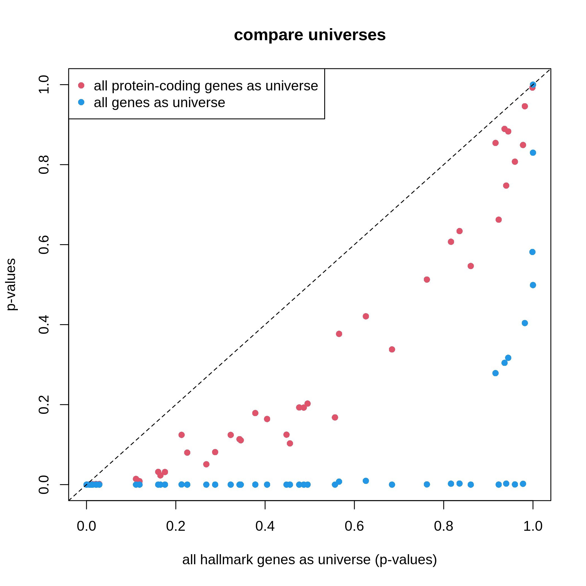

非常に明瞭な結果が得られます。ユニバースがより大規模になると、有意な遺伝子セットの数が増加し、潜在的な偽陽性が生じる可能性が高まります。
これは特にゲノム上の全遺伝子をユニバースとして使用する場合に顕著な問題となります。

本節での議論を踏まえ、ユニバースを使用する際の推奨事項は以下の通りです：

1. タンパク質をコードする遺伝子を使用すること
2. 測定された遺伝子を使用すること
3. あるいは**clusterProfiler**の保守的な方法を採用すること

## 可視化機能

**clusterProfiler**では、GSEAの結果に対してシンプルな可視化から複雑な可視化まで、豊富な可視化手法を提供しています。
複雑な可視化は視覚的には華やかですが、有用な情報をあまり伝達できず、非常に特殊な条件下でのみ使用すべきものです。
一方、シンプルなグラフの方が通常優れた結果をもたらします。
近年、**clusterProfiler**の可視化関連コードは新たに**enrichplot**パッケージに移行されました。
まずは**enrichplot**パッケージを読み込みましょう。
**enrichplot**がサポートするすべての可視化機能の詳細については、
https://yulab-smu.top/biomedical-knowledge-mining-book/enrichplot.html を参照してください。

まず、エンリッチメントテーブルを再生成します。


``` r
library(enrichplot)
resTimeGO = enrichGO(gene = timeDEgenes, 
                     keyType = "SYMBOL",
                     ont = "BP", 
                     OrgDb = org.Mm.eg.db,
                     pvalueCutoff = 1,
                     qvalueCutoff = 1)
resTimeGOTable = as.data.frame(resTimeGO)
head(resTimeGOTable)
```

``` output
                   ID                Description GeneRatio   BgRatio RichFactor
GO:0050900 GO:0050900        leukocyte migration    50/965 408/28832  0.1225490
GO:0006935 GO:0006935                 chemotaxis    54/965 475/28832  0.1136842
GO:0042330 GO:0042330                      taxis    54/965 477/28832  0.1132075
GO:0030595 GO:0030595       leukocyte chemotaxis    35/965 242/28832  0.1446281
GO:0060326 GO:0060326            cell chemotaxis    41/965 337/28832  0.1216617
GO:0071674 GO:0071674 mononuclear cell migration    32/965 229/28832  0.1397380
           FoldEnrichment    zScore       pvalue     p.adjust       qvalue
GO:0050900       3.661485 10.075346 2.751321e-15 1.053782e-11 7.745382e-12
GO:0006935       3.396625  9.800882 5.186751e-15 1.053782e-11 7.745382e-12
GO:0042330       3.382383  9.763475 6.190224e-15 1.053782e-11 7.745382e-12
GO:0030595       4.321158  9.654694 3.373742e-13 4.307425e-10 3.165991e-10
GO:0060326       3.634975  9.054313 1.137629e-12 1.161974e-09 8.540597e-10
GO:0071674       4.175053  8.976588 8.861995e-12 6.891923e-09 5.065617e-09
                                                                                                                                                                                                                                                                                                                             geneID
GO:0050900                                 Tnfsf18/Sell/Slamf9/Fut7/Itga4/Mdk/Grem1/Ada/Prex1/Edn3/P2ry12/Il12a/S100a8/S100a9/Nbl1/Padi2/Bst1/Cxcl5/Ppbp/Pf4/Cxcl1/Ptn/Alox5/Trpm4/Hsd3b7/Itgam/Adam8/Ascl2/Gdf15/Calr/Enpp1/Aire/Ccl2/Ccl7/Ccl5/Ccr7/Aoc3/Itgb3/Ccl28/Lgals3/Ptk2b/Emp2/Apod/Retnlg/Plg/Fpr2/Dusp1/Ager/Il33/Ch25h
GO:0006935 Tnfsf18/Sell/Slamf9/Mdk/Grem1/Prex1/Edn3/P2ry12/Il12a/S100a7a/S100a8/S100a9/Lpar1/Ptgr1/Nbl1/Padi2/Bst1/Cxcl5/Ppbp/Pf4/Cxcl1/Ptn/Alox5/Ntf3/Trpm4/Hsd3b7/Itgam/Adam8/Lsp1/Calr/Ccl17/Robo3/Cmtm7/Ccl2/Ccl7/Ccl5/Ccl6/Ccr7/Itgb3/Tubb2b/Ccl28/Lgals3/Cmtm5/Ptk2b/Nr4a1/Casr/Retnlg/Fpr2/Dusp1/Ager/Stx3/Ch25h/Plxnb3/Nox1
GO:0042330 Tnfsf18/Sell/Slamf9/Mdk/Grem1/Prex1/Edn3/P2ry12/Il12a/S100a7a/S100a8/S100a9/Lpar1/Ptgr1/Nbl1/Padi2/Bst1/Cxcl5/Ppbp/Pf4/Cxcl1/Ptn/Alox5/Ntf3/Trpm4/Hsd3b7/Itgam/Adam8/Lsp1/Calr/Ccl17/Robo3/Cmtm7/Ccl2/Ccl7/Ccl5/Ccl6/Ccr7/Itgb3/Tubb2b/Ccl28/Lgals3/Cmtm5/Ptk2b/Nr4a1/Casr/Retnlg/Fpr2/Dusp1/Ager/Stx3/Ch25h/Plxnb3/Nox1
GO:0030595                                                                                                                 Tnfsf18/Sell/Slamf9/Mdk/Grem1/Prex1/Edn3/Il12a/S100a8/S100a9/Nbl1/Padi2/Bst1/Cxcl5/Ppbp/Pf4/Cxcl1/Ptn/Alox5/Trpm4/Hsd3b7/Itgam/Adam8/Calr/Ccl2/Ccl7/Ccl5/Ccr7/Ccl28/Lgals3/Ptk2b/Retnlg/Fpr2/Dusp1/Ch25h
GO:0060326                                                                              Tnfsf18/Sell/Slamf9/Mdk/Grem1/Prex1/Edn3/Il12a/S100a8/S100a9/Lpar1/Nbl1/Padi2/Bst1/Cxcl5/Ppbp/Pf4/Cxcl1/Ptn/Alox5/Trpm4/Hsd3b7/Itgam/Adam8/Calr/Ccl17/Ccl2/Ccl7/Ccl5/Ccl6/Ccr7/Ccl28/Lgals3/Ptk2b/Nr4a1/Retnlg/Fpr2/Dusp1/Ch25h/Plxnb3/Nox1
GO:0071674                                                                                                                                  Tnfsf18/Slamf9/Fut7/Itga4/Mdk/Grem1/P2ry12/Il12a/Nbl1/Padi2/Alox5/Trpm4/Hsd3b7/Adam8/Ascl2/Calr/Enpp1/Aire/Ccl2/Ccl7/Ccl5/Ccr7/Itgb3/Lgals3/Ptk2b/Apod/Retnlg/Plg/Fpr2/Dusp1/Ager/Ch25h
           Count
GO:0050900    50
GO:0006935    54
GO:0042330    54
GO:0030595    35
GO:0060326    41
GO:0071674    32
```

`barplot()`と`dotplot()`は、有意な遺伝子セット数が少ない場合にプロットを生成します。
これらの関数は`enrichGO()`関数が返す`resTimeGO`オブジェクトに直接適用されます。


``` r
barplot(resTimeGO, showCategory = 20)
```

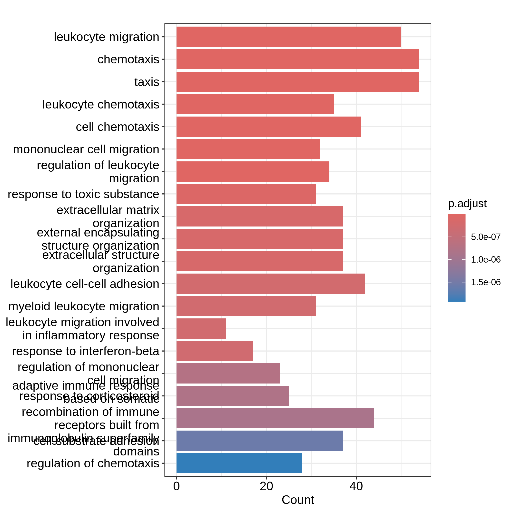

``` r
dotplot(resTimeGO, showCategory = 20)
```

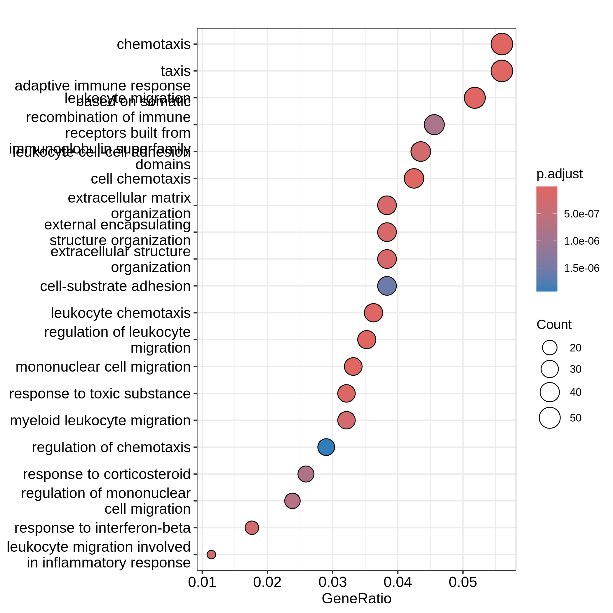

棒グラフでは2つの変数をプロットにマッピングできます。
一方は棒の高さに、他方は棒の色に対応します。
一方、ドットプロットではドットのサイズを第三の変数にマッピングできます。
変数名は結果テーブルの列名に対応しています。
どちらのプロットも上位20個の最も有意な用語を表示しています。
ドットプロットでは、用語はx軸の値（`GeneRatio`）に基づいて順序付けられています。

ここで「優れた可視化とは何か」について考察します。
本質的に重要な2つの問いは「・プロットは読者にどのような主要なメッセージを伝えようとしているか？」「・プロットの主要な視覚的要素は何か？」です。
棒グラフやドットプロットにおいて、読者が最も容易に認識する主要な視覚的要素は、棒の高さまたは原点からのドットのオフセットです。
ORA解析で最も重要なメッセージはもちろん「エンリッチメント」そのものです。
`barplot()`と`dotplot()`の2つの例では、この情報が読者に十分に伝達されていません。
`"Count"`をx軸の値として使用した最初の棒グラフでは、遺伝子セット内のDE遺伝子数がエンリッチメントの適切な指標とは言えません。
これは遺伝子セットのサイズと正の相関があるためです。
`"Count"`の値が高いからといって、その遺伝子セットがよりエンリッチされているとは限りません。

ドットプロットで`"GeneRatio"`をx軸の値として使用する場合も同様の問題があります。
`"GeneRatio"`は特定の遺伝子セットからのDE遺伝子数の割合として計算されます（`GeneRatio = Count/Total_DE_Genes`）。
ドットプロットでは複数の遺伝子セットを同一プロット上に表示し、それらの比較を目的としているため、遺伝子セット間の比較可能性を確保するために「スケーリング」が必要です。
`"GeneRatio"`は異なる遺伝子セット間でスケーリングされておらず、依然として遺伝子セットのサイズと正の相関があります。
ドットプロットで観察できるように、遺伝子比率が高いほどドットのサイズも大きくなります。
実際、`"GeneRatio"`は`"Count"`（`GeneRatio = Count/Total_DE_Genes`）と同一の効果を持つため、前述の説明と同様に、`"GeneRatio"`もエンリッチメントの適切な指標とは言えません。

それでは、ORAのエンリッチメントをより適切に示すための合理的な棒グラフとドットプロットを作成してみましょう。

まず、遺伝子セット内のDE遺伝子の「エンリッチメント」を測定するいくつかの指標を定義します。
2×2分割表の表記法を思い出してください（ここではその概念から遠く離れていますが！）。エンリッチメントテーブルからこれらの数値を取得します。


``` r
n_11 = resTimeGOTable$Count
n_10 = 983  # length(intersect(resTimeGO@gene, resTimeGO@universe))
n_01 = as.numeric(gsub("/.*$", "", resTimeGOTable$BgRatio))
n = 28943  # length(resTimeGO@universe)
```

`GeneRatio`の代わりに、遺伝子セット内のDE遺伝子の割合を使用します。
これはすべての遺伝子セットに対して「スケーリング」された値と言えます。これを計算しましょう：


``` r
resTimeGOTable$DE_Ratio = n_11/n_01
resTimeGOTable$GS_size = n_01  # 遺伝子セットのサイズ
```

直感的に、ある遺伝子セットの`DE_Ratio`値が高い場合、その遺伝子セットではDE遺伝子のエンリッチメントが高いと言えます^[ここで「エンリッチメント」という用語が統計学的な意味を持つ場合に限ります。]。

エンリッチメントを測定する方法は他に2つあります。まず、対数2倍エンリッチメントを以下のように定義します：

$$ \log_2(\mathrm{Fold\_enrichment}) = \frac{n_{11}/n_{10}}{n_{01}/n} = \frac{n_{11}/n_{01}}{n_{10}/n} = \frac{n_{11}n}{n_{10}n_{01}} $$

これは、遺伝子セット内の_DE%_とユニバース内の_DE%_の比率の対数2乗、あるいは_遺伝子セット%_のDE遺伝子数とユニバース内の_遺伝子セット%_の比率の対数2乗に相当します。これらは同一の値です。


``` r
resTimeGOTable$log2_Enrichment = log( (n_11/n_10)/(n_01/n) )
```

第二に、ハイパー幾何分布の平均値μと標準偏差σを用いて計算されるzスコアも一般的に使用されます：

$$ z = \frac{n_{11} - \mu}{\sigma} $$

ここでμとσはそれぞれハイパー幾何分布の平均値と標準偏差を表します。これらは以下の式で計算できます：


``` r
hyper_mean = n_01*n_10/n

n_02 = n - n_01
n_20 = n - n_10
hyper_var = n_01*n_10/n * n_20*n_02/n/(n-1)
resTimeGOTable$zScore = (n_11 - hyper_mean)/sqrt(hyper_var)
```


主な変数として対数2倍変化量を棒グラフの高さに、補助変数としてDE比を色のマッピングに使用します。これは**ggplot2**パッケージを用いて直接実行可能です。また、棒グラフには調整済みp値をラベルとして追加します。

`resTimeGOTable`では遺伝子セットが既に有意性順に並べ替えられているため、最も有意性の高い上位10個の遺伝子セットを選択します。


``` r
library(ggplot2)
ggplot(resTimeGOTable[1:10, ], 
        aes(x = log2_Enrichment, y = factor(Description, levels = rev(Description)), 
            fill = DE_Ratio)) +
    geom_bar(stat = "identity") +
    geom_text(aes(x = log2_Enrichment, 
        label = sprintf("%.2e", p.adjust)), hjust = 1, col = "white") +
    ylab("")
```

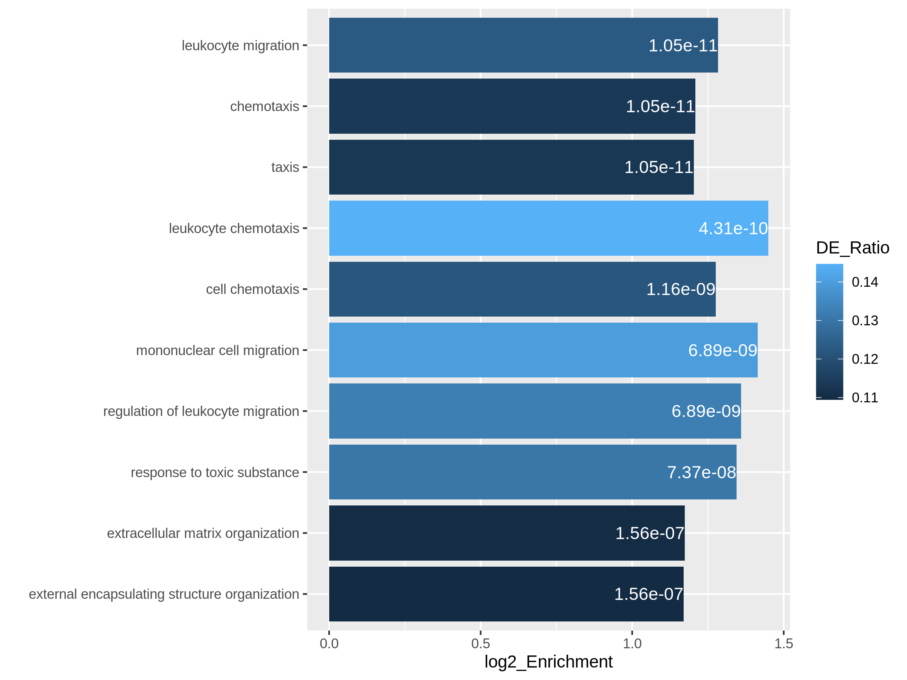

次の例では、zスコアを原点からのオフセットに、DE比とカウント値をドットの色とサイズにそれぞれマッピングしています。


``` r
ggplot(resTimeGOTable[1:10, ], 
        aes(x = zScore, y = factor(Description, levels = rev(Description)), 
            col = DE_Ratio, size = Count)) +
    geom_point() +
    ylab("")
```

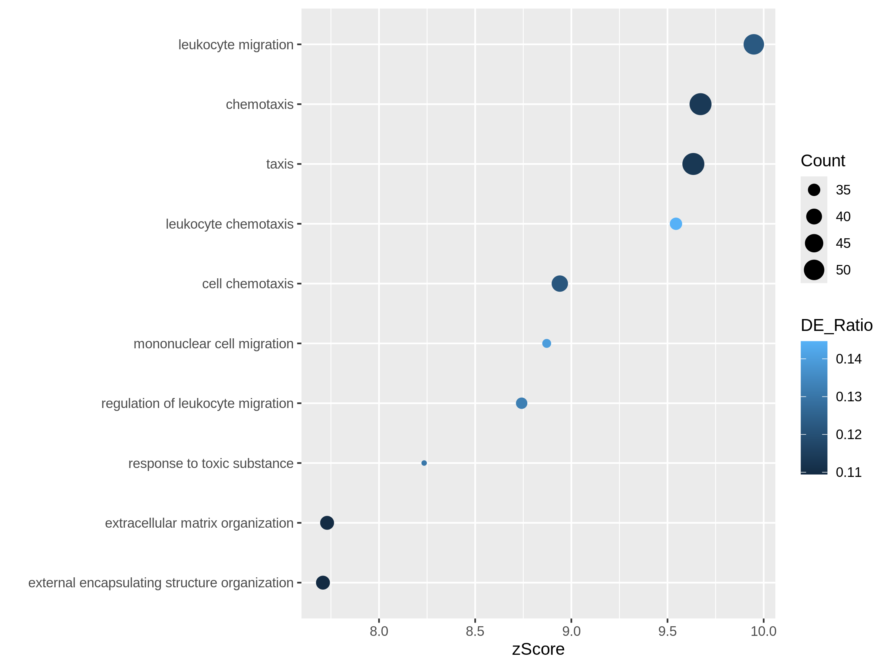

どちらのプロットでも、「炎症反応に関与する白血球遊走」という遺伝子セットは比較的小規模ながら高度に濃縮されていることが明らかになります。

もう一つの有用な可視化手法として火山プロットがあります。差異発現解析における火山プロットでは、x軸が差異発現の対数2倍変化量、y軸が調整済みp値に対応します。本ケースでも同様のアプローチを採用しており、x軸には対数2倍濃縮度を使用しています。

本分析では過剰表現のみを対象としているため、火山プロットは片側検定となります。対数2倍濃縮度と調整済みp値に対して2つの閾値を設定することで、右上領域に位置する遺伝子セットを、統計的に有意であると同時に生物学的にも意味のある結果と解釈できます。


``` r
ggplot(resTimeGOTable, 
    aes(x = log2_Enrichment, y = -log10(p.adjust), 
        color = DE_Ratio, size = GS_size)) +
    geom_point() +
    geom_hline(yintercept = -log10(0.01), lty = 2, col = "#444444") +
    geom_vline(xintercept = 1.5, lty = 2, col = "#444444")
```

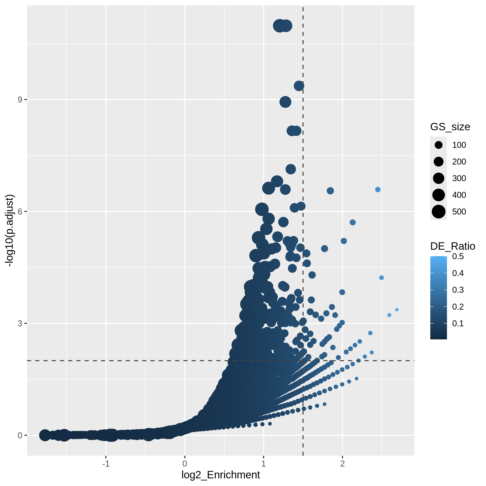

「火山プロット」では、複数の曲線から構成されるグラフが観察されます。特にプロット右下の領域でその傾向が明確に現れます。各「曲線」は同一の`"Count"`値（遺伝子セット内のDE遺伝子数）に対応しています。火山プロットは、濃縮度と遺伝子セットサイズの間に正の相関があることを非常に明確に示しています。すなわち、大規模な遺伝子セットは小さなDE比と小さな対数2倍濃縮度でも容易に小さなp値を達成できるのに対し、小規模な遺伝子セットでは有意な結果を得るためにより大きなDE比が必要となることを示しています。

また、一般的にアップレギュレーションされた遺伝子とダウンレギュレーションされた遺伝子に対してORA解析を個別に実施し、これら2つのORA解析から得られた有意な遺伝子セットを1つのプロットに統合したい場合があります。以下のコードでは、まずアップレギュレーション遺伝子とダウンレギュレーション遺伝子に対してそれぞれ独立した濃縮度テーブルを生成します。


``` r
# up-regulated genes
timeDEup <- as.data.frame(subset(resTime, padj < 0.05 & log2FoldChange > log2(1.5)))
timeDEupGenes <- rownames(timeDEup)

resTimeGOup = enrichGO(gene = timeDEupGenes, 
                       keyType = "SYMBOL",
                       ont = "BP", 
                       OrgDb = org.Mm.eg.db,
                       universe = rownames(se),
                       pvalueCutoff = 1,
                       qvalueCutoff = 1)
resTimeGOupTable = as.data.frame(resTimeGOup)
n_11 = resTimeGOupTable$Count
n_10 = length(intersect(resTimeGOup@gene, resTimeGOup@universe))
n_01 = as.numeric(gsub("/.*$", "", resTimeGOupTable$BgRatio))
n = length(resTimeGOup@universe)
resTimeGOupTable$log2_Enrichment = log( (n_11/n_10)/(n_01/n) )

# down-regulated genes
timeDEdown <- as.data.frame(subset(resTime, padj < 0.05 & log2FoldChange < -log2(1.5)))
timeDEdownGenes <- rownames(timeDEdown)

resTimeGOdown = enrichGO(gene = timeDEdownGenes, 
                       keyType = "SYMBOL",
                       ont = "BP", 
                       OrgDb = org.Mm.eg.db,
                       universe = rownames(se),
                       pvalueCutoff = 1,
                       qvalueCutoff = 1)
resTimeGOdownTable = as.data.frame(resTimeGOdown)
n_11 = resTimeGOdownTable$Count
n_10 = length(intersect(resTimeGOdown@gene, resTimeGOdown@universe))
n_01 = as.numeric(gsub("/.*$", "", resTimeGOdownTable$BgRatio))
n = length(resTimeGOdown@universe)
resTimeGOdownTable$log2_Enrichment = log( (n_11/n_10)/(n_01/n) )
```

具体例として、発現量が上昇した遺伝子については上位5つの最も有意な用語を、発現量が低下した遺伝子については上位5つの最も有意な用語を取り上げます。以下の**ggplot2**コードは容易に理解できる内容となっています。


``` r
# 3番目の用語名が長すぎるため、2行に分けて表示します
resTimeGOupTable[3, "Description"] = paste(strwrap(resTimeGOupTable[3, "Description"]), collapse = "\n")

direction = c(rep("up", 5), rep("down", 5))
ggplot(rbind(resTimeGOupTable[1:5, ],
             resTimeGOdownTable[1:5, ]),
        aes(x = log2_Enrichment, y = factor(Description, levels = rev(Description)), 
            fill = direction)) +
    geom_bar(stat = "identity") +
    scale_fill_manual(values = c("up" = "red", "down" = "darkgreen")) +
    geom_text(aes(x = log2_Enrichment, 
                  label = sprintf("%.2e", p.adjust)), hjust = 1, col = "white") +
    ylab("")
```

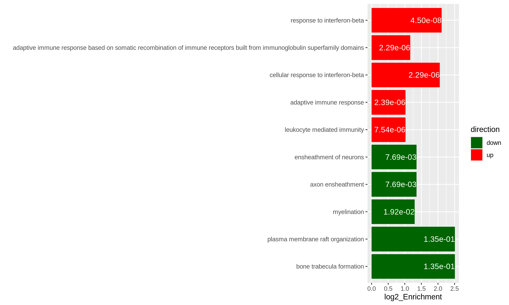


GOエンリッチメント分析においては、GOエンリッチメント解析から数百もの有意なGO用語が出力されることがよくあります。このような長いリストから共通する機能を要約するのは困難です。ここで紹介する最後のパッケージは**simplifyEnrichment**パッケージです。このパッケージでは、GO用語を意味的類似性に基づいてクラスタリング^[GO用語間の意味的類似性は、GO階層構造におけるトポロジカルな関係を考慮して算出されます]し、ワードクラウドを用いてそれらの共通機能を要約します。

`simplifyGO()`関数の入力はGO IDのベクトルです。要約と可視化を行うには、少なくとも100個のGO IDを用意することをお勧めします。


``` r
GO_ID = resTimeGOTable$ID[resTimeGOTable$p.adjust < 0.1]
library(simplifyEnrichment)
simplifyGO(GO_ID)
```

<!-- Carpentry CI cannot install RcppParallel which is indirectly depended by simplifyenrichment,
    so the plot is not generated on the fly.
 -->

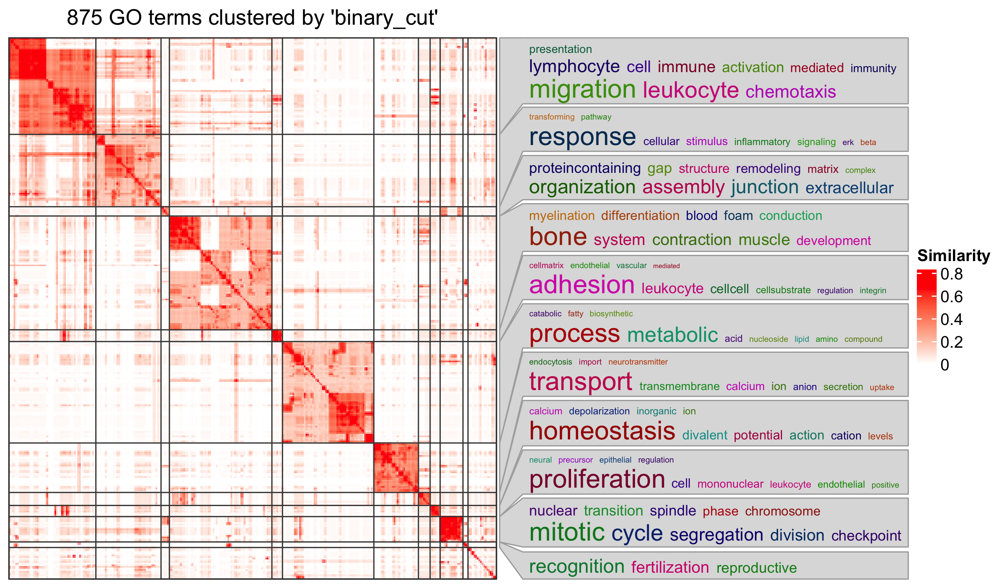

:::::::::::::::::::::::::::::::::::::::::  callout

### 関連文献

ORA解析では、実際に遺伝子に対して二値化処理を行います。カットオフ値を超えた遺伝子は1（発現変動遺伝子）として設定され、それ以外の遺伝子は0（非発現変動遺伝子）として処理されます。この二値化処理は問題を過度に単純化するため、多くの情報が失われることになります。これに対し、連続値の遺伝子レベルスコアを入力として扱い、遺伝子セット内における各遺伝子の重要度を重み付けする第二のクラスの遺伝子セットエンリッチメント解析手法が存在します。詳細については、[Subramanianらによる『遺伝子セットエンリッチメント解析：ゲノムワイド発現プロファイルを解釈するための知識ベースアプローチ』PNAS 2005](https://www.pnas.org/doi/10.1073/pnas.0506580102)を参照してください。


::::::::::::::::::::::::::::::::::::::::::::::::::


:::::::::::::::::::::::::::::::::::::::: keypoints

- ORA解析は遺伝子カウントデータに基づいており、Fisherの正確確率検定または超幾何分布を用いて統計的有意性を評価します。
- R環境では、多様なソースから容易に遺伝子セットを取得することが可能です。


::::::::::::::::::::::::::::::::::::::::::::::::::


<script>
$(function() {
    
    // if it is a general "callout", we need to filter the callout title
    // value for callout_title can be partial from the complete title
    var callout_title = "reading";  // short for "further reading"
    
    // then we select those callouts with the specified title
    var callout = $(".callout").filter(function(index) {
        var title = $(this).find(".callout-title").text();
        return title.indexOf(callout_title) >= 0;
    });
    callout.css("border-color", "#2b8cbe"); // select a color, this is for the left border of the box
    callout.find(".callout-square").css("background", "#2b8cbe"); // select a color, this is for the left border of the box
    
    // if you want to replace the default icon, go to https://feathericons.com/, and get the source of the svg icon
    var svg = '<svg xmlns="http://www.w3.org/2000/svg" width="24" height="24" viewBox="0 0 24 24" fill="none" stroke="currentColor" stroke-width="2" stroke-linecap="round" stroke-linejoin="round" class="feather feather-book-open callout-icon"><path d="M2 3h6a4 4 0 0 1 4 4v14a3 3 0 0 0-3-3H2z"></path><path d="M22 3h-6a4 4 0 0 0-4 4v14a3 3 0 0 1 3-3h7z"></path></svg>';
    // then update it with the new icon
    callout.find(".callout-square").html(svg);

});
</script>
